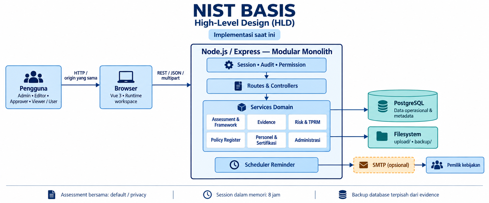
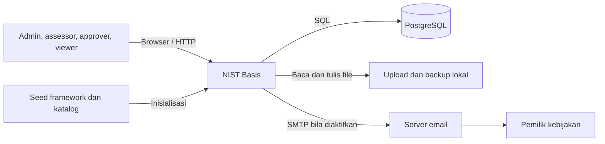
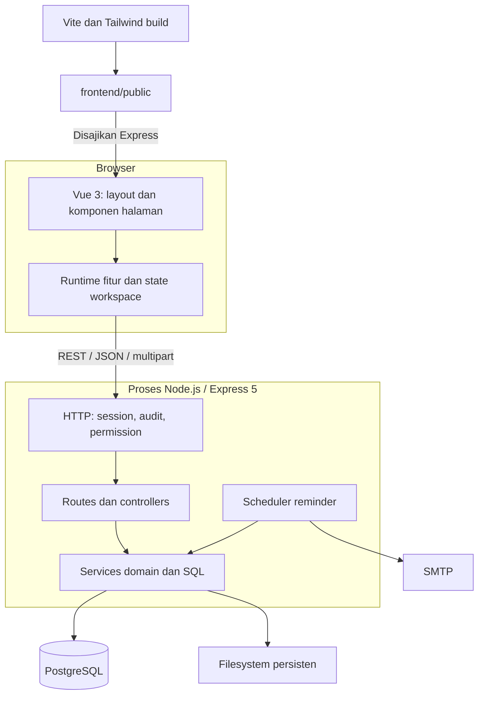
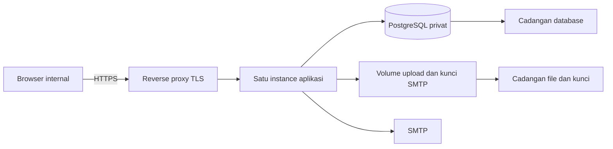

# High-Level Design — NIST Basis

Tanggal: 10 September 2026. Status: dokumentasi arsitektur berdasarkan source workspace saat peninjauan, termasuk perubahan lokal yang belum di-commit. Pasangan dokumen: [Low-Level Design](LOW_LEVEL_DESIGN.md).

## 1. Tujuan dan batas sistem

NIST Basis adalah aplikasi web internal untuk mengelola assessment keamanan informasi, evidence, risiko, kebijakan, serta kompetensi personel. Dokumen ini menjelaskan komponen besar, tanggung jawab, integrasi, deployment, dan arah pengembangan. Istilah desain sistem di sini berarti arsitektur perangkat lunak.

Bagian implementasi saat ini merujuk kode lokal; bagian **usulan** belum diimplementasikan. Dokumentasi ini tidak menyatakan kepatuhan atau sertifikasi terhadap framework tertentu dan tidak mengasumsikan adanya pemisahan data per organisasi.

## 2. Aktor dan kapabilitas

| Aktor | Kebutuhan | Implementasi akses |
|---|---|---|
| Administrator | Mengelola akun, izin, backup, restore, dan SMTP | Role `admin`; beberapa route khusus admin |
| Editor/assessor | Mengisi assessment, control, evidence, dan register | Role `editor` dengan izin halaman dan aksi |
| Approver | Mengelola keputusan risiko dan kebijakan | Role `approver`; bukan mesin approval bertahap terpisah |
| Viewer/user | Membaca data sesuai akses; user dapat upload pada izin tertentu | Role `viewer` atau `user`; kemampuan mengikuti matriks backend |
| Pemilik kebijakan | Menerima pengingat review | Pemetaan owner ke email pada pengaturan reminder |

Izin aktual adalah gabungan konfigurasi `role_permissions`, matriks aksi, dan middleware khusus. Nama role tidak cukup untuk menentukan semua hak akses.

## 3. Diagram konteks — implementasi saat ini

Browser berkomunikasi dengan aplikasi pada origin yang sama. PostgreSQL menyimpan data operasional dan metadata; file evidence berada terutama di filesystem. Email adalah integrasi opsional dan hanya berjalan bila pengaturannya aktif.

## 4. Arsitektur komponen

Sistem menggunakan **modular monolith**: fitur dipisahkan menjadi route, controller, dan service tetapi berjalan dalam satu proses. Tidak ada message broker atau microservice terpisah pada implementasi ini.

Frontend sudah menggunakan Vue 3. Logika kompatibilitas di `workspace/runtime.js` menggabungkan source fitur secara berurutan; fitur tersebut masih berbagi scope runtime. Pemisahan file belum berarti setiap fitur memiliki state yang terisolasi.

## 5. Batas modul

| Modul | Tanggung jawab | Penyimpanan utama |
|---|---|---|
| Framework dan assessment | CSF, Privacy, control generik, skor/catatan, ISO dan SOA | `frameworks`, `controls`, `assessment_state`, target kategori, objectives |
| Evidence | Upload, penggunaan ulang, download, replace, delete | `evidence_files` dan `upload/` |
| Risk Management dan Acceptance | Register, indikator, mitigasi, keputusan, PDF | `risk_register`, `risk_indicators`, `risk_acceptance_forms` |
| TPRM | Vendor, risiko terkait, due diligence, template | Tabel TPRM dan `questionnaire_templates` |
| Policy Register | Kebijakan, isi, attachment, review, reminder | Tabel policy dan reminder |
| Personel | Pegawai, sertifikasi, katalog roadmap | `organization_personnel`, `personnel_certifications`, katalog |
| Administrasi | Session, akun, izin, audit, backup/restore | `app_users`, `role_permissions`, `audit_events`, `backup/` |

## 6. Alur bisnis utama

1. Pengguna login; server memvalidasi bcrypt dan membuat session cookie.
2. Browser mengambil framework, assessment, dan data modul sesuai permission.
3. Pengguna memperbarui nilai atau register; API meneruskan permintaan ke service dan PostgreSQL.
4. Evidence dikirim sebagai multipart, disimpan sebagai file, lalu path-nya direferensikan dalam assessment/control/kebijakan.
5. Dashboard menampilkan hasil perhitungan dan ringkasan data; export JSON assessment memuat state dan referensi file.
6. Scheduler menilai jatuh tempo kebijakan dan mengirim reminder melalui SMTP bila aktif.

Assessment CSF menggunakan dokumen bersama ber-ID `default`, sedangkan Privacy menggunakan `privacy`. Identitas session tidak menjadi partition key assessment. Desain saat ini belum menyediakan assessment terpisah per pengguna atau tenant.

## 7. Deployment

**Saat ini:** satu aplikasi Express menyajikan frontend hasil build sekaligus API. PostgreSQL dapat berjalan di host yang sama atau host terpisah sesuai konfigurasi. `upload/`, `backup/`, dan kunci SMTP membutuhkan penyimpanan yang tetap tersedia setelah restart. Session berada di memori dan hilang saat proses restart.

**Usulan deployment operasional:**

Reverse proxy pada diagram adalah usulan. Menambahkan instance aplikasi memerlukan desain session bersama dan file bersama terlebih dahulu. Scheduler sudah memakai PostgreSQL advisory lock, tetapi itu tidak menyelesaikan kebutuhan session maupun storage bersama.

## 8. Kualitas sistem dan keterbatasan

| Aspek | Kondisi saat ini | Arah desain / usulan |
|---|---|---|
| Konsistensi | Assessment di-upsert sebagai seluruh JSONB | Tambahkan version dan deteksi konflik agar edit bersamaan tidak menimpa diam-diam |
| Ketersediaan | Proses tunggal dan filesystem lokal | Monitoring, restart terkelola, lalu evaluasi multi-instance berdasarkan beban |
| Kapasitas | Belum ada hasil load test dalam dokumen ini | Ukur jumlah user bersamaan, ukuran register, dan volume evidence sebelum menetapkan kapasitas |
| Pemulihan | Backup database tersedia; tidak mengarsipkan evidence | Pulihkan database, file, dan kunci SMTP sebagai satu set yang konsisten |
| Observabilitas | Audit event, log request/error, health API | Tambahkan metrik latency, error, kapasitas disk, dan kegagalan reminder |
| Maintainability | Service per domain; runtime frontend berurutan | Migrasikan state dan event ke komponen/composable Vue bertahap |

Target awal **usulan**, untuk disepakati dan diuji: RPO 24 jam, RTO 4 jam, p95 API baca ringan di bawah 1 detik pada 20 pengguna bersamaan. Target ini bukan hasil ukur; upload, export, dan restore perlu ukuran serta target terpisah.

## 9. Keamanan dan batas kepercayaan

Autentikasi, permission backend, bcrypt, cookie HttpOnly/SameSite, validasi file, dan audit adalah kontrol yang ada. Cookie Secure dan header HSTS bergantung mode production. Pemeriksaan origin mutasi membandingkan host bila header Origin tersedia; ini bukan bukti perlindungan menyeluruh untuk seluruh skenario CSRF.

Sumber data browser harus tetap divalidasi backend. Path evidence dalam JSON bukan foreign key. Route update evidence framework saat ini memeriksa permission `read`; penyelarasan dengan permission mutasi perlu ditinjau sebagai pekerjaan terpisah.

## 10. Prioritas pengembangan

| Prioritas | Hasil yang diinginkan | Kriteria penerimaan |
|---|---|---|
| P1 | Kontrak assessment tervalidasi dan memiliki versi | Nilai tidak valid ditolak; dua editor tidak kehilangan perubahan tanpa pemberitahuan |
| P1 | Referensi evidence konsisten lintas modul | File yang digunakan modul lain tidak terhapus; kegagalan parsial dapat dipulihkan |
| P1 | Backup lengkap dan pemulihan teruji | Data, evidence, serta dekripsi pengaturan SMTP berfungsi setelah pemulihan di lingkungan uji |
| P2 | Permission mutasi konsisten | Pengujian role mencakup setiap route mutasi dan pengecualiannya |
| P2 | Migrasi database terpisah dari startup | Perubahan schema memiliki versi dan dijalankan sebagai langkah deployment |
| P3 | Frontend memiliki state per fitur | Migrasi komponen mempertahankan alur pengguna tanpa ketergantungan urutan script global |

## 11. Sumber dan verifikasi

Sumber utama: [app.js](../src/app.js), [server.js](../src/server.js), [API mounts](../src/routes/index.js), [schema](../database/schema.sql), [permission service](../src/services/permissionService.js), [bootstrap frontend](../frontend/client/src/main.js), dan [reminder](../src/services/policyReminderService.js).

Peninjauan dilakukan melalui pembacaan source. Tidak menjalankan server, migrasi, operasi database, pengiriman email, atau pengujian performa. Catatan lama yang berbeda dengan kode saat ini tidak dijadikan dasar untuk mengklaim perilaku runtime.
