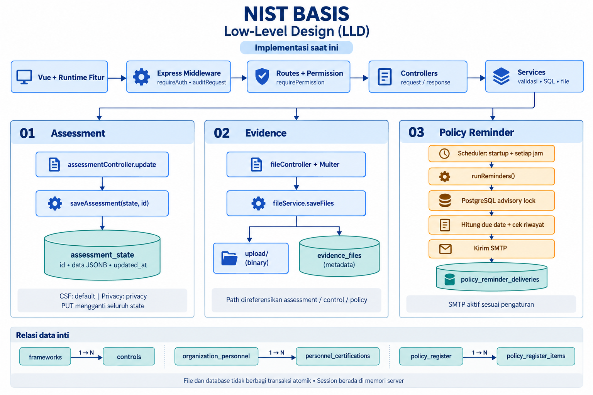
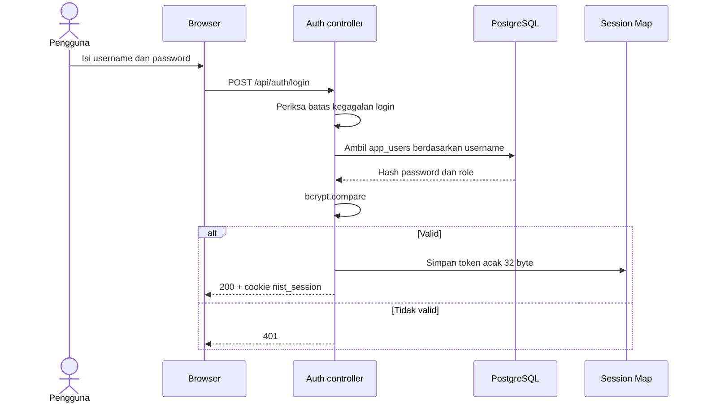
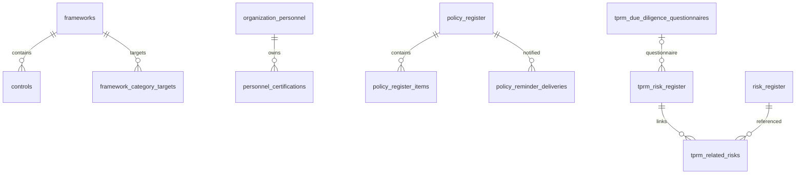
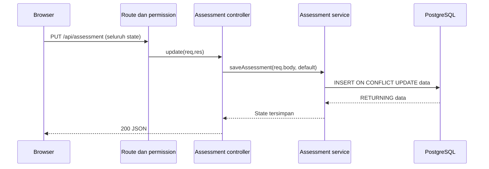
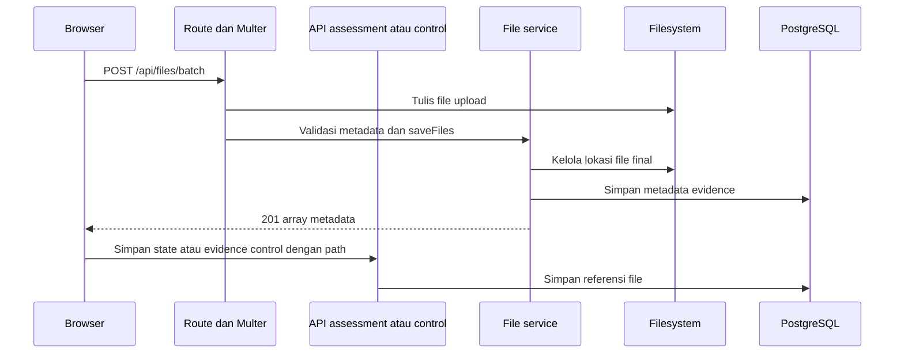

# Low-Level Design — NIST Basis

Tanggal: 10 September 2026. Basis: source workspace lokal, termasuk perubahan yang belum di-commit. Konteks arsitektur: [High-Level Design](HIGH_LEVEL_DESIGN.md). Label **usulan** berarti belum diimplementasikan.

## 1. Struktur implementasi

| Lapisan | File/direktori | Kontrak tanggung jawab |
|---|---|---|
| Bootstrap backend | `src/server.js` | Provisioning, inisialisasi store, listen, start scheduler |
| HTTP pipeline | `src/app.js` | Parser, header, origin, session, audit, route, static, error |
| Route | `src/routes/` | HTTP method, parameter URL, permission, upload middleware |
| Controller | `src/controllers/` | Membaca request, memanggil service, menentukan response |
| Service | `src/services/` | Validasi domain, SQL parameterized, filesystem, integrasi |
| Database | `src/config/database.js`, `database/` | Pool PostgreSQL dan schema; service juga memiliki DDL |
| Vue bootstrap | `frontend/client/src/main.js`, `App.vue` | Mount layout, nextTick, bootstrap runtime |
| UI fitur | `workspace/components/`, `workspace/features/` | Komponen halaman dan source logika fitur |
| Runtime | `workspace/runtime.js` | Import `?raw`, penggabungan source sesuai urutan |

Path `workspace/` pada tabel berada di `frontend/client/src/`. Edit source fitur, bukan bundle `frontend/public/vue/`. `npm run build` menjalankan build CSS dan client; `prepare:client` menyiapkan sumber generated sebelum Vite.

## 2. Lifecycle dan HTTP pipeline

Startup: `provisionDatabase` → folder upload → assessment/schema → framework → risk → personel/katalog → permission → TPRM/template → policy/reminder → audit/backup → SQL akun → listen → scheduler. Kegagalan startup ditangkap dan menetapkan exit code 1. Startup melakukan penulisan database, sehingga tidak dipakai sebagai pemeriksaan dokumentasi.

Urutan HTTP global: log request → security headers → JSON parser 10 MB → pemeriksaan origin mutasi → auth routes/publik → `/api` dengan `requireAuth` dan `auditRequest` → permission route → controller/service → error handler.

| Route halaman | Perilaku saat ini |
|---|---|
| `/`, `/index.html` | Landing publik |
| `/login`, `/tailwind.css` | Login dan stylesheet publik |
| `/app` | Workspace Vue dengan login |
| `/api/health`, `/api/health/db` | Tetap membutuhkan login |

## 3. Autentikasi dan otorisasi

Session berlaku 8 jam sejak dibuat, disimpan dalam `Map`, dan tidak bertahan setelah restart. Cookie: HttpOnly, SameSite `lax`, Secure hanya pada production. Pembatasan login memakai key IP dan username; lima kegagalan memicu blokir 15 menit, response permintaan selama blokir adalah 429.

`requirePermission(key, action)` memanggil `permissionService.has`. Admin diizinkan langsung; role lain membutuhkan `role_permissions.allowed` dan kecocokan matriks aksi. `requirePageAccess` adalah alias perilaku yang sama. `requireFrameworkEvidenceAccess` merupakan pengecualian: update evidence memakai pemeriksaan `read` pada key framework terkait. Ini dicatat sebagai kondisi aktual, bukan pola yang direkomendasikan untuk endpoint baru.

## 4. Model data

Diagram berikut hanya menampilkan relasi database inti, bukan seluruh kolom.

| Entitas | Key / data penting | Constraint dan penggunaan |
|---|---|---|
| `frameworks` | `id TEXT`, name, version | PK id; name/version tidak kosong |
| `controls` | `id BIGSERIAL`, framework_id, code, function, category, evidence JSONB, applicability | FK framework cascade; UNIQUE framework_id+code |
| `framework_category_targets` | framework_id, category, target_score | PK gabungan; skor database 0–5 |
| `assessment_state` | id, data JSONB, updated_at | CSF `default`; Privacy `privacy`; satu dokumen per ID |
| `evidence_files` | path, name, mime_type, content, updated_at | PK path; content BYTEA nullable untuk kompatibilitas |
| `risk_register` | risk_id, owner, likelihood, impact, residual data | PK teks risk_id; index rating dan owner |
| `risk_acceptance_forms` | id, deskripsi, mitigasi, keputusan, tanggal | Keputusan owner: temporary/one_year/denied; CIS: approved/denied/conditional |
| `tprm_risk_register` | id, third_party, questionnaire_id, due_diligence_assessment | FK questionnaire `ON DELETE SET NULL` |
| `tprm_related_risks` | tprm_id, risk_id | PK gabungan, FK keduanya cascade |
| `questionnaire_templates` | id, template_name, sections JSONB | Nama template unik |
| `tprm_due_diligence_questionnaires` | id, template_id, responses JSONB | Jangan menganggap template_id sebagai FK hanya dari nama; schema utama tidak mendeklarasikannya |
| `policy_register` | id, title, owner, review_cycle, attachment_path | Parent item dan reminder |
| `policy_register_items` | id, policy_id, subtitle, content, sort_order | FK cascade; subtitle atau content harus terisi |
| `organization_personnel` | id, personnel_name, employee_id, supervisor_name | Nama wajib; atasan disimpan sebagai teks |
| `personnel_certifications` | id, personnel_id, sertifikasi, tanggal, layout | Migrasi links menerapkan FK wajib; satu pegawai dapat memiliki banyak sertifikasi |
| `certification_roadmap_catalog` | id, domain, certification_name, level | Nama sertifikasi unik |
| `information_security_objectives` | id, objective_year, objective, period_targets | Tahun 2000–2100; frekuensi evaluasi dibatasi enum check |
| `app_users`, `role_permissions` | Akun/hash/role; role+permission_key | Constraint role efektif diperbarui oleh service |
| `audit_events` | id, request_id, actor, method, path, status, details | Index waktu, actor, request_id |
| `policy_reminder_settings` | id, settings JSONB, secret | Singleton `id=1`; secret terenkripsi |
| `policy_reminder_deliveries` | policy_id, due_date, recipient, sent_at | PK policy+tanggal+penerima mencegah duplikasi riwayat |

Referensi file dalam JSONB atau `attachment_path` adalah relasi logis, tidak ditegakkan FK ke `evidence_files`. Schema efektif adalah gabungan `database/schema.sql`, `database/users.sql`, migrasi personel, dan DDL service.

## 5. Kontrak API inti

Prefix seluruh URL berikut adalah `/api`. JSON adalah format default; unggah file memakai multipart. Response CRUD tiap modul mengikuti controller masing-masing, tidak ada envelope universal.

| Method dan path | Input / hasil | Akses |
|---|---|---|
| POST `/auth/login` | `{username,password}` → `{username,role}` dan cookie | Publik, dibatasi percobaan |
| POST `/auth/logout` | Hapus session → 204 | Route auth |
| GET `/auth/me` | Profil dan permissions | Login |
| GET/POST `/auth/users`, PUT/DELETE `/auth/users/:id` | Administrasi akun | Admin |
| GET/PUT `/assessment` | Baca/ganti dokumen state CSF → JSON state | assessment read/update |
| POST `/assessment/reset` | Reset assessment/evidence terkait → 204 | Admin |
| GET/PUT `/privacy/assessment` | Dokumen state Privacy | privacy-assessment read/update |
| GET/POST `/frameworks` | Framework | framework read/create |
| GET/POST `/frameworks/:frameworkId/controls` | Daftar/tambah control | framework read/create |
| PUT/DELETE `/frameworks/:frameworkId/controls/:code` | Ubah/hapus control | framework update/delete |
| PUT `/frameworks/:frameworkId/targets/:category` | Target kategori | framework update |
| PUT `/frameworks/:frameworkId/controls/:code/evidence` | Evidence control | Middleware evidence khusus |
| GET/POST `/files` | Daftar / upload satu file | files + pemeriksaan khusus upload |
| POST `/files/batch` | Upload banyak file → 201 array metadata | files create + pemeriksaan khusus |
| GET/PUT/DELETE `/files/*path` | Baca/replace/hapus file | files + pemeriksaan khusus path |
| GET/POST `/risk-management`, PUT/DELETE `/risk-management/:id` | Risk Register | risk-management + aksi |
| GET/POST `/risk-acceptance`, PUT/DELETE `/risk-acceptance/:id` | Form penerimaan risiko | risk-acceptance + aksi |
| GET `/risk-acceptance/:id/export/pdf` | Binary PDF | risk-acceptance read |
| GET/POST `/tprm`, PUT/DELETE `/tprm/:id` | Register vendor | tprm-register + aksi |
| GET/POST `/tprm-questionnaires`, PUT/DELETE `/tprm-questionnaires/:id` | Due diligence | tprm-questionnaire + aksi |
| GET/POST `/questionnaire-templates`, PUT/DELETE `/questionnaire-templates/:id` | Template | questionnaire-templates + aksi |
| GET/POST `/policy-register`, PUT/DELETE `/policy-register/:id` | Kebijakan; create/update mendukung field file | policy-register + aksi |
| GET/POST `/policy-register/:id/items` | Baca/tambah isi kebijakan | policy-register read/create |
| GET/PUT `/policy-register/reminder-settings` | Konfigurasi SMTP dan reminder | Admin |
| POST `/policy-register/reminder-settings/test` | `{to}` → hasil tes email | Admin; mengirim email |
| GET/POST `/personnel-certifications/organization-personnel` | Daftar/tambah pegawai | personnel-certification + aksi |
| GET/POST `/personnel-certifications` | Daftar/tambah sertifikasi | personnel-certification + aksi |
| GET/POST `/backups`, POST `/backups/restore` | Daftar/buat backup; restore field `backup` | Admin |

Daftar ini memuat kontrak inti, bukan spesifikasi OpenAPI seluruh endpoint. Definisi otoritatif tersedia di [routes](../src/routes/index.js) dan file route per modul.

## 6. Penyimpanan assessment

State kosong service: `{"scores":{},"policyScores":{},"practiceScores":{},"notes":{},"attachments":{}}`. API membaca `data` atau state kosong. PUT mengganti seluruh dokumen; bukan patch per control. Backend service ini belum menerapkan validasi detail skor atau optimistic locking. Dua pengguna yang menyimpan state lama dapat saling menimpa.

**Usulan kontrak berikutnya:** tambahkan `version` pada tabel, validasi bentuk state dan rentang skor, lalu update dengan kondisi `WHERE id=$1 AND version=$2`. Jika baris tidak ter-update, kembalikan 409 dan minta frontend memuat perubahan terbaru. Skala maturity harus diselaraskan terhadap source fitur dan target database sebelum dijadikan kontrak baku; dokumentasi lama memuat skala yang tidak seragam.

## 7. Evidence dan konsistensi file

Multipart satu file menggunakan field `file`; batch menggunakan `files`. Metadata `functionName` dan `kind` harus dikirim sebelum binary karena destination Multer membaca `req.body`. Folder ditentukan menjadi `upload/<functionName>/Policy` atau `Practice`; nama temporer menggunakan timestamp, random bytes, dan nama yang disanitasi.

Batas controller saat ini: 50 MiB per file, 20 file pada konfigurasi Multer, dan 200 MiB total batch pada pemeriksaan controller. Route batch menyebut maksimum array 50, tetapi batas Multer 20 tetap membatasi penerimaan. Pemeriksaan total batch terjadi setelah upload diterima ke disk.

File dan PostgreSQL tidak berbagi transaksi atomik. Saat save metadata atau penyimpanan referensi gagal, diperlukan penanganan file yatim; jangan menganggap semua jalur gagal otomatis rollback.

Download memanggil `readFile`, dengan fallback content database. Replace memakai memory storage. Delete/reset perlu memperhitungkan referensi bersama; pemeriksaan assessment saja tidak membuktikan keamanan penghapusan terhadap seluruh modul.

**Usulan:** tabel referensi terpusat `(file_id, module, entity_id)`, status upload staged/active, dan rekonsiliasi file yatim. Aktivasi setelah metadata berhasil; penghapusan hanya ketika seluruh referensi sudah dilepas.

## 8. Personel, risiko, dan kebijakan

Pegawai harus dibuat sebelum sertifikasinya. `personnel_id` menjadi identitas hubungan; nama, employee ID, jabatan, dan atasan pada sertifikasi diisi mengikuti pegawai untuk kompatibilitas. Penghapusan pegawai yang masih memiliki sertifikasi ditolak. Migrasi penautan data lama dijalankan service dalam transaksi.

TPRM memakai `tprm_related_risks` untuk hubungan banyak-ke-banyak dengan Risk Register. `questionnaire_id` pada vendor bersifat opsional. Kolom keputusan Risk Acceptance merekam nilai keputusan; struktur tersebut tidak dengan sendirinya menyediakan signature kriptografis atau workflow approval berurutan.

Policy Register memiliki item terurut dengan parent `policy_id`. Menghapus parent menghapus child melalui FK cascade. Metadata attachment dan file fisik tetap perlu ditangani service.

## 9. Scheduler email reminder

`startScheduler()` menjalankan pemeriksaan saat startup dan setiap satu jam. Flag lokal `running` mencegah overlap dalam proses; `pg_try_advisory_lock(73421009)` mengoordinasikan proses yang menggunakan database yang sama.

Alur `runReminders()`:

1. Ambil lock dan pengaturan; berhenti bila lock tidak diperoleh atau reminder nonaktif.
2. Ambil policy dan hitung tanggal review: Annual +12 bulan, Biannual +6 bulan, Quarterly +3 bulan, dengan penyesuaian akhir bulan dalam UTC.
3. Lewati tanggal/siklus yang tidak valid dan owner tanpa pemetaan email.
4. Pilih due date yang tidak melewati hari sekarang + `daysBefore`, termasuk yang terlambat.
5. Lewati tuple policy/due date/penerima yang sudah ada di delivery log.
6. Kirim SMTP, lalu insert riwayat sukses; kegagalan akan dicoba pada tick berikutnya.
7. Lepas lock dan client database dalam `finally`.

Semantik pengiriman bukan exactly-once: crash setelah SMTP menerima email dan sebelum insert log dapat menghasilkan pengiriman ulang. Password SMTP terenkripsi dengan kunci lokal `data/smtp-secret.key`; browser tidak menerima password tersimpan. Pemulihan pengaturan membutuhkan database dan kunci yang cocok.

## 10. Error, audit, dan recovery

Global error handler menerima `error.status` 4xx; selain itu mengembalikan 500 dengan `Internal server error`. Bentuk response global adalah `{error, requestId}`. Beberapa controller memberikan response langsung `{error}`, sehingga requestId belum konsisten pada seluruh kegagalan.

Backup menggunakan `pg_dump`, dengan fallback snapshot JSON ketika executable tidak ditemukan. Restore dump memakai `pg_restore --clean --if-exists`; restore JSON mengganti data dalam transaksi. Backup database tidak mencakup file evidence atau kunci SMTP.

**Usulan prosedur recovery:** hentikan perubahan pengguna dan scheduler, simpan snapshot sebelum restore, pulihkan database serta upload dari periode konsisten, pasang kunci yang sesuai, mulai aplikasi, lalu verifikasi login, relasi personel, assessment, pembukaan evidence, dan dekripsi konfigurasi SMTP. Pengiriman tes email hanya dilakukan ketika memang diotorisasi.

## 11. Rencana verifikasi implementasi

| Skenario | Hasil yang perlu dibuktikan |
|---|---|
| Login salah, blokir, expiry, logout | Status sesuai dan token tidak lagi diterima setelah invalidasi |
| Role dan endpoint mutasi | Permission backend menolak akses tanpa izin, termasuk evidence |
| Assessment round-trip | State kembali utuh, CSF/Privacy tidak tercampur |
| Dua editor bersamaan | Dokumentasikan perilaku overwrite saat ini; 409 setelah usulan version diterapkan |
| Upload dan penghapusan bersama | Batas benar, traversal ditolak, referensi lintas modul tidak rusak |
| Sertifikasi tanpa pegawai / hapus parent | Relasi wajib dan penolakan penghapusan terjaga |
| Reminder akhir bulan, retry, dua proses | Tanggal benar dan koordinasi lock bekerja |
| Restore pada lingkungan uji | Database, evidence, serta kunci dipulihkan secara konsisten |

`npm test` saat ini mencakup file service, personel, policy register, template, dan reminder. Dokumen ini dibuat melalui inspeksi source; test runtime dan restore tidak dijalankan. Tidak ada klaim hasil benchmark atau keberhasilan operasi database.

## 12. Referensi implementasi

- [Assessment service](../src/services/assessmentService.js) dan [controller](../src/controllers/assessmentController.js).
- [File controller](../src/controllers/fileController.js) dan [service](../src/services/fileService.js).
- [Auth](../src/config/auth.js), [permission](../src/services/permissionService.js), dan [middleware](../src/middleware/permission.js).
- [Schema utama](../database/schema.sql) dan [migrasi personel](../database/personnel-certification-links.sql).
- [Reminder service](../src/services/policyReminderService.js) dan [panduan operasional](policy-email-reminders.md).
- [Runtime frontend](../frontend/client/src/workspace/runtime.js) dan [package scripts](../package.json).
