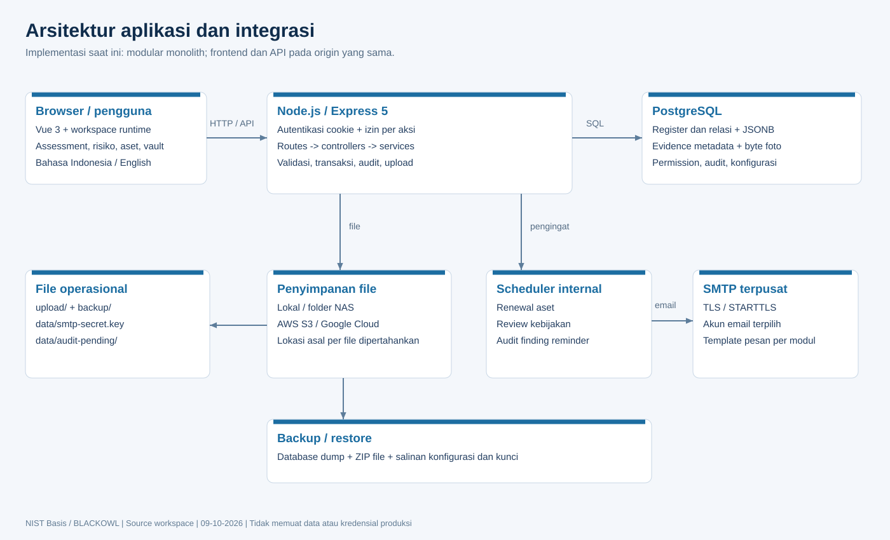
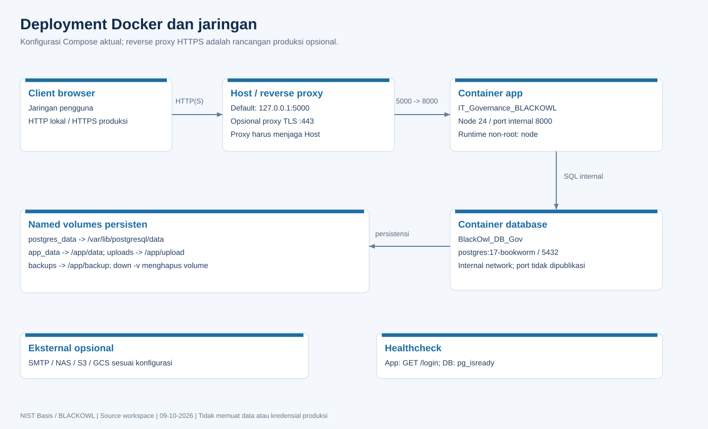

# Detail infrastruktur

## Topologi aktual

Aplikasi adalah modular monolith. Satu proses Express menyajikan halaman publik, workspace Vue hasil build, REST API, dan scheduler. PostgreSQL menyimpan data operasional. Penyimpanan file dapat lokal, folder shared/NAS, S3, atau GCS; SMTP bersifat opsional. Tidak terdapat Redis, message broker, service mesh, Kubernetes, atau load balancer bawaan dalam konfigurasi repository.

| Komponen | Implementasi | Lokasi konfigurasi |
| --- | --- | --- |
| Backend | Node.js; Express 5; pool `pg` | `src/server.js`, `src/app.js` |
| Frontend | Vue 3, Vite, Tailwind, Tiptap, DOMPurify | `frontend/client/`, `package.json` |
| Database | PostgreSQL; Docker major 17 | `compose.yaml`, `src/config/database.js` |
| Build Docker | Node 24 trixie slim, multi-stage | `Dockerfile` |
| Runtime Docker | Non-root `node`, client PostgreSQL 17 | `Dockerfile` |
| SMTP | Nodemailer, TLS/STARTTLS, akun terpusat | `src/services/smtpService.js` |
| Backup database | `pg_dump`, `pg_restore`; custom dump | `src/services/backupService.js` |
| Backup file | ZIP + manifest; baca storage sesuai asal file | `src/services/fileBackupService.js` |

## Docker, port, dan volume

Project Compose bernama `it_governance_blackowl`. Container app `IT_Governance_BLACKOWL`, container DB `BlackOwl_DB_Gov`. Aplikasi menunggu healthcheck database sebelum dijalankan; restart policy `unless-stopped`, app `init: true`, grace period 30 detik.

| Koneksi | Default | Keterangan |
| --- | --- | --- |
| Browser -> host | `127.0.0.1:5000` | `BLACKOWL_BIND_IP`, `BLACKOWL_PORT` dapat diubah |
| Host -> app | Host 5000 -> container 8000 | Server Express `PORT=8000` |
| App -> DB | `db:5432` | Port DB tidak dipublikasikan ke host |
| Dev frontend | 5173 -> backend 8000 | Proxy Vite untuk API dan aset terkait |
| SMTP | 587 default | Port akun dapat dikonfigurasi; STARTTLS default |

| Named volume | Mount | Isi yang harus persisten |
| --- | --- | --- |
| `postgres_data` | `/var/lib/postgresql/data` | Cluster PostgreSQL |
| `app_data` | `/app/data` | Seed, kunci SMTP, antrean audit |
| `uploads` | `/app/upload` | File lokal dan staging `.incoming` |
| `backups` | `/app/backup` | Dump database; ZIP pada `backup/files` |

`docker compose down` mempertahankan named volume. `down -v` menghapusnya. Folder NAS dan credential cloud harus dipasang/disediakan pada runtime jika digunakan; Compose saat ini belum memasangnya otomatis.

## Environment dan konfigurasi

Nilai berikut berasal dari konfigurasi kode atau contoh Docker; nilai rahasia deployment tidak dibaca atau dicantumkan.

| Variable | Default / fungsi |
| --- | --- |
| `NODE_ENV` | `development`; Docker `production` |
| `PORT` | 8000 |
| `DATABASE_URL` | Alternatif connection string pada pool utama |
| `DB_HOST`, `DB_PORT` | localhost, 5432; Compose host `db` |
| `DB_NAME`, `DB_USER` | Native `nist_basis`, `postgres`; Compose `BlackOwl_DB_Gov`, `blackowl` |
| `DB_PASSWORD` | Tidak ada password bawaan pada env config; wajib isi sesuai DB |
| `DB_SSL` | `true` untuk TLS; default false |
| `DB_SSL_REJECT_UNAUTHORIZED` | Verifikasi sertifikat aktif kecuali diset false |
| `DB_SSL_CA` | CA tambahan bila diperlukan |
| `SESSION_COOKIE_SECURE` | Production true kecuali eksplisit false; dev false kecuali true |
| `LOG_HTTP_REQUESTS` | true mengaktifkan log request; gunakan saat troubleshooting |
| `PG_DUMP_PATH`, `PG_RESTORE_PATH` | Override executable client PostgreSQL |
| `BLACKOWL_DB_PASSWORD` | Wajib untuk Compose |
| `BLACKOWL_PORT`, `BLACKOWL_BIND_IP` | 5000, 127.0.0.1 |
| `BLACKOWL_COOKIE_SECURE` | false untuk HTTP lokal; true untuk HTTPS |
| `TZ` | Compose Asia/Bangkok; reminder aset juga eksplisit menggunakan zona ini |
| AWS credential chain | Diberikan ke runtime server, tidak melalui UI |
| GCS Application Default Credentials | Diberikan ke runtime server, tidak melalui UI |

Pool database: maksimum 10 koneksi, idle timeout 30 detik, connection timeout 5 detik. Provisioning script masih membaca `DB_*`; ketika memilih `DATABASE_URL`, pastikan `DB_*` provisioning menunjuk database yang sama. Jangan mengasumsikan kedua mekanisme otomatis identik.

## Penyimpanan dan integrasi

Setelan aktif di `file_storage_settings`; setiap file menyimpan lokasi asal melalui `file_storage_locations`. Pergantian mode hanya menentukan lokasi upload baru, tidak memigrasikan file lama. Penggantian/download file lama tetap memakai lokasi asal. Kegagalan cloud tidak dialihkan diam-diam ke lokal.

SMTP menyimpan ciphertext AES-256-GCM di database; kunci berada di `data/smtp-secret.key`. Salinan database saja tidak cukup untuk mendekripsi password setelah pindah host. Pertahankan kunci yang sesuai dan ACL hanya untuk akun server.

## Kapasitas dan observabilitas

Healthcheck container app: `GET /login`, interval 30 detik, timeout 5 detik, start period 120 detik. Ini mengecek respons HTTP, bukan seluruh kesiapan DB. Database: `pg_isready` interval 5 detik. `/api/health` dan `/api/health/db` membutuhkan login.

Log tersedia pada stdout/stderr; audit di `audit_events`, fallback pada `data/audit-pending`. Scheduler aset memeriksa startup dan tiap jam; recovery audit mencoba ulang tiap 30 detik. Antrean audit maksimum 1000 file, 128 KiB per event; 100 event per putaran recovery.

**Rekomendasi produksi:** HTTPS melalui reverse proxy, database dan storage di jaringan terbatas, satu instance app sampai sesi/limiter menjadi shared, backup off-host, monitoring error dan kapasitas disk, serta proses restore rehearsal. Ukuran CPU/RAM/disk harus ditentukan lewat uji beban jumlah aset, catatan, upload, dan concurrency; repository tidak menetapkan sizing teruji atau target RTO/RPO.

Sumber: `compose.yaml`, `Dockerfile`, `docker.env.example`, `src/config/`, `src/services/storageService.js`, `cloudStorageService.js`, `smtpService.js`, `auditRecoveryService.js`.
