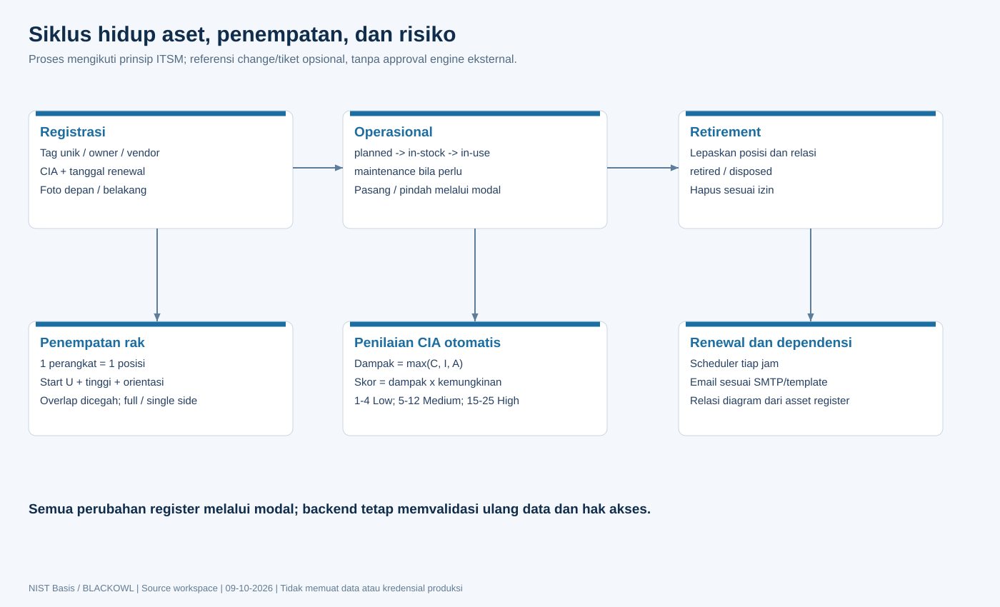

# Detail aplikasi dan struktur kode

## Lapisan dan tanggung jawab

| Lapisan | Path | Tanggung jawab |
| --- | --- | --- |
| Bootstrap | `src/server.js` | Provision DB, DDL/seed, folder, listen, scheduler |
| HTTP | `src/app.js` | Header, audit, parser, origin, session, routing, static, errors |
| Routes | `src/routes/` | Method/path, izin, parameter, multipart |
| Controllers | `src/controllers/` | Konversi request/response; sebagian modul memakai handler inline |
| Domain services | `src/services/` | Validasi bisnis, SQL, transaksi, storage, SMTP, backup |
| Shared contracts | `src/shared/` | Skor CIA, stencil diagram, aturan bersama |
| SQL | `database/` | Schema dasar, akun, ownership, migrasi relasi |
| Vue UI | `frontend/client/src/workspace/components/` | Tampilan fitur dan modal |
| Runtime fitur | `frontend/client/src/workspace/features/` | Logika DOM untuk fitur kompatibilitas |
| Runtime loader | `frontend/client/src/workspace/runtime.js` | Import raw JS berurutan dan shared scope |
| Generated assets | `frontend/public/vue/` | Hasil build; jangan diedit langsung |
| Quality tools | `test/`, `scripts/` | Unit, integrasi, browser, provisioning dan generator |

Frontend memakai dua pola: komponen Vue reaktif (antara lain Asset Management, Knowledge Notes, Threat Modelling) dan komponen DOM statis yang dikelola runtime lama. Urutan loader dan ID DOM merupakan kontrak kompatibilitas. Shared scope belum memberikan isolasi state per modul seperti modul Vue murni; refaktor bertahap memerlukan pengujian regresi.

## Inventaris fitur

| Modul | Kapabilitas dan hubungan |
| --- | --- |
| NIST CSF 2.0 | Kontrol, policy/practice score, catatan, attachment, ringkasan fungsi |
| NIST Privacy | Kontrol privasi dan assessment state tersendiri |
| Framework / ISO 27001 | Framework, kontrol, target kategori, security objectives |
| SOA | Applicability dan evidence kontrol ISO |
| Risk Management | Risk register, CIA 5x5, inherent/residual risk, treatment, dropdown, indikator |
| Risk Acceptance | Form keputusan, mitigasi, tanggal, bidang tanda tangan, export PDF |
| Asset Register | Identitas, lifecycle, owner, CIA, vendor pengelola opsional, related risk, renewal, foto |
| Rak Server | Rak 1-60 U, front/rear, full/single depth, install/move, drag/drop, daftar perangkat |
| Modelling Asset Register | Kanvas relasi berarah, palette register, multi-edge, zoom, versi layout |
| Knowledge Vault | Folder/subfolder, Markdown/editor, wiki-link/search, gambar, import/export ZIP/JSON |
| Policy Register | Kebijakan, item isi, lampiran, related notes, review, kalender, reminder |
| TPRM | Vendor assessment, risk register vendor, tiering, linked risks, status hubungan |
| Due Diligence / Templates | Respons kuesioner dan template sections/questions |
| Audit Finding Tracker | Hierarki audit -> finding -> followup/evidence, lampiran dan reminder |
| Personel / Sertifikasi | Pegawai terdaftar, supervisor, sertifikasi, roadmap dan layout |
| Uploaded Files | Daftar pusat semua modul, owner, pencarian, download, replacement, delete referensi |
| Administrasi | Akun, izin per aksi, SMTP, storage, audit, DB/file backup |

## Startup dan data sharing

Startup memprovision DB, menyiapkan schema/seed, memigrasikan store modul, membuat folder dan memulai scheduler. Startup melakukan penulisan database, sehingga tidak dipakai sebagai healthcheck dokumentasi. Assessment CSF ber-ID `default`; Privacy `privacy`. Keduanya merupakan dokumen bersama, bukan partition per pengguna. Aplikasi belum menyediakan tenancy/organisasi terisolasi secara menyeluruh.

## Autentikasi dan hak akses

Login memvalidasi bcrypt, membuat token acak 32 byte, dan menyimpan session di Map. Cookie `nist_session`: HttpOnly, SameSite=Lax, Secure sesuai konfigurasi; usia 8 jam. Login baru mengganti sesi sebelumnya untuk username sama. Restart, pengubahan password/role, penghapusan akun, dan restore DB mencabut sesi terkait sesuai service aplikasi.

Role: admin, approver, editor, viewer, user. Izin efektif memerlukan page allowed + Read + aksi Read/Create/Update/Delete. Admin bypass izin per halaman. Akun administratif, SMTP, storage, dan backup dibatasi admin. Evidence menambahkan ownership. Jangan menentukan hak akses hanya dari label role atau tombol yang terlihat.

## Asset Management / ITSM

Tag aset unik; status `planned`, `in-stock`, `in-use`, `maintenance`, `retired`, `disposed`. Referensi change/tiket opsional. Lepaskan posisi dan relasi sebelum retirement. Aset operasional harus dipensiunkan sebelum dihapus; status planned dapat dihapus untuk koreksi pencatatan.

Satu perangkat punya satu posisi fisik. `startUnit` dihitung dari bawah; rentang berakhir `startUnit + height - 1`. Kedalaman penuh memakai kedua sisi; perangkat satu sisi pada orientasi berbeda boleh memakai U sama. Backend menolak overlap, over-capacity, nonfisik (Software/License/Cloud), aset retired/disposed, serta pemasangan ulang tanpa konteks pemindahan. Drag/drop mengisi modal; DB baru berubah setelah Simpan.

Foto PNG/JPEG/WebP max 5 MiB per sisi. Byte asli tersimpan tanpa kompresi ulang; `object-fit: scale-down` menghindari pembesaran melampaui resolusi sumber. Foto panel ditampilkan sesuai orientasi dan tinggi U; foto rak keseluruhan adalah referensi terpisah. File tercatat di Uploaded Files; foto history tetap tersedia ketika foto aktif diganti lewat modul.

Relasi: `connects-to`, `depends-on`, `protects`, `balances`, `hosts`, `backs-up`. Tidak boleh self-link atau duplikat source/target/type. Multi-edge dan arah sebaliknya diperbolehkan; kurva diagram dibedakan. `depends-on` berarti sumber bergantung pada tujuan; `hosts` berarti sumber berjalan pada host tujuan. Analisis hanya menelusuri dependensi yang dicatat, bukan discovery jaringan atau simulasi gangguan.

Layout disimpan dengan version untuk mencegah overwrite edit bersamaan. Foto, aset, dan import disimpan atomik pada jalur terkait. Export JSON format `nist-basis-asset-management` versi 1: aset, rak, posisi, relasi, node, foto base64, dan template email. Import merge berdasarkan tag/nama; ID dipetakan ulang; konflik membatalkan transaksi. Vendor/risk eksternal harus sudah tersedia. Kredensial SMTP tidak dipindahkan oleh export ini.

Daftar aset newest-to-oldest menurut created_at; data lama menggunakan updated_at sebagai fallback migrasi. Daftar rak diurutkan nama; posisi berdasarkan U; relasi berdasarkan tipe. Filter hanya mengubah tampilan, bukan okupansi atau relasi tersimpan.

## Penilaian CIA 5x5

C, I, A dan likelihood berada pada skala 1-5. Impact = max(C,I,A); score = impact x likelihood. Score 1-4 Low, 5-12 Medium, 15-25 High. Tidak ada score 13/14 dari perkalian integer 1-5. Backend menghitung ulang; nilai impact/rating kiriman client tidak dipercaya untuk CIA lengkap. Risk Management menghitung residual rating dari residual likelihood x residual impact dengan batas yang sama. Data legacy tanpa CIA lengkap dapat memerlukan pengisian ulang; bukan dianggap sudah dinilai.

Related risk adalah tautan ke Risk Register, berbeda dari hasil CIA aset. Vendor pengelola mengacu TPRM dan opsional; vendor perangkat/manufacturer merupakan field informasi terpisah.

## Knowledge, policy, evidence, dan backup

Knowledge mempunyai title/folder unik tanpa mengubah isi Markdown. Update membutuhkan version. Import baru menyimpan file MD/TXT/JSON asli dan gambar ke evidence library bersama hasil parsing. Import historis yang tidak menyimpan original bytes tidak dapat direkonstruksi persis.

Policy dapat memilih note individual atau semua note di folder/subfolder. Subfolder tertutup default; pencarian membuka folder hasil. Pemilihan folder mencakup seluruh descendants, termasuk hasil yang tersembunyi oleh filter. Isi note terkait ikut pencarian policy. Link policy-note disimpan sebagai array JSONB, bukan FK individual.

Semua modul menggunakan library evidence terpusat. Admin dapat mengelola seluruh file; pengguna mengikuti ownership dan izin aksi. Hapus file di library dapat melepaskan referensi lintas modul; melepas satu attachment dilakukan melalui modul asal. File Backup tidak memulihkan record bisnis; Database Backup dan File Backup diperlukan bersama.

## Bahasa, UI, dan proses development

`frontend/public/i18n.js` menyimpan kamus ID/EN, dynamic patterns, pilihan `nist-basis-language`, dan event pergantian bahasa. Enum/value form harus eksplisit agar label terjemahan tidak mengubah data API. Konten pengguna menggunakan batas no-translate bila sesuai. Tambah/ubah fitur aset memakai modal, konfirmasi mutasi, busy lock dan pesan error.

Edit source, jalankan build, verifikasi unit dan browser, lalu restart backend bila ada perubahan server/migrasi. Lihat runbook untuk perintah. Prinsip industri yang dipakai: separation of concerns, validasi server, parameterized SQL, transaksi satu koneksi, least privilege, optimistic concurrency, audit, dan backup terpisah. Status approval pada register bukan workflow bertingkat atau tanda tangan digital kriptografis.
