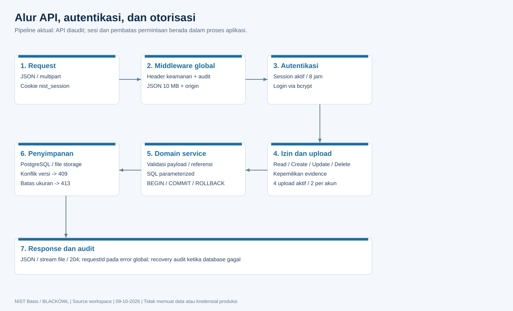

# Detail dan katalog API



## Kontrak umum

Base URL native `http://localhost:8000/api`, Compose `http://localhost:5000/api`. Gunakan origin deployment aktual dan HTTPS pada produksi. API belum memakai prefix versi `/v1`, bearer token/OAuth, atau kontrak OpenAPI tervalidasi bawaan.

Seluruh endpoint selain login/logout auth melewati sesi. Browser same-origin otomatis menyertakan cookie. Integrasi CLI menyimpan cookie jar dari login; jangan menaruh password atau cookie produksi di dokumentasi/log. Request JSON memakai `Content-Type: application/json`; upload memakai multipart dan boundary otomatis. Parser JSON dibatasi 10 MiB. Origin mutasi diperiksa ketika header Origin tersedia; cookie SameSite=Lax adalah kontrol tambahan, bukan token CSRF khusus.

Format response bervariasi per endpoint: array list, object record, `{ok:true}`, stream file/ZIP/PDF, atau 204 tanpa body. API menggunakan camelCase pada banyak register, tetapi rack placements/relations dan beberapa indikator masih mengembalikan snake_case. ID BIGSERIAL dapat berupa string dari `pg`; jangan mengasumsikan seluruh ID aman dikonversi ke Number. Asset/rack/relasi memakai UUID; Risk Register memakai string seperti `CSR - 001`.

| Status | Pemakaian |
| --- | --- |
| 200 | Baca, update, action sukses |
| 201 | Pembuatan resource pada handler yang menetapkannya |
| 204 | Hapus/logout/reset tertentu; jangan parse JSON |
| 400 | Payload, path, enum, referensi/form/upload tidak valid |
| 401 | Kredensial salah atau session tidak aktif |
| 403 | Izin, ownership, origin atau admin-only ditolak |
| 404 | Record/file/route tidak ditemukan |
| 409 | Constraint, record digunakan, collision atau konflik versi |
| 413 | Batas upload/body terlampaui |
| 429 | Rate limit atau kapasitas upload; dapat memuat Retry-After |
| 500 | Error global yang tidak diekspos rinci kepada client |
| 502/503 | Beberapa handler khusus dapat melaporkan kegagalan integrasi/restore; error global hanya meneruskan status 4xx |

Error global berbentuk `{"error":"...","requestId":"..."}`; handler lokal dapat hanya mengembalikan `error`. Jangan mengandalkan adanya requestId pada seluruh respons. Jangan melakukan retry mutasi secara buta setelah timeout; pastikan hasil sudah/belum tersimpan, terutama upload/import/email.

## Upload dan tipe konten

| Jalur | Multipart / batas aktual |
| --- | --- |
| `/files` | `file`; functionName, kind policy/practice, rejectDuplicate opsional; 100 MiB/file |
| `/files/batch` | `files`; efektif maksimum 20 file dari Multer walaupun route array cap 50; total 200 MiB selama streaming |
| `/files/*path` PUT | `file`, 100 MiB; ownership diperiksa sebelum parsing dan penulisan |
| Aset/foto rak | `front`, `rear`; 5 MiB/sisi, max 2 file; `data` JSON pada registrasi multipart, removeFront/removeRear boolean string |
| `/asset-management/import` | `file` JSON; maksimum 100 MiB |
| `/knowledge-notes/images` | `images` satu gambar; paths JSON array; 10 MiB/file |
| `/knowledge-notes/import-with-images` | images max100, documents max200; payload, paths, documentPaths; 10 MiB/file dan total stream 100 MiB |
| Audit finding | `file` max10, 10 MiB/file; data dan parent sesuai kind |
| DB/file restore | `backup`; 500 MiB/file; dump/JSON untuk DB, ZIP untuk file |

Semua multipart API dibatasi 4 request aktif per proses dan 2 per akun. Evidence umum menerima PDF/DOC/DOCX/PPT/PPTX/PNG/JPG/GIF/WebP sesuai MIME+extension. Foto aset memeriksa bytes gambar; validasi seluruh dokumen belum merupakan antivirus/malware scanning.

## Payload domain dan validasi

Field di bawah mencakup kontrak bisnis utama. Detail endpoint dan observed fields terdapat pada katalog/lampiran source; field bertanda derived dihitung backend. PUT pada beberapa register membutuhkan formulir lengkap, bukan PATCH universal.

| Resource | Field dan batas |
| --- | --- |
| Login | username 3-50 karakter `[A-Za-z0-9._-]`, password max72 byte UTF-8 |
| Profil | fullName; admin dapat mengubah security fields sesuai service; password memakai currentPassword/newPassword/confirmPassword |
| Izin | permissions array key dikenal; actions map boolean read/create/update/delete; write memerlukan read |
| Assessment | scores, policyScores, practiceScores, notes, attachments; state bersama default/privacy; attachments harus mereferensikan file yang boleh digunakan |
| Asset | tag/name/owner wajib max150; type/status/criticality enum; serial/vendor/model/location/service/changeReference max250; description max2000; ownerEmail max254; dates YYYY-MM-DD; reminderEnabled boolean, reminderDays integer0-365; managedVendorId string ID TPRM atau null; assetAssessment C/I/A/likelihood integer1-5 |
| Rack | name wajib max150, location wajib max250, units integer1-60 |
| Placement | assetId/rackId UUID, startUnit/height integer>=1, facing front/rear, fullDepth boolean; previousRackId harus cocok untuk pindah existing; changeReference opsional |
| Asset relation | sourceId/targetId UUID berbeda, type enum enam relasi, notes max1000, changeReference max250 |
| Asset diagram | nodes max500, setiap id UUID unik, x/y finite0-20000, version integer>=0; response version dinaikkan |
| Related risk | riskRegisterIds array unik max500; setiap riskId string nonkosong max150 dan benar-benar terdaftar |
| Risk Register | riskCategory/effectedAsset/deviceName/identificationRisk/likelihood/impact wajib sesuai validator; C/I/A1-5; impact/value/rating derived bila CIA lengkap; riskId dibuat backend; riskOwner/treatment/deadline/residual fields/comment/ref opsional sesuai service |
| Risk dropdown | fieldName dari kategori/asset/device/owner/treatment, optionValue, sortOrder; nama/type yang sudah dipakai tidak dapat diubah/hapus |
| Risk indicator | indicatorType, label wajib; score, description, sortOrder |
| Risk acceptance | requestorName, assetName, department, riskDescription, benefitJustification, mitigationPlan; businessOwnerDecision temporary/one_year/denied; cisDecision approved/denied/conditional; dates dan signature fields |
| TPRM questionnaire | vendorName wajib; status Draft/In progress/Complete/Expired/Final; result Pending/Approved/Approved with Conditions/Rejected; reviewDate, reviewer, notes, responses JSON |
| TPRM register | thirdParty/serviceDependency wajib; questionnaireId harus terdaftar dan nama vendor cocok; riskLevel tiga tier; assessmentStatus Not started/In progress/Complete/Accepted; relationshipStatus Active/Offboarded/Expired/Terminated; riskRegisterIds, dueDiligenceAssessment, nextReview, notes |
| Questionnaire template | name dan sections; sections berupa pasangan `[judul, [pertanyaan...]]`; judul dan minimal satu pertanyaan tiap section |
| Policy | title/category/owner/reviewCycle/approvalStatus wajib saat create; lastReview, attachmentName/Path/Type, notes, items subtitle/content; relatedNoteIds max10000 positive IDs |
| Knowledge note | title wajib max200 tanpa karakter filename/wiki-link khusus; content max1.000.000 byte; folder max500 path valid; update version integer>=1 |
| Knowledge folder | path, atau source/destination untuk move; delete mode empty/all; root tidak boleh dihapus, self-descendant move ditolak |
| Threat model | name max200; diagram nodes max500/edges max1000; node finite coordinates, width>=60,height>=40; IDs unik; edges referensi node berbeda; threats STRIDE dengan severity/status/mitigation; update version |
| Audit finding | kind audit/finding/followup/evidence; parentId mengikuti hierarki; title max200 wajib, reference max100, owner max160, description max10000; status Open/In progress/Closed; severity Low/Medium/High/Critical; dueDate valid |
| Certification | personnelId pegawai terdaftar wajib, certificationName wajib; issuer/referenceUrl HTTP(S), certificationLevel, status, dates, notes, layout fields |
| SMTP | host/username/from max254 tanpa CRLF; port1-65535; security tls/starttls; password opsional max4096; clearPassword; akun UUID/default; test to/smtpAccountId |
| Storage | mode local/shared/s3/gcs; shared directory absolut khusus di luar project/root; cloud bucket/prefix, region S3 wajib, projectId GCS opsional; credentials dari runtime |

## Contoh integrasi

Gunakan akun pengujian berizin. Contoh berikut bersifat dokumentasi dan tidak dijalankan terhadap data produksi.

```bash
curl -c cookies.txt -H 'Content-Type: application/json' \
  -d '{"username":"test.user","password":"REPLACE_WITH_TEST_PASSWORD"}' \
  http://localhost:8000/api/auth/login
curl -b cookies.txt http://localhost:8000/api/auth/me
curl -b cookies.txt http://localhost:8000/api/asset-management/assets
curl -b cookies.txt 'http://localhost:8000/api/files?details=true'
```

Contoh create aset (JSON; bila foto disertakan kirim payload ini sebagai multipart field `data`):

```json
{"tag":"SRV-DEMO-001","name":"Server Demo","type":"Server","status":"planned","owner":"IT Operations","ownerEmail":"owner@example.com","criticality":"medium","reminderEnabled":false,"reminderDays":30,"managedVendorId":null,"assetAssessment":{"confidentiality":3,"integrity":4,"availability":4,"likelihood":3}}
```

Response assetAssessment dihitung ulang: impact4, score12, level medium. Jangan mengirim terjemahan enum seperti Direncanakan sebagai status API; gunakan `planned`.

Contoh posisi baru; ganti ID dengan record yang sudah dibuat:

```json
{"assetId":"00000000-0000-4000-8000-000000000001","rackId":"00000000-0000-4000-8000-000000000002","startUnit":20,"height":2,"facing":"front","fullDepth":true,"changeReference":""}
```

Saat pindah aset existing, tambahkan previousRackId dari posisi terbaru. Konflik memberi 409, lalu muat ulang posisi. Diagram dan catatan membutuhkan version terbaru sebelum update. File path wildcard bisa memiliki beberapa segmen; encode tiap segmen URL dan jangan menerima path absolut atau `..`.

## Seluruh endpoint terdaftar

Kolom izin mencantumkan guard route yang terbaca. Guard dinamis, ownership, dan validasi service tetap berlaku. Observed fields hanyalah pembacaan request eksplisit, bukan daftar field wajib/schema lengkap; gunakan tabel domain dan lampiran implementasi.


### authRoutes

| Method | Endpoint | Izin | Input terbaca | Source |
| --- | --- | --- | --- | --- |
| POST | `/api/auth/login` | public | Kontrak domain / handler | src/routes/authRoutes.js:14 |
| POST | `/api/auth/logout` | public | Kontrak domain / handler | src/routes/authRoutes.js:15 |
| GET | `/api/auth/me` | session; pemeriksaan tambahan di handler/service (lihat source) | Kontrak domain / handler | src/routes/authRoutes.js:16 |
| PUT | `/api/auth/me` | session; pemeriksaan tambahan di handler/service (lihat source) | Kontrak domain / handler | src/routes/authRoutes.js:17 |
| PUT | `/api/auth/me/password` | session; pemeriksaan tambahan di handler/service (lihat source) | Kontrak domain / handler | src/routes/authRoutes.js:18 |
| GET | `/api/auth/users` | admin | Kontrak domain / handler | src/routes/authRoutes.js:19 |
| POST | `/api/auth/users` | admin | Kontrak domain / handler | src/routes/authRoutes.js:20 |
| PUT | `/api/auth/users/:id` | admin | path: id | src/routes/authRoutes.js:21 |
| DELETE | `/api/auth/users/:id` | admin | path: id | src/routes/authRoutes.js:22 |
| GET | `/api/auth/permissions` | admin | Kontrak domain / handler | src/routes/authRoutes.js:23 |
| PUT | `/api/auth/permissions/:role` | admin | path: role | src/routes/authRoutes.js:24 |

### assetManagementRoutes

| Method | Endpoint | Izin | Input terbaca | Source |
| --- | --- | --- | --- | --- |
| GET | `/api/asset-management/export` | asset-register + server-racks + asset-modelling: read | Kontrak domain / handler | src/routes/assetManagementRoutes.js:17 |
| POST | `/api/asset-management/import` | asset-register + server-racks + asset-modelling: read/create/update; TPRM/risk read jika ada referensi | Kontrak domain / handler | src/routes/assetManagementRoutes.js:18 |
| GET | `/api/asset-management/reminder-settings` | asset-register:read | Kontrak domain / handler | src/routes/assetManagementRoutes.js:26 |
| PUT | `/api/asset-management/reminder-settings` | asset-register:update | Kontrak domain / handler | src/routes/assetManagementRoutes.js:27 |
| GET | `/api/asset-management/vendor-catalog` | asset-register:read + tprm-register:read | Kontrak domain / handler | src/routes/assetManagementRoutes.js:28 |
| GET | `/api/asset-management/risk-catalog` | asset-register:read + risk-management:read | Kontrak domain / handler | src/routes/assetManagementRoutes.js:29 |
| GET | `/api/asset-management/diagram` | asset-modelling:read | Kontrak domain / handler | src/routes/assetManagementRoutes.js:30 |
| PUT | `/api/asset-management/diagram` | asset-modelling:update | Kontrak domain / handler | src/routes/assetManagementRoutes.js:31 |
| GET | `/api/asset-management/assets` | asset-register:read | Kontrak domain / handler | src/routes/assetManagementRoutes.js:35 |
| DELETE | `/api/asset-management/assets/:id` | asset-register:delete | path: id | src/routes/assetManagementRoutes.js:36 |
| GET | `/api/asset-management/racks` | server-racks:read | Kontrak domain / handler | src/routes/assetManagementRoutes.js:35 |
| DELETE | `/api/asset-management/racks/:id` | server-racks:delete | path: id | src/routes/assetManagementRoutes.js:36 |
| GET | `/api/asset-management/placements` | server-racks:read | Kontrak domain / handler | src/routes/assetManagementRoutes.js:35 |
| DELETE | `/api/asset-management/placements/:id` | server-racks:delete | path: id | src/routes/assetManagementRoutes.js:36 |
| GET | `/api/asset-management/relations` | asset-modelling:read | Kontrak domain / handler | src/routes/assetManagementRoutes.js:35 |
| DELETE | `/api/asset-management/relations/:id` | asset-modelling:delete | path: id | src/routes/assetManagementRoutes.js:36 |
| PUT | `/api/asset-management/assets/:id/related-risks` | asset-register:update + risk-management:read | body: riskRegisterIds; path: id | src/routes/assetManagementRoutes.js:44 |
| POST | `/api/asset-management/assets` | asset-register:create | Kontrak domain / handler | src/routes/assetManagementRoutes.js:45 |
| PUT | `/api/asset-management/assets/:id` | asset-register:update | path: id | src/routes/assetManagementRoutes.js:46 |
| POST | `/api/asset-management/racks` | server-racks:create | Kontrak domain / handler | src/routes/assetManagementRoutes.js:48 |
| PUT | `/api/asset-management/racks/:id` | server-racks:update | path: id | src/routes/assetManagementRoutes.js:49 |
| GET | `/api/asset-management/catalog` | session; pemeriksaan tambahan di handler/service (lihat source) | Kontrak domain / handler | src/routes/assetManagementRoutes.js:51 |
| PUT | `/api/asset-management/placements` | server-racks:update | Kontrak domain / handler | src/routes/assetManagementRoutes.js:52 |
| POST | `/api/asset-management/relations` | asset-modelling:create | Kontrak domain / handler | src/routes/assetManagementRoutes.js:53 |
| PUT | `/api/asset-management/relations/:id` | asset-modelling:update | path: id | src/routes/assetManagementRoutes.js:54 |
| GET | `/api/asset-management/photos` | session; pemeriksaan tambahan di handler/service (lihat source) | Kontrak domain / handler | src/routes/assetManagementRoutes.js:55 |
| GET | `/api/asset-management/photos/:kind/:id/:side` | assets: asset-register; racks: server-racks; read foto aset juga via server-racks | path: kind, id, side | src/routes/assetManagementRoutes.js:57 |
| PUT | `/api/asset-management/photos/:kind/:id` | assets: asset-register; racks: server-racks; read foto aset juga via server-racks | path: kind, id | src/routes/assetManagementRoutes.js:58 |

### knowledgeNoteRoutes

| Method | Endpoint | Izin | Input terbaca | Source |
| --- | --- | --- | --- | --- |
| GET | `/api/knowledge-notes` | knowledge-notes:read | Kontrak domain / handler | src/routes/knowledgeNoteRoutes.js:29 |
| GET | `/api/knowledge-notes/folders` | knowledge-notes:read | Kontrak domain / handler | src/routes/knowledgeNoteRoutes.js:30 |
| GET | `/api/knowledge-notes/images` | knowledge-notes:read | Kontrak domain / handler | src/routes/knowledgeNoteRoutes.js:31 |
| GET | `/api/knowledge-notes/images/:id` | knowledge-notes:read | path: id | src/routes/knowledgeNoteRoutes.js:32 |
| POST | `/api/knowledge-notes/images` | knowledge-notes:create | Kontrak domain / handler | src/routes/knowledgeNoteRoutes.js:36 |
| PUT | `/api/knowledge-notes/images/:id` | knowledge-notes:update | body: folder; path: id | src/routes/knowledgeNoteRoutes.js:40 |
| DELETE | `/api/knowledge-notes/images/:id` | knowledge-notes:delete | path: id | src/routes/knowledgeNoteRoutes.js:41 |
| POST | `/api/knowledge-notes/import-with-images` | knowledge-notes:create | body: payload, documentPaths | src/routes/knowledgeNoteRoutes.js:42 |
| POST | `/api/knowledge-notes/folders` | knowledge-notes:create | body: path | src/routes/knowledgeNoteRoutes.js:52 |
| PUT | `/api/knowledge-notes/folders` | knowledge-notes:update | body: source, destination | src/routes/knowledgeNoteRoutes.js:53 |
| DELETE | `/api/knowledge-notes/folders` | knowledge-notes:delete | body: path, mode | src/routes/knowledgeNoteRoutes.js:54 |
| GET | `/api/knowledge-notes/export` | knowledge-notes:read | Kontrak domain / handler | src/routes/knowledgeNoteRoutes.js:55 |
| POST | `/api/knowledge-notes/import` | knowledge-notes:create | body: notes, folders | src/routes/knowledgeNoteRoutes.js:68 |
| POST | `/api/knowledge-notes` | knowledge-notes:create | Kontrak domain / handler | src/routes/knowledgeNoteRoutes.js:69 |
| PUT | `/api/knowledge-notes/:id` | knowledge-notes:update | path: id | src/routes/knowledgeNoteRoutes.js:70 |
| DELETE | `/api/knowledge-notes/:id` | knowledge-notes:delete | path: id | src/routes/knowledgeNoteRoutes.js:71 |

### threatModelRoutes

| Method | Endpoint | Izin | Input terbaca | Source |
| --- | --- | --- | --- | --- |
| POST | `/api/threat-modelling/validate` | threat-modelling:read | Kontrak domain / handler | src/routes/threatModelRoutes.js:4 |
| GET | `/api/threat-modelling` | threat-modelling:read | Kontrak domain / handler | src/routes/threatModelRoutes.js:5 |
| POST | `/api/threat-modelling` | threat-modelling:create | Kontrak domain / handler | src/routes/threatModelRoutes.js:6 |
| PUT | `/api/threat-modelling/:id` | threat-modelling:update | path: id | src/routes/threatModelRoutes.js:7 |
| DELETE | `/api/threat-modelling/:id` | threat-modelling:delete | path: id | src/routes/threatModelRoutes.js:8 |

### auditFindingRoutes

| Method | Endpoint | Izin | Input terbaca | Source |
| --- | --- | --- | --- | --- |
| GET | `/api/audit-finding-tracker/reminder-settings` | admin | Kontrak domain / handler | src/routes/auditFindingRoutes.js:9 |
| PUT | `/api/audit-finding-tracker/reminder-settings` | admin | Kontrak domain / handler | src/routes/auditFindingRoutes.js:10 |
| POST | `/api/audit-finding-tracker/reminder-settings/test` | admin | body: to | src/routes/auditFindingRoutes.js:11 |
| GET | `/api/audit-finding-tracker` | audit-finding-tracker:read | Kontrak domain / handler | src/routes/auditFindingRoutes.js:13 |
| GET | `/api/audit-finding-tracker/available-files` | session; pemeriksaan tambahan di handler/service (lihat source) | Kontrak domain / handler | src/routes/auditFindingRoutes.js:14 |
| GET | `/api/audit-finding-tracker/:id/download` | audit-finding-tracker:read | query: path; path: id | src/routes/auditFindingRoutes.js:19 |
| POST | `/api/audit-finding-tracker` | audit-finding-tracker:create | body: kind, parentId | src/routes/auditFindingRoutes.js:23 |
| PUT | `/api/audit-finding-tracker/:id` | audit-finding-tracker:update | body: kind; path: id | src/routes/auditFindingRoutes.js:24 |
| DELETE | `/api/audit-finding-tracker/:id` | audit-finding-tracker:delete | path: id | src/routes/auditFindingRoutes.js:25 |

### smtpRoutes

| Method | Endpoint | Izin | Input terbaca | Source |
| --- | --- | --- | --- | --- |
| GET | `/api/smtp-settings/accounts` | admin | Kontrak domain / handler | src/routes/smtpRoutes.js:9 |
| POST | `/api/smtp-settings/accounts` | admin | Kontrak domain / handler | src/routes/smtpRoutes.js:10 |
| PUT | `/api/smtp-settings/accounts/:id` | admin | path: id | src/routes/smtpRoutes.js:11 |
| GET | `/api/smtp-settings` | admin | Kontrak domain / handler | src/routes/smtpRoutes.js:12 |
| PUT | `/api/smtp-settings` | admin | Kontrak domain / handler | src/routes/smtpRoutes.js:13 |
| POST | `/api/smtp-settings/test` | admin | body: to, smtpAccountId | src/routes/smtpRoutes.js:14 |

### assessmentRoutes

| Method | Endpoint | Izin | Input terbaca | Source |
| --- | --- | --- | --- | --- |
| GET | `/api/assessment` | assessment:read | Kontrak domain / handler | src/routes/assessmentRoutes.js:6 |
| PUT | `/api/assessment` | assessment:update | body: attachments | src/routes/assessmentRoutes.js:7 |
| POST | `/api/assessment/reset` | assessment:delete | Kontrak domain / handler | src/routes/assessmentRoutes.js:8 |

### fileRoutes

| Method | Endpoint | Izin | Input terbaca | Source |
| --- | --- | --- | --- | --- |
| GET | `/api/files` | files:read | query: details | src/routes/fileRoutes.js:12 |
| POST | `/api/files` | files:create | body: functionName, kind, rejectDuplicate | src/routes/fileRoutes.js:13 |
| POST | `/api/files/batch` | files:create | body: functionName, kind, rejectDuplicate | src/routes/fileRoutes.js:14 |
| GET | `/api/files/access/*path` | session; pemeriksaan tambahan di handler/service (lihat source) | path: path | src/routes/fileRoutes.js:16 |
| GET | `/api/files/open/*path` | session; pemeriksaan tambahan di handler/service (lihat source) | path: path | src/routes/fileRoutes.js:17 |
| GET | `/api/files/open-page/*path` | session; pemeriksaan tambahan di handler/service (lihat source) | path: path | src/routes/fileRoutes.js:18 |
| PUT | `/api/files/open-page/*path` | session; pemeriksaan tambahan di handler/service (lihat source) | body: openPage; path: path | src/routes/fileRoutes.js:19 |
| PUT | `/api/files/*path` | session; pemeriksaan tambahan di handler/service (lihat source) | path: path | src/routes/fileRoutes.js:20 |
| GET | `/api/files/*path` | session; pemeriksaan tambahan di handler/service (lihat source) | path: path | src/routes/fileRoutes.js:25 |
| DELETE | `/api/files/*path` | session; pemeriksaan tambahan di handler/service (lihat source) | query: library; path: path | src/routes/fileRoutes.js:26 |

### storageRoutes

| Method | Endpoint | Izin | Input terbaca | Source |
| --- | --- | --- | --- | --- |
| GET | `/api/storage-settings` | admin | Kontrak domain / handler | src/routes/storageRoutes.js:6 |
| PUT | `/api/storage-settings` | admin | Kontrak domain / handler | src/routes/storageRoutes.js:7 |
| POST | `/api/storage-settings/test` | admin | Kontrak domain / handler | src/routes/storageRoutes.js:8 |

### csfRoutes

| Method | Endpoint | Izin | Input terbaca | Source |
| --- | --- | --- | --- | --- |
| GET | `/api/csf` | csf:read | Kontrak domain / handler | src/routes/csfRoutes.js:7 |
| POST | `/api/csf` | csf:create | Kontrak domain / handler | src/routes/csfRoutes.js:8 |
| PUT | `/api/csf/:id` | csf:update | path: id | src/routes/csfRoutes.js:9 |
| DELETE | `/api/csf/:id` | csf:delete | path: id | src/routes/csfRoutes.js:10 |

### privacyRoutes

| Method | Endpoint | Izin | Input terbaca | Source |
| --- | --- | --- | --- | --- |
| GET | `/api/privacy` | privacy:read | Kontrak domain / handler | src/routes/privacyRoutes.js:7 |
| POST | `/api/privacy` | privacy:create | Kontrak domain / handler | src/routes/privacyRoutes.js:8 |
| GET | `/api/privacy/assessment` | privacy-assessment:read | Kontrak domain / handler | src/routes/privacyRoutes.js:9 |
| PUT | `/api/privacy/assessment` | privacy-assessment:update | body: attachments | src/routes/privacyRoutes.js:10 |
| POST | `/api/privacy/assessment/reset` | privacy-assessment:delete | Kontrak domain / handler | src/routes/privacyRoutes.js:11 |
| PUT | `/api/privacy/:id` | privacy:update | path: id | src/routes/privacyRoutes.js:12 |
| DELETE | `/api/privacy/:id` | privacy:delete | path: id | src/routes/privacyRoutes.js:13 |

### frameworkRoutes

| Method | Endpoint | Izin | Input terbaca | Source |
| --- | --- | --- | --- | --- |
| GET | `/api/frameworks` | framework:read | Kontrak domain / handler | src/routes/frameworkRoutes.js:8 |
| POST | `/api/frameworks` | framework:create | Kontrak domain / handler | src/routes/frameworkRoutes.js:9 |
| GET | `/api/frameworks/:frameworkId/controls` | key framework/assessment dinamis:read | path: frameworkId | src/routes/frameworkRoutes.js:10 |
| GET | `/api/frameworks/:frameworkId/targets` | key framework/assessment dinamis:read | path: frameworkId | src/routes/frameworkRoutes.js:11 |
| PUT | `/api/frameworks/:frameworkId/targets/:category` | key framework/assessment dinamis:update | body: targetScore; path: frameworkId, category | src/routes/frameworkRoutes.js:12 |
| GET | `/api/frameworks/iso27001/objectives` | iso27001:read | query: year | src/routes/frameworkRoutes.js:13 |
| POST | `/api/frameworks/iso27001/assessment/reset` | iso27001:delete | Kontrak domain / handler | src/routes/frameworkRoutes.js:14 |
| POST | `/api/frameworks/iso27001/objectives` | iso27001:create | Kontrak domain / handler | src/routes/frameworkRoutes.js:15 |
| PUT | `/api/frameworks/iso27001/objectives/:id` | iso27001:update | path: id | src/routes/frameworkRoutes.js:16 |
| DELETE | `/api/frameworks/iso27001/objectives/:id` | iso27001:delete | path: id | src/routes/frameworkRoutes.js:17 |
| PUT | `/api/frameworks/:frameworkId/controls/:code/evidence` | framework / iso27001 / iso27001-soa:update | body: evidence; path: frameworkId, code | src/routes/frameworkRoutes.js:18 |
| POST | `/api/frameworks/:frameworkId/controls` | key framework/assessment dinamis:create | path: frameworkId | src/routes/frameworkRoutes.js:19 |
| PUT | `/api/frameworks/:frameworkId/controls/:code` | key framework/assessment dinamis:update | path: frameworkId, code | src/routes/frameworkRoutes.js:20 |
| DELETE | `/api/frameworks/:frameworkId/controls/:code` | key framework/assessment dinamis:delete | path: frameworkId, code | src/routes/frameworkRoutes.js:21 |

### riskAcceptanceRoutes

| Method | Endpoint | Izin | Input terbaca | Source |
| --- | --- | --- | --- | --- |
| GET | `/api/risk-acceptance` | risk-acceptance:read | Kontrak domain / handler | src/routes/riskAcceptanceRoutes.js:6 |
| POST | `/api/risk-acceptance` | risk-acceptance:create | Kontrak domain / handler | src/routes/riskAcceptanceRoutes.js:7 |
| GET | `/api/risk-acceptance/:id/export/pdf` | risk-acceptance:read | path: id | src/routes/riskAcceptanceRoutes.js:8 |
| PUT | `/api/risk-acceptance/:id` | risk-acceptance:update | path: id | src/routes/riskAcceptanceRoutes.js:9 |
| DELETE | `/api/risk-acceptance/:id` | risk-acceptance:delete | path: id | src/routes/riskAcceptanceRoutes.js:10 |

### riskManagementRoutes

| Method | Endpoint | Izin | Input terbaca | Source |
| --- | --- | --- | --- | --- |
| GET | `/api/risk-management/dashboard` | risk-management:read | Kontrak domain / handler | src/routes/riskManagementRoutes.js:5 |
| GET | `/api/risk-management/indicators` | risk-management:read | Kontrak domain / handler | src/routes/riskManagementRoutes.js:6 |
| GET | `/api/risk-management/dropdowns` | risk-management:read | Kontrak domain / handler | src/routes/riskManagementRoutes.js:7 |
| POST | `/api/risk-management/dropdowns` | risk-management:create | Kontrak domain / handler | src/routes/riskManagementRoutes.js:8 |
| PUT | `/api/risk-management/dropdowns/:id` | risk-management:update | path: id | src/routes/riskManagementRoutes.js:9 |
| DELETE | `/api/risk-management/dropdowns/:id` | risk-management:delete | path: id | src/routes/riskManagementRoutes.js:10 |
| POST | `/api/risk-management/indicators` | risk-management:create | Kontrak domain / handler | src/routes/riskManagementRoutes.js:11 |
| PUT | `/api/risk-management/indicators/:id` | risk-management:update | path: id | src/routes/riskManagementRoutes.js:12 |
| DELETE | `/api/risk-management/indicators/:id` | risk-management:delete | path: id | src/routes/riskManagementRoutes.js:13 |
| GET | `/api/risk-management` | risk-management:read | Kontrak domain / handler | src/routes/riskManagementRoutes.js:14 |
| POST | `/api/risk-management` | risk-management:create | Kontrak domain / handler | src/routes/riskManagementRoutes.js:15 |
| PUT | `/api/risk-management/:id` | risk-management:update | path: id | src/routes/riskManagementRoutes.js:16 |
| DELETE | `/api/risk-management/:id` | risk-management:delete | path: id | src/routes/riskManagementRoutes.js:17 |
| DELETE | `/api/risk-management` | risk-management:delete | Kontrak domain / handler | src/routes/riskManagementRoutes.js:18 |

### personnelCertificationRoutes

| Method | Endpoint | Izin | Input terbaca | Source |
| --- | --- | --- | --- | --- |
| GET | `/api/personnel-certifications` | personnel-certification:read | Kontrak domain / handler | src/routes/personnelCertificationRoutes.js:5 |
| GET | `/api/personnel-certifications/organization-personnel` | personnel-certification:read | Kontrak domain / handler | src/routes/personnelCertificationRoutes.js:6 |
| POST | `/api/personnel-certifications/organization-personnel` | personnel-certification:create | Kontrak domain / handler | src/routes/personnelCertificationRoutes.js:7 |
| PUT | `/api/personnel-certifications/organization-personnel/:personnelId` | personnel-certification:update | path: personnelId | src/routes/personnelCertificationRoutes.js:8 |
| DELETE | `/api/personnel-certifications/organization-personnel/:personnelId` | personnel-certification:delete | path: personnelId | src/routes/personnelCertificationRoutes.js:9 |
| POST | `/api/personnel-certifications` | personnel-certification:create | Kontrak domain / handler | src/routes/personnelCertificationRoutes.js:11 |
| PUT | `/api/personnel-certifications/:id/layout` | personnel-certification:update | path: id | src/routes/personnelCertificationRoutes.js:12 |
| PUT | `/api/personnel-certifications/:id` | personnel-certification:update | path: id | src/routes/personnelCertificationRoutes.js:13 |
| DELETE | `/api/personnel-certifications/:id` | personnel-certification:delete | path: id | src/routes/personnelCertificationRoutes.js:14 |

### certificationRoadmapCatalogRoutes

| Method | Endpoint | Izin | Input terbaca | Source |
| --- | --- | --- | --- | --- |
| GET | `/api/certification-roadmap-catalog` | personnel-certification:read | Kontrak domain / handler | src/routes/certificationRoadmapCatalogRoutes.js:5 |
| POST | `/api/certification-roadmap-catalog` | personnel-certification:create | Kontrak domain / handler | src/routes/certificationRoadmapCatalogRoutes.js:6 |
| PUT | `/api/certification-roadmap-catalog/:id` | personnel-certification:update | path: id | src/routes/certificationRoadmapCatalogRoutes.js:7 |
| DELETE | `/api/certification-roadmap-catalog/:id` | personnel-certification:delete | path: id | src/routes/certificationRoadmapCatalogRoutes.js:8 |

### tprmRoutes

| Method | Endpoint | Izin | Input terbaca | Source |
| --- | --- | --- | --- | --- |
| GET | `/api/tprm` | tprm-register:read | Kontrak domain / handler | src/routes/tprmRoutes.js:5 |
| POST | `/api/tprm` | tprm-register:create | Kontrak domain / handler | src/routes/tprmRoutes.js:6 |
| PUT | `/api/tprm/:id` | tprm-register:update | path: id | src/routes/tprmRoutes.js:7 |
| DELETE | `/api/tprm/:id` | tprm-register:delete | path: id | src/routes/tprmRoutes.js:8 |

### tprmQuestionnaireRoutes

| Method | Endpoint | Izin | Input terbaca | Source |
| --- | --- | --- | --- | --- |
| GET | `/api/tprm-questionnaires` | tprm-questionnaire:read | Kontrak domain / handler | src/routes/tprmQuestionnaireRoutes.js:5 |
| POST | `/api/tprm-questionnaires` | tprm-questionnaire:create | Kontrak domain / handler | src/routes/tprmQuestionnaireRoutes.js:6 |
| PUT | `/api/tprm-questionnaires/:id` | tprm-questionnaire:update | path: id | src/routes/tprmQuestionnaireRoutes.js:7 |
| PUT | `/api/tprm-questionnaires/:id/documents` | tprm-questionnaire:update | path: id | src/routes/tprmQuestionnaireRoutes.js:8 |
| DELETE | `/api/tprm-questionnaires/:id` | tprm-questionnaire:delete | path: id | src/routes/tprmQuestionnaireRoutes.js:9 |

### questionnaireTemplateRoutes

| Method | Endpoint | Izin | Input terbaca | Source |
| --- | --- | --- | --- | --- |
| GET | `/api/questionnaire-templates` | questionnaire-templates:read | Kontrak domain / handler | src/routes/questionnaireTemplateRoutes.js:6 |
| POST | `/api/questionnaire-templates` | questionnaire-templates:create | Kontrak domain / handler | src/routes/questionnaireTemplateRoutes.js:15 |
| PUT | `/api/questionnaire-templates/:id` | questionnaire-templates:update | path: id | src/routes/questionnaireTemplateRoutes.js:24 |
| DELETE | `/api/questionnaire-templates/:id` | questionnaire-templates:delete | path: id | src/routes/questionnaireTemplateRoutes.js:33 |

### policyRegisterRoutes

| Method | Endpoint | Izin | Input terbaca | Source |
| --- | --- | --- | --- | --- |
| GET | `/api/policy-register/reminder-settings` | admin | Kontrak domain / handler | src/routes/policyRegisterRoutes.js:15 |
| PUT | `/api/policy-register/reminder-settings` | admin | Kontrak domain / handler | src/routes/policyRegisterRoutes.js:16 |
| POST | `/api/policy-register/reminder-settings/test` | admin | body: to | src/routes/policyRegisterRoutes.js:17 |
| GET | `/api/policy-register/dropdowns` | policy-register:read | Kontrak domain / handler | src/routes/policyRegisterRoutes.js:25 |
| POST | `/api/policy-register/dropdowns` | policy-register:create | Kontrak domain / handler | src/routes/policyRegisterRoutes.js:26 |
| PUT | `/api/policy-register/dropdowns/:id` | policy-register:update | path: id | src/routes/policyRegisterRoutes.js:27 |
| DELETE | `/api/policy-register/dropdowns/:id` | policy-register:delete | path: id | src/routes/policyRegisterRoutes.js:28 |
| GET | `/api/policy-register/:id/items` | policy-register:read | path: id | src/routes/policyRegisterRoutes.js:30 |
| POST | `/api/policy-register/:id/items` | policy-register:create | path: id | src/routes/policyRegisterRoutes.js:31 |
| PUT | `/api/policy-register/:id/items/:itemId` | policy-register:update | path: id, itemId | src/routes/policyRegisterRoutes.js:32 |
| DELETE | `/api/policy-register/:id/items/:itemId` | policy-register:delete | path: id, itemId | src/routes/policyRegisterRoutes.js:33 |
| GET | `/api/policy-register` | policy-register:read | Kontrak domain / handler | src/routes/policyRegisterRoutes.js:36 |
| POST | `/api/policy-register` | policy-register:create | Kontrak domain / handler | src/routes/policyRegisterRoutes.js:51 |
| PUT | `/api/policy-register/:id` | policy-register:update | path: id | src/routes/policyRegisterRoutes.js:59 |
| DELETE | `/api/policy-register/:id` | policy-register:delete | path: id | src/routes/policyRegisterRoutes.js:67 |

### auditRoutes

| Method | Endpoint | Izin | Input terbaca | Source |
| --- | --- | --- | --- | --- |
| GET | `/api/audit` | admin | Kontrak domain / handler | src/routes/auditRoutes.js:6 |
| POST | `/api/audit/activity` | session; pemeriksaan tambahan di handler/service (lihat source) | Kontrak domain / handler | src/routes/auditRoutes.js:11 |

### backupRoutes

| Method | Endpoint | Izin | Input terbaca | Source |
| --- | --- | --- | --- | --- |
| GET | `/api/backups` | admin | Kontrak domain / handler | src/routes/backupRoutes.js:7 |
| POST | `/api/backups` | admin | Kontrak domain / handler | src/routes/backupRoutes.js:8 |
| POST | `/api/backups/restore` | admin | Kontrak domain / handler | src/routes/backupRoutes.js:9 |
| DELETE | `/api/backups/:fileName` | admin | path: fileName | src/routes/backupRoutes.js:10 |
| GET | `/api/backups/:fileName` | admin | path: fileName | src/routes/backupRoutes.js:11 |

### fileBackupRoutes

| Method | Endpoint | Izin | Input terbaca | Source |
| --- | --- | --- | --- | --- |
| GET | `/api/file-backups` | admin | Kontrak domain / handler | src/routes/fileBackupRoutes.js:10 |
| GET | `/api/file-backups/folders` | admin | Kontrak domain / handler | src/routes/fileBackupRoutes.js:11 |
| POST | `/api/file-backups` | admin | body: folder | src/routes/fileBackupRoutes.js:12 |
| POST | `/api/file-backups/restore` | admin | body: folder | src/routes/fileBackupRoutes.js:13 |
| GET | `/api/file-backups/:fileName` | admin | path: fileName | src/routes/fileBackupRoutes.js:14 |
| DELETE | `/api/file-backups/:fileName` | admin | path: fileName | src/routes/fileBackupRoutes.js:15 |

### health

| Method | Endpoint | Izin | Input terbaca | Source |
| --- | --- | --- | --- | --- |
| GET | `/api/health` | session | Kontrak domain / handler | src/routes/index.js:25 |
| GET | `/api/health/db` | session | Kontrak domain / handler | src/routes/index.js:25 |
