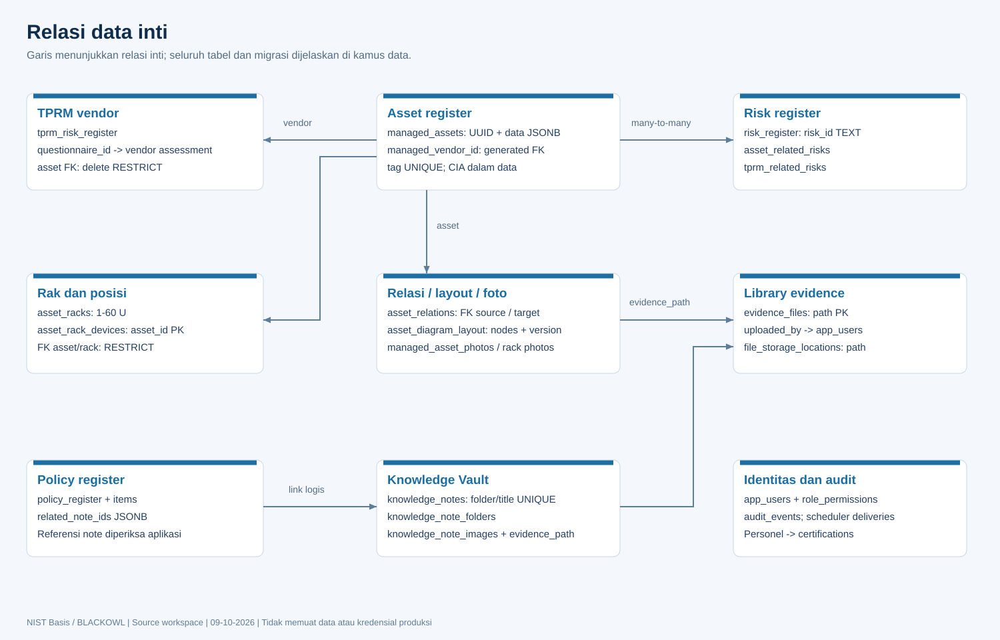

# Database, relasi, dan struktur data



## Model dan aturan integritas

PostgreSQL menjadi sumber data utama. Schema dasar berada di database/schema.sql; banyak modul menjalankan additive migrations dalam ensureStore. Inventaris di bawah berasal dari source, bukan koneksi schema produksi. DDL CREATE menunjukkan bentuk awal; ALTER dan trigger dalam source dapat menambahkan atau mengubah kolom/constraint.

| Hubungan | Enforcement / penghapusan |
| --- | --- |
| framework -> controls/targets | Foreign key; lihat DDL untuk aksi cascade |
| organization_personnel -> personnel_certifications | FK dari migrasi; identitas sertifikasi berasal pegawai terdaftar |
| policy -> items / deliveries | FK pada store terkait |
| vendor questionnaire -> TPRM register | questionnaire_id FK ON DELETE SET NULL; create/update memvalidasi vendor cocok |
| TPRM -> risks | Join table tprm_related_risks, FK cascade kedua sisi; JSON legacy tetap ada |
| asset -> vendor TPRM | managed_vendor_id GENERATED STORED dari JSONB, FK DELETE RESTRICT; opsional null |
| asset -> racks | asset_id PK memastikan satu posisi; FK asset/rack DELETE RESTRICT |
| asset -> related risks | Join table FK CASCADE kedua sisi |
| asset relations | source/target FK RESTRICT, CHECK source!=target, UNIQUE source/target/type |
| asset/rack -> photos | FK CASCADE; original bytes dan evidence_path |
| evidence -> uploader | uploaded_by mengacu akun sesuai ownership migration; file legacy tanpa owner admin-only |
| audit hierarchy | self-FK parent_id RESTRICT; audit root tanpa parent, record anak punya parent |
| policy -> knowledge notes | related_note_ids JSONB; link logis, bukan FK individual |
| diagram -> assets | node IDs dalam JSONB; validasi service, bukan FK per node |
| evidence -> module attachments | Path di JSONB/record; diperiksa service dan cleanup/trigger, bukan seluruhnya FK |

## Normalisasi, JSONB, dan concurrency

Identitas core memakai PK UUID/BIGSERIAL/TEXT yang sesuai domain. Relasi penting memakai join table/FK; data formulir fleksibel memakai JSONB. `managed_vendor_id` mengubah referensi vendor dalam JSON aset menjadi kolom generated dengan FK, sehingga update/import JSON yang tidak valid ditolak database dan vendor yang masih dipakai tidak bisa dihapus. Index membantu lookup.

Rack occupancy divalidasi server di bawah advisory transaction lock. CHECK dasar/PK tidak sendirian membuktikan semua rentang U bebas overlap; operasi tulis aplikasi wajib melewati service. Asset diagram dan knowledge/threat model memakai optimistic versioning; mismatch mendapat 409.

Reset Risk Register sekarang memakai satu client pool dari BEGIN sampai COMMIT/ROLLBACK. Koneksi harus selalu release dalam finally. Mengirim BEGIN melalui pool.query lalu operasi melalui pool.query berbeda tidak menjamin transaksi satu koneksi.

Reference path foto/knowledge disinkronkan terhadap evidence_files lewat trigger penggantian/penghapusan. Content asli foto dan gambar knowledge tetap tersedia sebagai BYTEA; evidence umum di storage eksternal tidak selalu mempunyai salinan BYTEA. Kebijakan retensi library terpisah dari foto aktif.

## Inventaris semua tabel dari source

| Tabel | Definisi source |
| --- | --- |
| app_smtp_accounts | src/services/smtpService.js:52 |
| app_smtp_settings | src/services/smtpService.js:44 |
| app_users | database/users.sql:4 |
| assessment_state | database/schema.sql:14 |
| asset_diagram_layout | src/services/assetDiagramService.js:4 |
| asset_rack_devices | src/services/assetManagementService.js:17 |
| asset_racks | src/services/assetManagementService.js:16 |
| asset_related_risks | src/services/assetManagementService.js:21 |
| asset_relations | src/services/assetManagementService.js:20 |
| asset_reminder_settings | src/services/assetReminderSettingsService.js:5 |
| asset_renewal_deliveries | src/services/assetManagementService.js:22 |
| audit_events | database/schema.sql:364; src/services/auditService.js:4 |
| audit_finding_records | src/services/auditFindingService.js:27 |
| audit_finding_reminder_deliveries | src/services/auditFindingReminderService.js:12 |
| audit_finding_reminder_settings | src/services/auditFindingReminderService.js:11 |
| certification_roadmap_catalog | database/schema.sql:160; src/services/certificationRoadmapCatalogService.js:33 |
| controls | database/schema.sql:399 |
| evidence_files | database/schema.sql:329 |
| file_storage_locations | database/schema.sql:347; src/services/storageService.js:28 |
| file_storage_settings | database/schema.sql:338; src/services/storageService.js:25 |
| framework_category_targets | database/schema.sql:438 |
| frameworks | database/schema.sql:387 |
| information_security_objectives | database/schema.sql:450 |
| knowledge_note_folders | src/services/knowledgeNoteService.js:24 |
| knowledge_note_images | src/services/knowledgeImageService.js:4 |
| knowledge_notes | src/services/knowledgeNoteService.js:17 |
| managed_assets | src/services/assetManagementService.js:10 |
| organization_personnel | database/schema.sql:146; src/services/personnelCertificationService.js:38 |
| personnel_certifications | database/schema.sql:118; src/services/personnelCertificationService.js:37 |
| policy_register | database/schema.sql:205; src/services/policyRegisterService.js:94 |
| policy_register_dropdown_options | database/schema.sql:238; src/services/policyRegisterService.js:125 |
| policy_register_items | database/schema.sql:224; src/services/policyRegisterService.js:112 |
| policy_reminder_deliveries | src/services/policyReminderService.js:19 |
| policy_reminder_settings | src/services/policyReminderService.js:18 |
| questionnaire_templates | database/schema.sql:274 |
| risk_acceptance_forms | database/schema.sql:20; src/services/riskAcceptanceService.js:29 |
| risk_dropdown_options | database/schema.sql:105; src/services/riskManagementService.js:39 |
| risk_indicators | database/schema.sql:52; src/services/riskManagementService.js:35 |
| risk_register | database/schema.sql:66; src/services/riskManagementService.js:36 |
| role_permissions | database/schema.sql:516; src/services/permissionService.js:72 |
| threat_models | database/schema.sql:5; src/services/threatModelService.js:40 |
| tprm_due_diligence_questionnaires | database/schema.sql:287; src/services/tprmQuestionnaireService.js:10 |
| tprm_related_risks | database/schema.sql:196; src/services/tprmService.js:14 |
| tprm_risk_register | database/schema.sql:176; src/services/tprmService.js:14 |

## Kolom, constraint, dan migrasi per tabel

Definisi berikut adalah kutipan DDL source untuk audit dan pemahaman, **bukan script migrasi yang boleh langsung dieksekusi**. Untuk instalasi gunakan provisioning/startup resmi.


### app_smtp_accounts

Source: `src/services/smtpService.js:52`.

```sql
CREATE TABLE IF NOT EXISTS app_smtp_accounts (id UUID PRIMARY KEY, settings JSONB NOT NULL, secret TEXT NOT NULL DEFAULT '');
```


### app_smtp_settings

Source: `src/services/smtpService.js:44`.

```sql
CREATE TABLE IF NOT EXISTS app_smtp_settings (id INTEGER PRIMARY KEY CHECK (id = 1), settings JSONB NOT NULL, secret TEXT NOT NULL DEFAULT '');
```


### app_users

Source: `database/users.sql:4`.

```sql
CREATE TABLE IF NOT EXISTS app_users (
  id BIGSERIAL PRIMARY KEY,
  username TEXT UNIQUE NOT NULL,
  full_name TEXT NOT NULL DEFAULT '',
  password_hash TEXT NOT NULL,
  role TEXT NOT NULL DEFAULT 'user' CHECK (role IN ('admin', 'approver', 'editor', 'viewer', 'user')),
  created_at TIMESTAMPTZ NOT NULL DEFAULT NOW(),
  updated_at TIMESTAMPTZ NOT NULL DEFAULT NOW()
);
```

Migrasi source terkait:

- `database/users.sql: ALTER TABLE app_users`


### assessment_state

Source: `database/schema.sql:14`.

```sql
CREATE TABLE IF NOT EXISTS assessment_state (
  id TEXT PRIMARY KEY,
  data JSONB NOT NULL,
  updated_at TIMESTAMPTZ NOT NULL DEFAULT NOW()
);
```

Migrasi source terkait:

- `database/schema.sql: ALTER TABLE assessment_state ADD CONSTRAINT assessment_state_id_not_blank CHECK (btrim(id) <> '`


### asset_diagram_layout

Source: `src/services/assetDiagramService.js:4`.

```sql
CREATE TABLE IF NOT EXISTS asset_diagram_layout (id INTEGER PRIMARY KEY CHECK(id=1), nodes JSONB NOT NULL, version INTEGER NOT NULL DEFAULT 1);
```


### asset_rack_devices

Source: `src/services/assetManagementService.js:17`.

```sql
CREATE TABLE IF NOT EXISTS asset_rack_devices(asset_id UUID PRIMARY KEY REFERENCES managed_assets(id) ON DELETE RESTRICT, rack_id UUID NOT NULL REFERENCES asset_racks(id) ON DELETE RESTRICT, start_unit INTEGER NOT NULL, height INTEGER NOT NULL);
```

Migrasi source terkait:

- `src/services/assetManagementService.js: ALTER TABLE asset_rack_devices ADD COLUMN IF NOT EXISTS facing TEXT NOT NULL DEFAULT 'front' CHECK(facing IN ('front','rear`
- `src/services/assetManagementService.js: ALTER TABLE asset_rack_devices ADD COLUMN IF NOT EXISTS full_depth BOOLEAN NOT NULL DEFAULT TRUE`


### asset_racks

Source: `src/services/assetManagementService.js:16`.

```sql
CREATE TABLE IF NOT EXISTS asset_racks(id UUID PRIMARY KEY, name TEXT UNIQUE NOT NULL, location TEXT NOT NULL, units INTEGER NOT NULL CHECK(units BETWEEN 1 AND 60));
```


### asset_related_risks

Source: `src/services/assetManagementService.js:21`.

```sql
CREATE TABLE IF NOT EXISTS asset_related_risks(asset_id UUID NOT NULL REFERENCES managed_assets(id) ON DELETE CASCADE, risk_id TEXT NOT NULL REFERENCES risk_register(risk_id) ON DELETE CASCADE, PRIMARY KEY(asset_id,risk_id));
```


### asset_relations

Source: `src/services/assetManagementService.js:20`.

```sql
CREATE TABLE IF NOT EXISTS asset_relations(id UUID PRIMARY KEY, source_id UUID NOT NULL REFERENCES managed_assets(id) ON DELETE RESTRICT, target_id UUID NOT NULL REFERENCES managed_assets(id) ON DELETE RESTRICT, type TEXT NOT NULL, notes TEXT NOT NULL DEFAULT '', change_reference TEXT NOT NULL, CHECK(source_id <> target_id), UNIQUE(source_id,target_id,type));
```


### asset_reminder_settings

Source: `src/services/assetReminderSettingsService.js:5`.

```sql
CREATE TABLE IF NOT EXISTS asset_reminder_settings (id INTEGER PRIMARY KEY CHECK(id=1), settings JSONB NOT NULL);
```


### asset_renewal_deliveries

Source: `src/services/assetManagementService.js:22`.

```sql
CREATE TABLE IF NOT EXISTS asset_renewal_deliveries(asset_id UUID REFERENCES managed_assets(id) ON DELETE CASCADE, renewal_date DATE NOT NULL, recipient TEXT NOT NULL, sent_on DATE NOT NULL, PRIMARY KEY(asset_id,renewal_date,recipient,sent_on));
```


### audit_events

Source: `database/schema.sql:364`.

```sql
CREATE TABLE IF NOT EXISTS audit_events (
  id BIGSERIAL PRIMARY KEY,
  request_id TEXT NOT NULL,
  actor_username TEXT NOT NULL DEFAULT '',
  actor_role TEXT NOT NULL DEFAULT '',
  event_type TEXT NOT NULL,
  method TEXT NOT NULL,
  path TEXT NOT NULL,
  status_code INTEGER NOT NULL DEFAULT 200,
  ip_address TEXT NOT NULL DEFAULT '',
  user_agent TEXT NOT NULL DEFAULT '',
  duration_ms INTEGER NOT NULL DEFAULT 0,
  details JSONB NOT NULL DEFAULT '{}'::jsonb,
  created_at TIMESTAMPTZ NOT NULL DEFAULT NOW()
);
```


### audit_finding_records

Source: `src/services/auditFindingService.js:27`.

```sql
CREATE TABLE IF NOT EXISTS audit_finding_records (
    id UUID PRIMARY KEY, kind TEXT NOT NULL CHECK(kind IN ('audit','finding','followup','evidence')),
    parent_id UUID REFERENCES audit_finding_records(id) ON DELETE RESTRICT,
    data JSONB NOT NULL, filename TEXT, content BYTEA, created_at TIMESTAMPTZ NOT NULL DEFAULT NOW(),
    updated_at TIMESTAMPTZ NOT NULL DEFAULT NOW(), CHECK ((kind = 'audit') = (parent_id IS NULL))
  );
```


### audit_finding_reminder_deliveries

Source: `src/services/auditFindingReminderService.js:12`.

```sql
CREATE TABLE IF NOT EXISTS audit_finding_reminder_deliveries (
    finding_id UUID REFERENCES audit_finding_records(id) ON DELETE CASCADE,
    due_date DATE NOT NULL, recipient TEXT NOT NULL, sent_at TIMESTAMPTZ NOT NULL DEFAULT NOW(),
    PRIMARY KEY(finding_id,due_date,recipient));
```

Migrasi source terkait:

- `src/services/auditFindingReminderService.js: ALTER TABLE audit_finding_reminder_deliveries ADD COLUMN IF NOT EXISTS reminder_date DATE`
- `src/services/auditFindingReminderService.js: ALTER TABLE audit_finding_reminder_deliveries ALTER COLUMN reminder_date SET NOT NULL`
- `src/services/auditFindingReminderService.js: ALTER TABLE audit_finding_reminder_deliveries DROP CONSTRAINT IF EXISTS audit_finding_reminder_deliveries_pkey`
- `src/services/auditFindingReminderService.js: ALTER TABLE audit_finding_reminder_deliveries ADD PRIMARY KEY(finding_id,due_date,recipient,reminder_date)`


### audit_finding_reminder_settings

Source: `src/services/auditFindingReminderService.js:11`.

```sql
CREATE TABLE IF NOT EXISTS audit_finding_reminder_settings (id INTEGER PRIMARY KEY CHECK(id=1), settings JSONB NOT NULL);
```


### certification_roadmap_catalog

Source: `database/schema.sql:160`.

```sql
CREATE TABLE IF NOT EXISTS certification_roadmap_catalog (
  id BIGSERIAL PRIMARY KEY,
  domain TEXT NOT NULL DEFAULT '',
  certification_name TEXT NOT NULL,
  issuer TEXT NOT NULL DEFAULT '',
  reference_url TEXT NOT NULL DEFAULT '',
  certification_level TEXT NOT NULL DEFAULT 'Intermediate',
  notes TEXT NOT NULL DEFAULT '',
  created_at TIMESTAMPTZ NOT NULL DEFAULT NOW(),
  updated_at TIMESTAMPTZ NOT NULL DEFAULT NOW(),
  CONSTRAINT certification_roadmap_catalog_unique UNIQUE (certification_name)
);
```

Source: `src/services/certificationRoadmapCatalogService.js:33`.

```sql
CREATE TABLE IF NOT EXISTS certification_roadmap_catalog (id BIGSERIAL PRIMARY KEY, domain TEXT NOT NULL DEFAULT '', certification_name TEXT NOT NULL, issuer TEXT NOT NULL DEFAULT '', reference_url TEXT NOT NULL DEFAULT '', certification_level TEXT NOT NULL DEFAULT 'Intermediate', notes TEXT NOT NULL DEFAULT '', created_at TIMESTAMPTZ NOT NULL DEFAULT NOW(), updated_at TIMESTAMPTZ NOT NULL DEFAULT NOW(), CONSTRAINT certification_roadmap_catalog_unique UNIQUE (certification_name));
```


### controls

Source: `database/schema.sql:399`.

```sql
CREATE TABLE IF NOT EXISTS controls (
  id BIGSERIAL PRIMARY KEY,
  framework_id TEXT NOT NULL REFERENCES frameworks (id) ON DELETE CASCADE,
  code TEXT NOT NULL,
  function TEXT NOT NULL,
  category TEXT NOT NULL,
  subcategory TEXT NOT NULL,
  implementation TEXT NOT NULL DEFAULT '',
  "references" TEXT NOT NULL DEFAULT '',
  minimum_evidence TEXT NOT NULL DEFAULT '',
  notes TEXT NOT NULL DEFAULT '',
  evidence JSONB NOT NULL DEFAULT '[]'::jsonb,
  applicability TEXT NOT NULL DEFAULT 'Applicable',
  created_at TIMESTAMPTZ NOT NULL DEFAULT NOW(),
  updated_at TIMESTAMPTZ NOT NULL DEFAULT NOW(),
  CONSTRAINT controls_framework_code_unique UNIQUE (framework_id, code),
  CONSTRAINT controls_code_not_blank CHECK (btrim(code) <> '')
);
```

Migrasi source terkait:

- `database/schema.sql: ALTER TABLE controls ADD COLUMN IF NOT EXISTS minimum_evidence TEXT NOT NULL DEFAULT ''`
- `database/schema.sql: ALTER TABLE controls ADD COLUMN IF NOT EXISTS notes TEXT NOT NULL DEFAULT ''`
- `database/schema.sql: ALTER TABLE controls ADD COLUMN IF NOT EXISTS evidence JSONB NOT NULL DEFAULT '[]'::jsonb`
- `database/schema.sql: ALTER TABLE controls ADD COLUMN IF NOT EXISTS applicability TEXT NOT NULL DEFAULT 'Applicable'`


### evidence_files

Source: `database/schema.sql:329`.

```sql
CREATE TABLE IF NOT EXISTS evidence_files (
  path TEXT PRIMARY KEY,
  name TEXT NOT NULL,
  content BYTEA,
  mime_type TEXT NOT NULL,
  open_page INTEGER NOT NULL DEFAULT 1 CHECK (open_page >= 1),
  updated_at TIMESTAMPTZ NOT NULL DEFAULT NOW()
);
```

Migrasi source terkait:

- `database/evidence-ownership.sql: ALTER TABLE evidence_files ADD COLUMN IF NOT EXISTS uploaded_by BIGINT REFERENCES app_users(id) ON DELETE SET NULL`
- `database/schema.sql: ALTER TABLE evidence_files`
- `database/schema.sql: ALTER TABLE evidence_files ADD COLUMN IF NOT EXISTS open_page INTEGER NOT NULL DEFAULT 1 CHECK (open_page >= 1)`
- `database/schema.sql: ALTER TABLE evidence_files ADD CONSTRAINT evidence_files_path_not_blank CHECK (btrim(path) <> '`
- `database/schema.sql: ALTER TABLE evidence_files ADD CONSTRAINT evidence_files_name_not_blank CHECK (btrim(name) <> '`


### file_storage_locations

Source: `database/schema.sql:347`.

```sql
CREATE TABLE IF NOT EXISTS file_storage_locations (
  path TEXT PRIMARY KEY,
  root TEXT NOT NULL,
  object_key TEXT NOT NULL,
  updated_at TIMESTAMPTZ NOT NULL DEFAULT NOW()
);
```

Source: `src/services/storageService.js:28`.

```sql
CREATE TABLE IF NOT EXISTS file_storage_locations (
        path TEXT PRIMARY KEY, root TEXT NOT NULL, object_key TEXT NOT NULL,
        updated_at TIMESTAMPTZ NOT NULL DEFAULT NOW());
```


### file_storage_settings

Source: `database/schema.sql:338`.

```sql
CREATE TABLE IF NOT EXISTS file_storage_settings (
  id INTEGER PRIMARY KEY CHECK (id = 1),
  mode TEXT NOT NULL CHECK (mode IN ('local', 'shared')),
  directory TEXT NOT NULL DEFAULT '',
  updated_at TIMESTAMPTZ NOT NULL DEFAULT NOW()
);
```

Source: `src/services/storageService.js:25`.

```sql
CREATE TABLE IF NOT EXISTS file_storage_settings (
        id INTEGER PRIMARY KEY CHECK (id = 1), mode TEXT NOT NULL CHECK (mode IN ('local', 'shared')),
        directory TEXT NOT NULL DEFAULT '', updated_at TIMESTAMPTZ NOT NULL DEFAULT NOW());
```

Migrasi source terkait:

- `src/services/storageService.js: ALTER TABLE file_storage_settings DROP CONSTRAINT IF EXISTS file_storage_settings_mode_check`
- `src/services/storageService.js: ALTER TABLE file_storage_settings ADD CONSTRAINT file_storage_settings_mode_check CHECK (mode IN ('local', 'shared', 's3', 'gcs`
- `src/services/storageService.js: ALTER TABLE file_storage_settings ADD COLUMN IF NOT EXISTS cloud_config JSONB NOT NULL DEFAULT '{}'::jsonb`


### framework_category_targets

Source: `database/schema.sql:438`.

```sql
CREATE TABLE IF NOT EXISTS framework_category_targets (
  framework_id TEXT NOT NULL REFERENCES frameworks (id) ON DELETE CASCADE,
  category TEXT NOT NULL,
  target_score NUMERIC(3,1) NOT NULL DEFAULT 3.0 CHECK (target_score >= 0 AND target_score <= 5),
  updated_at TIMESTAMPTZ NOT NULL DEFAULT NOW(),
  PRIMARY KEY (framework_id, category),
  CONSTRAINT framework_category_targets_category_not_blank CHECK (btrim(category) <> '')
);
```


### frameworks

Source: `database/schema.sql:387`.

```sql
CREATE TABLE IF NOT EXISTS frameworks (
  id TEXT PRIMARY KEY,
  name TEXT NOT NULL,
  version TEXT NOT NULL,
  description TEXT NOT NULL DEFAULT '',
  created_at TIMESTAMPTZ NOT NULL DEFAULT NOW(),
  updated_at TIMESTAMPTZ NOT NULL DEFAULT NOW(),
  CONSTRAINT frameworks_id_not_blank CHECK (btrim(id) <> ''),
  CONSTRAINT frameworks_name_not_blank CHECK (btrim(name) <> ''),
  CONSTRAINT frameworks_version_not_blank CHECK (btrim(version) <> '')
);
```


### information_security_objectives

Source: `database/schema.sql:450`.

```sql
CREATE TABLE IF NOT EXISTS information_security_objectives (
  id BIGSERIAL PRIMARY KEY,
  objective_year INTEGER NOT NULL CHECK (objective_year BETWEEN 2000 AND 2100),
  objective TEXT NOT NULL,
  indicator TEXT NOT NULL DEFAULT '',
  baseline TEXT NOT NULL DEFAULT '',
  target_value TEXT NOT NULL DEFAULT '',
  owner TEXT NOT NULL DEFAULT '',
  evaluation_frequency TEXT NOT NULL DEFAULT 'monthly' CHECK (evaluation_frequency IN ('monthly', 'quarterly', 'semester', 'annual')),
  period_targets JSONB NOT NULL DEFAULT '{}'::jsonb,
  monthly_status TEXT NOT NULL DEFAULT 'Not started',
  quarterly_status TEXT NOT NULL DEFAULT 'Not started',
  semester_status TEXT NOT NULL DEFAULT 'Not started',
  annual_status TEXT NOT NULL DEFAULT 'Not started',
  notes TEXT NOT NULL DEFAULT '',
  created_at TIMESTAMPTZ NOT NULL DEFAULT NOW(),
  updated_at TIMESTAMPTZ NOT NULL DEFAULT NOW(),
  CONSTRAINT information_security_objective_text_not_blank CHECK (btrim(objective) <> '')
);
```

Migrasi source terkait:

- `database/schema.sql: ALTER TABLE information_security_objectives`


### knowledge_note_folders

Source: `src/services/knowledgeNoteService.js:24`.

```sql
CREATE TABLE IF NOT EXISTS knowledge_note_folders (path TEXT PRIMARY KEY);
```


### knowledge_note_images

Source: `src/services/knowledgeImageService.js:4`.

```sql
CREATE TABLE IF NOT EXISTS knowledge_note_images (
  id UUID PRIMARY KEY,path TEXT NOT NULL UNIQUE,folder TEXT NOT NULL DEFAULT '',mime_type TEXT NOT NULL,
  content BYTEA NOT NULL,created_at TIMESTAMPTZ NOT NULL DEFAULT NOW());
```

Migrasi source terkait:

- `src/services/knowledgeImageService.js: ALTER TABLE knowledge_note_images ADD COLUMN IF NOT EXISTS evidence_path TEXT`


### knowledge_notes

Source: `src/services/knowledgeNoteService.js:17`.

```sql
CREATE TABLE IF NOT EXISTS knowledge_notes (id BIGSERIAL PRIMARY KEY, title TEXT NOT NULL, content TEXT NOT NULL DEFAULT '', version INTEGER NOT NULL DEFAULT 1, updated_at TIMESTAMPTZ NOT NULL DEFAULT NOW());
```

Migrasi source terkait:

- `src/services/knowledgeNoteService.js: ALTER TABLE knowledge_notes ADD COLUMN IF NOT EXISTS folder TEXT NOT NULL DEFAULT ''`


### managed_assets

Source: `src/services/assetManagementService.js:10`.

```sql
CREATE TABLE IF NOT EXISTS managed_assets(id UUID PRIMARY KEY, tag TEXT UNIQUE NOT NULL, data JSONB NOT NULL, updated_at TIMESTAMPTZ NOT NULL DEFAULT NOW());
```

Migrasi source terkait:

- `src/services/assetManagementService.js: ALTER TABLE managed_assets ADD COLUMN IF NOT EXISTS created_at TIMESTAMPTZ`
- `src/services/assetManagementService.js: ALTER TABLE managed_assets ALTER COLUMN created_at SET DEFAULT NOW(), ALTER COLUMN created_at SET NOT NULL`
- `src/services/assetManagementService.js: ALTER TABLE managed_assets ADD COLUMN IF NOT EXISTS managed_vendor_id BIGINT GENERATED ALWAYS AS (NULLIF(data->>'managedVendorId','`


### organization_personnel

Source: `database/schema.sql:146`.

```sql
CREATE TABLE IF NOT EXISTS organization_personnel (
  id BIGSERIAL PRIMARY KEY,
  personnel_name TEXT NOT NULL,
  employee_id TEXT NOT NULL DEFAULT '',
  personnel_role TEXT NOT NULL DEFAULT '',
  supervisor_name TEXT NOT NULL DEFAULT '',
  created_at TIMESTAMPTZ NOT NULL DEFAULT NOW(),
  updated_at TIMESTAMPTZ NOT NULL DEFAULT NOW(),
  CONSTRAINT organization_personnel_name_not_blank CHECK (btrim(personnel_name) <> '')
);
```

Source: `src/services/personnelCertificationService.js:38`.

```sql
CREATE TABLE IF NOT EXISTS organization_personnel (id BIGSERIAL PRIMARY KEY, personnel_name TEXT NOT NULL, employee_id TEXT NOT NULL DEFAULT '', personnel_role TEXT NOT NULL DEFAULT '', supervisor_name TEXT NOT NULL DEFAULT '', created_at TIMESTAMPTZ NOT NULL DEFAULT NOW(), updated_at TIMESTAMPTZ NOT NULL DEFAULT NOW());
```


### personnel_certifications

Source: `database/schema.sql:118`.

```sql
CREATE TABLE IF NOT EXISTS personnel_certifications (
  id BIGSERIAL PRIMARY KEY,
  -- Backfilled, constrained and indexed by personnel-certification-links.sql during setup.
  personnel_id BIGINT,
  personnel_name TEXT NOT NULL,
  employee_id TEXT NOT NULL DEFAULT '',
  personnel_role TEXT NOT NULL DEFAULT '',
  supervisor_name TEXT NOT NULL DEFAULT '',
  certification_name TEXT NOT NULL,
  issuer TEXT NOT NULL DEFAULT '',
  reference_url TEXT NOT NULL DEFAULT '',
  certification_level TEXT NOT NULL DEFAULT 'Intermediate',
  status TEXT NOT NULL DEFAULT 'Planned',
  issue_date DATE,
  expiry_date DATE,
  notes TEXT NOT NULL DEFAULT '',
  on_canvas BOOLEAN NOT NULL DEFAULT FALSE,
  position_x INTEGER NOT NULL DEFAULT 24,
  position_y INTEGER NOT NULL DEFAULT 24,
  card_width INTEGER NOT NULL DEFAULT 260,
  card_height INTEGER NOT NULL DEFAULT 190,
  created_at TIMESTAMPTZ NOT NULL DEFAULT NOW(),
  updated_at TIMESTAMPTZ NOT NULL DEFAULT NOW()
);
```

Source: `src/services/personnelCertificationService.js:37`.

```sql
CREATE TABLE IF NOT EXISTS personnel_certifications (id BIGSERIAL PRIMARY KEY, personnel_name TEXT NOT NULL, employee_id TEXT NOT NULL DEFAULT '', personnel_role TEXT NOT NULL DEFAULT '', supervisor_name TEXT NOT NULL DEFAULT '', certification_name TEXT NOT NULL, issuer TEXT NOT NULL DEFAULT '', reference_url TEXT NOT NULL DEFAULT '', certification_level TEXT NOT NULL DEFAULT 'Intermediate', status TEXT NOT NULL DEFAULT 'Planned', issue_date DATE, expiry_date DATE, notes TEXT NOT NULL DEFAULT '', on_canvas BOOLEAN NOT NULL DEFAULT FALSE, position_x INTEGER NOT NULL DEFAULT 24, position_y INTEGER NOT NULL DEFAULT 24, card_width INTEGER NOT NULL DEFAULT 260, card_height INTEGER NOT NULL DEFAULT 190, created_at TIMESTAMPTZ NOT NULL DEFAULT NOW(), updated_at TIMESTAMPTZ NOT NULL DEFAULT NOW());
```

Migrasi source terkait:

- `database/personnel-certification-links.sql: ALTER TABLE personnel_certifications ADD COLUMN IF NOT EXISTS personnel_id BIGINT`
- `database/personnel-certification-links.sql: ALTER TABLE personnel_certifications`
- `database/personnel-certification-links.sql: ALTER TABLE personnel_certifications ALTER COLUMN personnel_id SET NOT NULL`
- `src/services/personnelCertificationService.js: ALTER TABLE personnel_certifications ADD COLUMN IF NOT EXISTS reference_url TEXT NOT NULL DEFAULT \'\'`
- `src/services/personnelCertificationService.js: ALTER TABLE personnel_certifications ADD COLUMN IF NOT EXISTS certification_level TEXT NOT NULL DEFAULT \'Intermediate\'`
- `src/services/personnelCertificationService.js: ALTER TABLE personnel_certifications ADD COLUMN IF NOT EXISTS on_canvas BOOLEAN NOT NULL DEFAULT FALSE`
- `src/services/personnelCertificationService.js: ALTER TABLE personnel_certifications ADD COLUMN IF NOT EXISTS supervisor_name TEXT NOT NULL DEFAULT \'\'`


### policy_register

Source: `database/schema.sql:205`.

```sql
CREATE TABLE IF NOT EXISTS policy_register (
  id BIGSERIAL PRIMARY KEY,
  title TEXT NOT NULL,
  category TEXT NOT NULL,
  owner TEXT NOT NULL,
  review_cycle TEXT NOT NULL,
  approval_status TEXT NOT NULL,
  last_review DATE,
  attachment_name TEXT NOT NULL DEFAULT '',
  attachment_path TEXT NOT NULL DEFAULT '',
  attachment_type TEXT NOT NULL DEFAULT '',
  notes TEXT NOT NULL DEFAULT '',
  created_at TIMESTAMPTZ NOT NULL DEFAULT NOW(),
  updated_at TIMESTAMPTZ NOT NULL DEFAULT NOW()
);
```

Migrasi source terkait:

- `src/services/policyRegisterService.js: ALTER TABLE policy_register ADD COLUMN IF NOT EXISTS related_note_ids JSONB NOT NULL DEFAULT '[]'::jsonb`


### policy_register_dropdown_options

Source: `database/schema.sql:238`.

```sql
CREATE TABLE IF NOT EXISTS policy_register_dropdown_options (
  id BIGSERIAL PRIMARY KEY,
  field_name TEXT NOT NULL,
  option_value TEXT NOT NULL,
  sort_order INTEGER NOT NULL DEFAULT 0,
  created_at TIMESTAMPTZ NOT NULL DEFAULT NOW(),
  updated_at TIMESTAMPTZ NOT NULL DEFAULT NOW(),
  CONSTRAINT policy_register_dropdown_option_unique UNIQUE (field_name, option_value)
);
```


### policy_register_items

Source: `database/schema.sql:224`.

```sql
CREATE TABLE IF NOT EXISTS policy_register_items (
  id BIGSERIAL PRIMARY KEY,
  policy_id BIGINT NOT NULL REFERENCES policy_register(id) ON DELETE CASCADE,
  subtitle TEXT NOT NULL DEFAULT '',
  content TEXT NOT NULL DEFAULT '',
  sort_order INTEGER NOT NULL DEFAULT 0,
  created_at TIMESTAMPTZ NOT NULL DEFAULT NOW(),
  updated_at TIMESTAMPTZ NOT NULL DEFAULT NOW(),
  CONSTRAINT policy_register_item_content_check CHECK (subtitle <> '' OR content <> '')
);
```


### policy_reminder_deliveries

Source: `src/services/policyReminderService.js:19`.

```sql
CREATE TABLE IF NOT EXISTS policy_reminder_deliveries (policy_id BIGINT REFERENCES policy_register(id) ON DELETE CASCADE, due_date DATE NOT NULL, recipient TEXT NOT NULL, sent_at TIMESTAMPTZ NOT NULL DEFAULT NOW(), PRIMARY KEY(policy_id, due_date, recipient));
```

Migrasi source terkait:

- `src/services/policyReminderService.js: ALTER TABLE policy_reminder_deliveries ADD COLUMN IF NOT EXISTS reminder_date DATE`
- `src/services/policyReminderService.js: ALTER TABLE policy_reminder_deliveries ALTER COLUMN reminder_date SET NOT NULL`
- `src/services/policyReminderService.js: ALTER TABLE policy_reminder_deliveries DROP CONSTRAINT IF EXISTS policy_reminder_deliveries_pkey`
- `src/services/policyReminderService.js: ALTER TABLE policy_reminder_deliveries ADD PRIMARY KEY(policy_id,due_date,recipient,reminder_date)`


### policy_reminder_settings

Source: `src/services/policyReminderService.js:18`.

```sql
CREATE TABLE IF NOT EXISTS policy_reminder_settings (id INTEGER PRIMARY KEY CHECK (id = 1), settings JSONB NOT NULL, secret TEXT NOT NULL DEFAULT '');
```


### questionnaire_templates

Source: `database/schema.sql:274`.

```sql
CREATE TABLE IF NOT EXISTS questionnaire_templates (
  id BIGSERIAL PRIMARY KEY,
  template_name TEXT NOT NULL UNIQUE,
  description TEXT NOT NULL DEFAULT '',
  sections JSONB NOT NULL DEFAULT '[]'::jsonb,
  is_default BOOLEAN NOT NULL DEFAULT FALSE,
  created_at TIMESTAMPTZ NOT NULL DEFAULT NOW(),
  updated_at TIMESTAMPTZ NOT NULL DEFAULT NOW()
);
```


### risk_acceptance_forms

Source: `database/schema.sql:20`.

```sql
CREATE TABLE IF NOT EXISTS risk_acceptance_forms (
  id BIGSERIAL PRIMARY KEY,
  requestor_name TEXT NOT NULL,
  asset_name TEXT NOT NULL,
  department TEXT NOT NULL,
  previously_accepted BOOLEAN NOT NULL DEFAULT FALSE,
  risk_description TEXT NOT NULL,
  benefit_justification TEXT NOT NULL,
  mitigation_plan TEXT NOT NULL,
  business_owner_decision TEXT NOT NULL CHECK (business_owner_decision IN ('temporary', 'one_year', 'denied')),
  remediation_date DATE,
  requestor_print_name TEXT NOT NULL DEFAULT '',
  requestor_email_phone TEXT NOT NULL DEFAULT '',
  requestor_signature TEXT NOT NULL DEFAULT '',
  requestor_date DATE,
  cio_comments TEXT NOT NULL DEFAULT '',
  cio_name TEXT NOT NULL DEFAULT '',
  cio_signature TEXT NOT NULL DEFAULT '',
  cio_date DATE,
  cis_decision TEXT NOT NULL CHECK (cis_decision IN ('approved', 'denied', 'conditional')),
  cis_reason TEXT NOT NULL DEFAULT '',
  cis_conditions TEXT NOT NULL DEFAULT '',
  cis_name TEXT NOT NULL DEFAULT '',
  cis_signature TEXT NOT NULL DEFAULT '',
  cis_date DATE,
  created_at TIMESTAMPTZ NOT NULL DEFAULT NOW(),
  updated_at TIMESTAMPTZ NOT NULL DEFAULT NOW()
);
```

Source: `src/services/riskAcceptanceService.js:29`.

```sql
CREATE TABLE IF NOT EXISTS risk_acceptance_forms (id BIGSERIAL PRIMARY KEY, requestor_name TEXT NOT NULL, asset_name TEXT NOT NULL, department TEXT NOT NULL, previously_accepted BOOLEAN NOT NULL DEFAULT FALSE, risk_description TEXT NOT NULL, benefit_justification TEXT NOT NULL, mitigation_plan TEXT NOT NULL, business_owner_decision TEXT NOT NULL CHECK (business_owner_decision IN ('temporary', 'one_year', 'denied')), remediation_date DATE, requestor_print_name TEXT NOT NULL DEFAULT '', requestor_email_phone TEXT NOT NULL DEFAULT '', requestor_signature TEXT NOT NULL DEFAULT '', requestor_date DATE, cio_comments TEXT NOT NULL DEFAULT '', cio_name TEXT NOT NULL DEFAULT '', cio_signature TEXT NOT NULL DEFAULT '', cio_date DATE, cis_decision TEXT NOT NULL CHECK (cis_decision IN ('approved', 'denied', 'conditional')), cis_reason TEXT NOT NULL DEFAULT '', cis_conditions TEXT NOT NULL DEFAULT '', cis_name TEXT NOT NULL DEFAULT '', cis_signature TEXT NOT NULL DEFAULT '', cis_date DATE, created_at TIMESTAMPTZ NOT NULL DEFAULT NOW(), updated_at TIMESTAMPTZ NOT NULL DEFAULT NOW());
```


### risk_dropdown_options

Source: `database/schema.sql:105`.

```sql
CREATE TABLE IF NOT EXISTS risk_dropdown_options (
  id BIGSERIAL PRIMARY KEY,
  field_name TEXT NOT NULL,
  option_value TEXT NOT NULL,
  sort_order INTEGER NOT NULL DEFAULT 0,
  created_at TIMESTAMPTZ NOT NULL DEFAULT NOW(),
  updated_at TIMESTAMPTZ NOT NULL DEFAULT NOW(),
  CONSTRAINT risk_dropdown_option_unique UNIQUE (field_name, option_value)
);
```

Source: `src/services/riskManagementService.js:39`.

```sql
CREATE TABLE IF NOT EXISTS risk_dropdown_options (id BIGSERIAL PRIMARY KEY, field_name TEXT NOT NULL, option_value TEXT NOT NULL, sort_order INTEGER NOT NULL DEFAULT 0, created_at TIMESTAMPTZ NOT NULL DEFAULT NOW(), updated_at TIMESTAMPTZ NOT NULL DEFAULT NOW(), CONSTRAINT risk_dropdown_option_unique UNIQUE (field_name, option_value));
```


### risk_indicators

Source: `database/schema.sql:52`.

```sql
CREATE TABLE IF NOT EXISTS risk_indicators (
  id BIGSERIAL PRIMARY KEY,
  indicator_type TEXT NOT NULL,
  score INTEGER,
  label TEXT NOT NULL,
  description TEXT NOT NULL DEFAULT '',
  details JSONB NOT NULL DEFAULT '{}'::jsonb,
  sort_order INTEGER NOT NULL DEFAULT 0,
  updated_at TIMESTAMPTZ NOT NULL DEFAULT NOW()
);
```

Source: `src/services/riskManagementService.js:35`.

```sql
CREATE TABLE IF NOT EXISTS risk_indicators (id BIGSERIAL PRIMARY KEY, indicator_type TEXT NOT NULL, score INTEGER, label TEXT NOT NULL, description TEXT NOT NULL DEFAULT '', details JSONB NOT NULL DEFAULT '{}'::jsonb, sort_order INTEGER NOT NULL DEFAULT 0, updated_at TIMESTAMPTZ NOT NULL DEFAULT NOW());
```


### risk_register

Source: `database/schema.sql:66`.

```sql
CREATE TABLE IF NOT EXISTS risk_register (
  risk_id TEXT PRIMARY KEY,
  third_party TEXT NOT NULL DEFAULT '',
  risk_category TEXT NOT NULL,
  effected_asset TEXT NOT NULL,
  device_name TEXT NOT NULL DEFAULT '',
  identification_risk TEXT NOT NULL,
  risk_control TEXT NOT NULL DEFAULT '',
  risk_cause TEXT NOT NULL DEFAULT '',
  risk_analysis TEXT NOT NULL DEFAULT '',
  asset_confidentiality INTEGER,
  asset_integrity INTEGER,
  asset_availability INTEGER,
  asset_value INTEGER,
  risk_owner TEXT NOT NULL DEFAULT '',
  note TEXT NOT NULL DEFAULT '',
  ref TEXT NOT NULL DEFAULT '',
  likelihood INTEGER NOT NULL,
  impact INTEGER NOT NULL,
  risk_rating TEXT NOT NULL DEFAULT '',
  treatment_action TEXT NOT NULL DEFAULT '',
  acceptance_form_no TEXT NOT NULL DEFAULT '',
  risk_treatment_description TEXT NOT NULL DEFAULT '',
  owner_of_action TEXT NOT NULL DEFAULT '',
  deadline DATE,
  residual_risk_description TEXT NOT NULL DEFAULT '',
  residual_likelihood INTEGER,
  residual_impact INTEGER,
  residual_rating TEXT NOT NULL DEFAULT '',
  comment TEXT NOT NULL DEFAULT '',
  created_at TIMESTAMPTZ NOT NULL DEFAULT NOW(),
  updated_at TIMESTAMPTZ NOT NULL DEFAULT NOW()
);
```

Source: `src/services/riskManagementService.js:36`.

```sql
CREATE TABLE IF NOT EXISTS risk_register (risk_id TEXT PRIMARY KEY, risk_category TEXT NOT NULL, effected_asset TEXT NOT NULL, device_name TEXT NOT NULL DEFAULT '', identification_risk TEXT NOT NULL, risk_control TEXT NOT NULL DEFAULT '', risk_cause TEXT NOT NULL DEFAULT '', risk_analysis TEXT NOT NULL DEFAULT '', asset_confidentiality INTEGER, asset_integrity INTEGER, asset_availability INTEGER, asset_value INTEGER, risk_owner TEXT NOT NULL DEFAULT '', note TEXT NOT NULL DEFAULT '', ref TEXT NOT NULL DEFAULT '', likelihood INTEGER NOT NULL, impact INTEGER NOT NULL, risk_rating TEXT NOT NULL DEFAULT '', treatment_action TEXT NOT NULL DEFAULT '', acceptance_form_no TEXT NOT NULL DEFAULT '', risk_treatment_description TEXT NOT NULL DEFAULT '', owner_of_action TEXT NOT NULL DEFAULT '', deadline DATE, residual_risk_description TEXT NOT NULL DEFAULT '', residual_likelihood INTEGER, residual_impact INTEGER, residual_rating TEXT NOT NULL DEFAULT '', comment TEXT NOT NULL DEFAULT '', created_at TIMESTAMPTZ NOT NULL DEFAULT NOW(), updated_at TIMESTAMPTZ NOT NULL DEFAULT NOW());
```

Migrasi source terkait:

- `database/schema.sql: ALTER TABLE risk_register ADD COLUMN IF NOT EXISTS third_party TEXT NOT NULL DEFAULT ''`
- `src/services/riskManagementService.js: ALTER TABLE risk_register ADD COLUMN IF NOT EXISTS device_name TEXT NOT NULL DEFAULT ''`
- `src/services/riskManagementService.js: ALTER TABLE risk_register ADD COLUMN IF NOT EXISTS third_party TEXT NOT NULL DEFAULT ''`


### role_permissions

Source: `database/schema.sql:516`.

```sql
CREATE TABLE IF NOT EXISTS role_permissions (
  role TEXT NOT NULL CHECK (role IN ('admin', 'user')),
  permission_key TEXT NOT NULL,
  allowed BOOLEAN NOT NULL DEFAULT TRUE,
  updated_at TIMESTAMPTZ NOT NULL DEFAULT NOW(),
  PRIMARY KEY (role, permission_key)
);
```

Source: `src/services/permissionService.js:72`.

```sql
CREATE TABLE IF NOT EXISTS role_permissions (role TEXT NOT NULL CHECK (role IN ('admin', 'approver', 'editor', 'viewer', 'user')), permission_key TEXT NOT NULL, allowed BOOLEAN NOT NULL DEFAULT TRUE, updated_at TIMESTAMPTZ NOT NULL DEFAULT NOW(), PRIMARY KEY (role, permission_key));
```

Migrasi source terkait:

- `src/services/permissionService.js: ALTER TABLE role_permissions ADD COLUMN IF NOT EXISTS actions JSONB`
- `src/services/permissionService.js: ALTER TABLE role_permissions DROP CONSTRAINT IF EXISTS role_permissions_role_check`
- `src/services/permissionService.js: ALTER TABLE role_permissions ADD CONSTRAINT role_permissions_role_check CHECK (role IN ('admin', 'approver', 'editor', 'viewer', 'user`


### threat_models

Source: `database/schema.sql:5`.

```sql
CREATE TABLE IF NOT EXISTS threat_models (
  id BIGSERIAL PRIMARY KEY,
  name TEXT NOT NULL,
  diagram JSONB NOT NULL,
  version INTEGER NOT NULL DEFAULT 1,
  created_at TIMESTAMPTZ NOT NULL DEFAULT NOW(),
  updated_at TIMESTAMPTZ NOT NULL DEFAULT NOW()
);
```

Source: `src/services/threatModelService.js:40`.

```sql
CREATE TABLE IF NOT EXISTS threat_models (id BIGSERIAL PRIMARY KEY, name TEXT NOT NULL, diagram JSONB NOT NULL, version INTEGER NOT NULL DEFAULT 1, created_at TIMESTAMPTZ NOT NULL DEFAULT NOW(), updated_at TIMESTAMPTZ NOT NULL DEFAULT NOW());
```


### tprm_due_diligence_questionnaires

Source: `database/schema.sql:287`.

```sql
CREATE TABLE IF NOT EXISTS tprm_due_diligence_questionnaires (
  id BIGSERIAL PRIMARY KEY,
  vendor_name TEXT NOT NULL,
  template_id BIGINT,
  assessment_status TEXT NOT NULL DEFAULT 'Draft',
  review_date DATE,
  assessment_result TEXT NOT NULL DEFAULT 'Pending',
  reviewer TEXT NOT NULL DEFAULT '',
  notes TEXT NOT NULL DEFAULT '',
  responses JSONB NOT NULL DEFAULT '{}'::jsonb,
  created_at TIMESTAMPTZ NOT NULL DEFAULT NOW(),
  updated_at TIMESTAMPTZ NOT NULL DEFAULT NOW()
);
```

Source: `src/services/tprmQuestionnaireService.js:10`.

```sql
CREATE TABLE IF NOT EXISTS tprm_due_diligence_questionnaires (id BIGSERIAL PRIMARY KEY, vendor_name TEXT NOT NULL, assessment_status TEXT NOT NULL DEFAULT 'Draft', review_date DATE, assessment_result TEXT NOT NULL DEFAULT 'Pending', reviewer TEXT NOT NULL DEFAULT '', notes TEXT NOT NULL DEFAULT '', responses JSONB NOT NULL DEFAULT '{}'::jsonb, created_at TIMESTAMPTZ NOT NULL DEFAULT NOW(), updated_at TIMESTAMPTZ NOT NULL DEFAULT NOW());
```

Migrasi source terkait:

- `src/services/tprmQuestionnaireService.js: ALTER TABLE tprm_due_diligence_questionnaires ADD COLUMN IF NOT EXISTS responses JSONB NOT NULL DEFAULT '{}'::jsonb`


### tprm_related_risks

Source: `database/schema.sql:196`.

```sql
CREATE TABLE IF NOT EXISTS tprm_related_risks (
  tprm_id BIGINT NOT NULL REFERENCES tprm_risk_register(id) ON DELETE CASCADE,
  risk_id TEXT NOT NULL REFERENCES risk_register(risk_id) ON DELETE CASCADE,
  PRIMARY KEY (tprm_id, risk_id)
);
```

Source: `src/services/tprmService.js:14`.

```sql
CREATE TABLE IF NOT EXISTS tprm_related_risks (tprm_id BIGINT NOT NULL REFERENCES tprm_risk_register(id) ON DELETE CASCADE, risk_id TEXT NOT NULL REFERENCES risk_register(risk_id) ON DELETE CASCADE, PRIMARY KEY (tprm_id, risk_id));
```


### tprm_risk_register

Source: `database/schema.sql:176`.

```sql
CREATE TABLE IF NOT EXISTS tprm_risk_register (
  id BIGSERIAL PRIMARY KEY,
  third_party TEXT NOT NULL,
  service_dependency TEXT NOT NULL,
  risk_level TEXT NOT NULL,
  assessment_status TEXT NOT NULL DEFAULT 'Not started',
  relationship_status TEXT NOT NULL DEFAULT 'Active',
  next_review DATE,
  notes TEXT NOT NULL DEFAULT '',
  risk_register_ids JSONB NOT NULL DEFAULT '[]'::jsonb,
  created_at TIMESTAMPTZ NOT NULL DEFAULT NOW(),
  updated_at TIMESTAMPTZ NOT NULL DEFAULT NOW()
);
```

Source: `src/services/tprmService.js:14`.

```sql
CREATE TABLE IF NOT EXISTS tprm_risk_register (id BIGSERIAL PRIMARY KEY, third_party TEXT NOT NULL, service_dependency TEXT NOT NULL, risk_level TEXT NOT NULL DEFAULT 'Medium Risk (Tier 2)', assessment_status TEXT NOT NULL DEFAULT 'Not started', relationship_status TEXT NOT NULL DEFAULT 'Active', next_review DATE, notes TEXT NOT NULL DEFAULT '', risk_register_ids JSONB NOT NULL DEFAULT '[]'::jsonb, questionnaire_id BIGINT REFERENCES tprm_due_diligence_questionnaires(id) ON DELETE SET NULL, due_diligence_assessment JSONB NOT NULL DEFAULT '{}'::jsonb, created_at TIMESTAMPTZ NOT NULL DEFAULT NOW(), updated_at TIMESTAMPTZ NOT NULL DEFAULT NOW());
```

Migrasi source terkait:

- `database/schema.sql: ALTER TABLE tprm_risk_register ADD COLUMN IF NOT EXISTS risk_register_ids JSONB NOT NULL DEFAULT '[]'::jsonb`
- `database/schema.sql: ALTER TABLE tprm_risk_register ADD COLUMN IF NOT EXISTS relationship_status TEXT NOT NULL DEFAULT 'Active'`
- `database/schema.sql: ALTER TABLE tprm_risk_register`
- `src/services/tprmService.js: ALTER TABLE tprm_risk_register ADD COLUMN IF NOT EXISTS questionnaire_id BIGINT REFERENCES tprm_due_diligence_questionnaires(id) ON DELETE SET NULL`
- `src/services/tprmService.js: ALTER TABLE tprm_risk_register ADD COLUMN IF NOT EXISTS due_diligence_assessment JSONB NOT NULL DEFAULT '{}'::jsonb`
- `src/services/tprmService.js: ALTER TABLE tprm_risk_register ADD COLUMN IF NOT EXISTS risk_register_ids JSONB NOT NULL DEFAULT '[]'::jsonb`
- `src/services/tprmService.js: ALTER TABLE tprm_risk_register ADD COLUMN IF NOT EXISTS relationship_status TEXT NOT NULL DEFAULT 'Active'`

## Batas dan pengembangan relasi

Policy-note, node diagram, dan beberapa attachment masih memakai link logis/JSONB. Rekomendasi berikutnya adalah normalisasi link yang membutuhkan jaminan database, disertai backfill dan tes orphan/cascade. Jangan menerapkan FK terhadap data legacy tanpa pemeriksaan referensi. Tenancy dan isolasi per organisasi belum tersedia; RLS tenant bukan kontrol yang sudah aktif.
