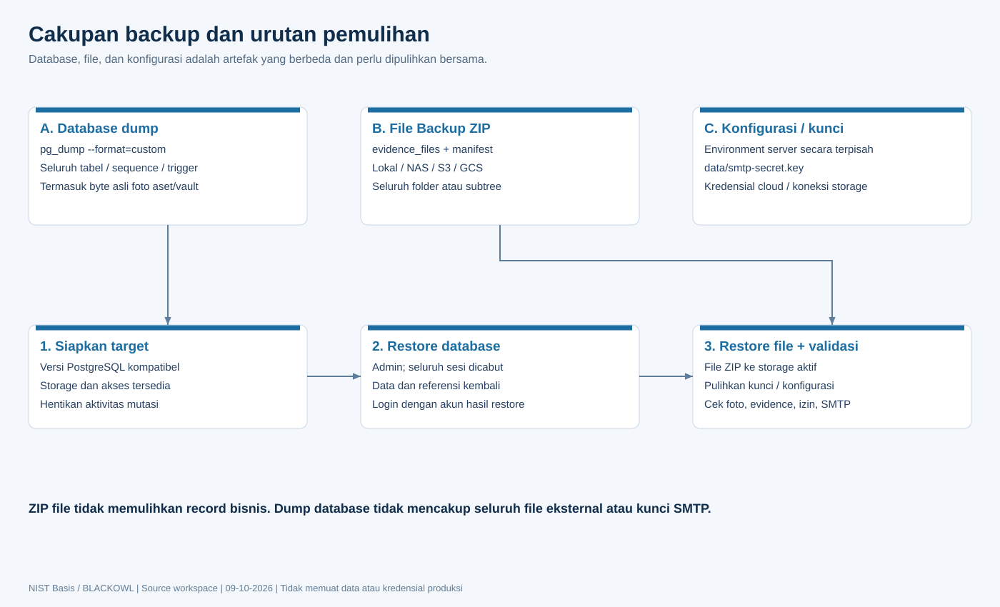

# Operasional, deployment, dan pengujian

## Instalasi native

Siapkan Node sesuai engines package.json (^20.19 atau >=22.12), PostgreSQL kompatibel, client pg_dump/pg_restore, konfigurasi DB, folder persisten dan akun administrator. Perintah contoh dijalankan dari root proyek; environment contoh tidak berisi kredensial siap pakai.

```powershell
npm.cmd ci
npm.cmd run build
npm.cmd run db:setup
npm.cmd run admin:create
npm.cmd start
```

Provisioning/startup menulis DDL/seed. Pastikan DB_HOST/PORT/NAME/USER provisioning dan pool mengacu instalasi yang sama. Detail akun administrator lihat scripts/create-admin.js dan dokumentasi instalasi; jangan menyisipkan password melalui source atau log.

## Instalasi Docker

```powershell
Copy-Item docker.env.example .env.docker
# Isi BLACKOWL_DB_PASSWORD dan sesuaikan bind/HTTPS pada .env.docker.
docker compose --env-file .env.docker up -d --build
docker compose --env-file .env.docker ps
docker compose --env-file .env.docker logs --tail 100 app
```

Default akses http://localhost:5000. Untuk jaringan pengguna set bind sesuai target; untuk produksi siapkan HTTPS/proxy dan Secure cookie. Jangan publikasikan DB port. Perintah tersebut adalah panduan, bukan deployment yang dijalankan saat pembuatan dokumen.

## Rilis dan perubahan database

1. Simpan backup DB, file, konfigurasi dan kunci yang sudah diuji recovery-nya.
2. Review source diff, migrasi dan dependency lock; jalankan quality gate.
3. Build client/CSS; deploy runtime dan migrasi pada maintenance window.
4. Restart backend; session in-memory berakhir, pengguna login kembali.
5. Verifikasi login/permission, API read, contoh record, foto/evidence, versi diagram dan scheduler.
6. Monitor error startup, constraint, SMTP, audit recovery dan kapasitas storage.

FK vendor baru mempertahankan API managedVendorId, tetapi kini penghapusan vendor yang masih dipakai memberikan 409. Lepaskan vendor pengelola dari aset terlebih dahulu. Tidak menghapus data bisnis secara otomatis. Source map production tidak lagi dihasilkan. Session/limiter masih single-process.

## Backup dan restore



DB Backup memakai PostgreSQL custom dump dan mencakup struktur/data satu database aplikasi, seluruh modul dan byte foto dalam DB. Tidak mencakup seluruh role cluster atau semua file luar DB. File Backup ZIP berisi file terdaftar dan metadata manifest, dapat memilih folder/subtree, membaca lokasi asal termasuk cloud.

Batas ZIP upload/hasil arsip500 MiB; hasil ekstraksi2 GiB; masing-masing file500 MiB; max49.999 file dan manifest10 MiB. File restore mempertahankan path; file matching diganti, file lain tetap. Storage failure dapat menyisakan partial restore dan jumlah hasil harus diperiksa. Arsip sumber tidak boleh dipercaya sebelum validasi path/manifest/size.

Urutan recovery: hentikan mutasi, siapkan DB/storage kompatibel, restore database, pulihkan kunci/env/akses storage, restore file ZIP, login akun hasil restore, lalu cek referensi/foto/izin/email. Restore DB mencabut sesi pada awal/akhir termasuk gagal. Maintenance diperlukan karena request yang sudah lolos autentikasi tidak otomatis dibatalkan.

## Pengujian dan quality gate

```powershell
npm.cmd audit
npm.cmd test
npm.cmd run test:security
npm.cmd run test:i18n
npm.cmd run test:notes
npm.cmd run build
npm.cmd run test:asset-rack-browser
node scripts/test-asset-transfer.js
node scripts/test-uploaded-images-backup.js
```

Suite utama dapat melewati tes integrasi DB sesuai flag konfigurasi; skipped test tidak dianggap lulus integrasi. Script transfer memakai schema terisolasi; script foto/backup melakukan rollback fixture. Jangan menjalankan test mutasi terhadap database produksi tanpa membaca isolation/cleanup script. Test browser mock tidak membuktikan koneksi SMTP/cloud nyata atau pentest.

Bukti hasil pemeriksaan terbaru dirangkum dalam VALIDATION.md. Tidak menjalankan restore database produksi saat pemeriksaan dokumentasi. Build menghasilkan bundle cukup besar; peringatan bundle bukan kegagalan keamanan tetapi kandidat pemecahan modul untuk kinerja.

## Troubleshooting

| Gejala | Pemeriksaan |
| --- | --- |
| API401 setelah restart/password/restore | Login ulang; cookie/HTTPS configuration |
| API403 | Page read + action, role admin-only, ownership, Origin/Host |
| API409 perangkat | Aset sudah dipasang, stale previousRackId, overlap atau kapasitas |
| API409 diagram/note | Muat version terbaru; jangan overwrite otomatis |
| API409 hapus vendor | Lepaskan managing vendor asset / relasi lebih dahulu |
| API413/429 upload | Ukuran per file/total, jumlah file, concurrency; retry setelah request selesai |
| DB connection/startup | Env, host/port, role DDL, DB health, migration referensi |
| Foto/evidence hilang | evidence_path, owner, lokasi asal storage, original DB bytes; status migration |
| SMTP gagal | Akun terpilih, host/port/TLS, from, relay permission dan key sesuai ciphertext |
| Backup dump gagal | pg_dump compatible major/server dan executable path |
| ZIP restore parsial | Storage connection/permission, count restored, retry setelah penyebab diperbaiki |
| UI versi lama | Build client; Ctrl+F5; pastikan server menyajikan generated index terbaru |
| audit-recovery berulang | DB outage, ACL data/audit-pending, queue/disk capacity |
