# Panduan Lengkap Fitur NIST Basis

Inventaris fitur berdasarkan source code dan halaman aplikasi lokal yang ditinjau pada 14 September 2026. Screenshot merupakan tampilan nyata pada sesi admin lokal, bukan mockup. Nilai, record, serta status pada gambar mencerminkan kondisi database saat pengambilan; sebagian tabel dapat kosong. Pengambilan gambar tidak menjalankan import, reset, restore, atau pengiriman email.

## 1. Beranda, login, dan navigasi

- Beranda menjelaskan cakupan platform dan menyediakan akses login serta penjelasan fitur.
- Model konseptual 3D menghubungkan strategi bisnis → struktur organisasi → proses → pengukuran kinerja → umpan balik ke strategi. Pengguna dapat menggeser model, memilih bagian, menjalankan tur otomatis, menjeda animasi, dan mereset posisi.
- Login menggunakan username/password dan sesi pengguna. Menu yang ditampilkan mengikuti hak akses.
- Choose framework menjadi pintu masuk NIST CSF 2.0, NIST Privacy Framework, dan ISO/IEC 27001:2022. Sidebar mengelompokkan assessment, TPRM, framework, evidence, serta backup; tersedia fungsi meminimalkan sidebar.

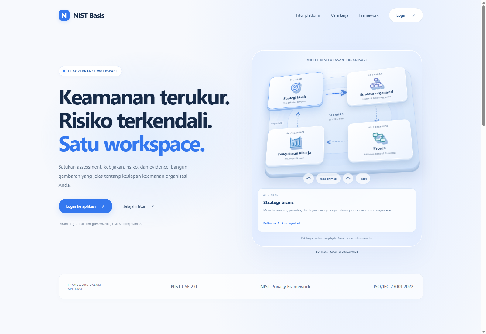

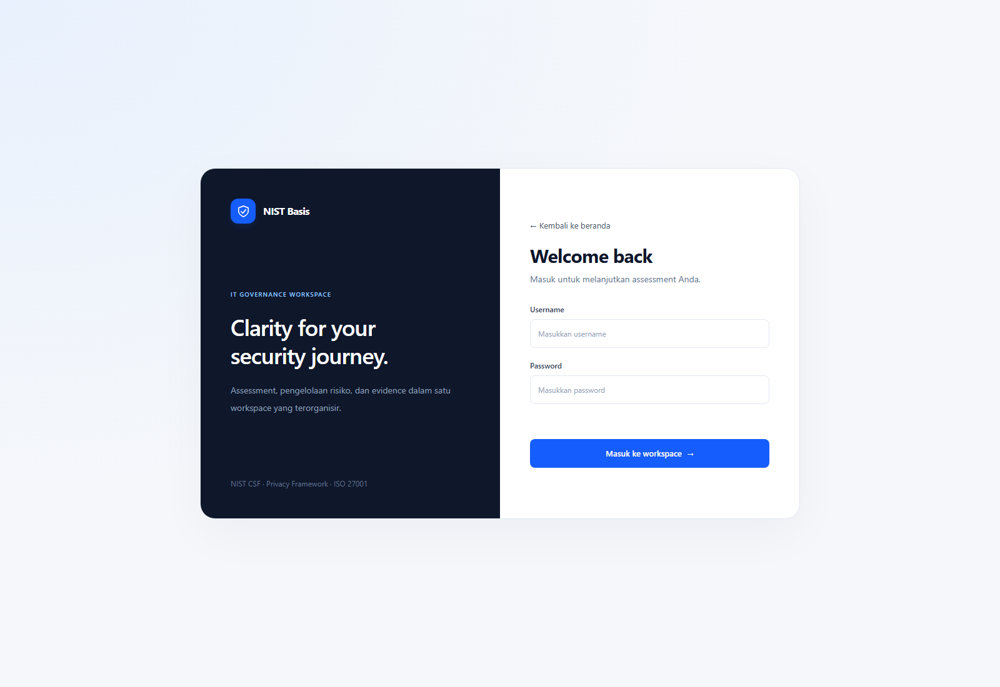

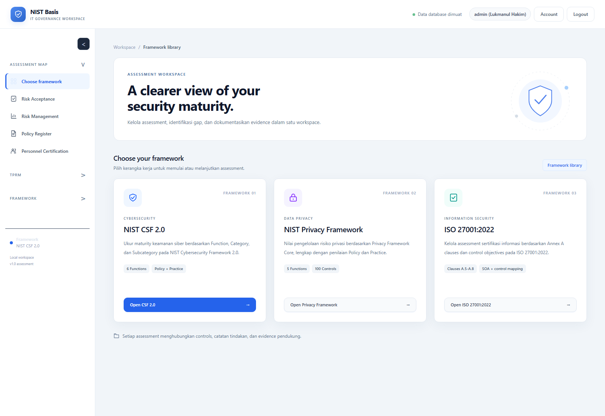

## 2. NIST CSF 2.0 — dashboard dan assessment

- Mencakup enam fungsi: Govern, Identify, Protect, Detect, Respond, dan Recover. Kontrol dikelompokkan menurut function, category, serta subcategory.
- Dashboard memperlihatkan kematangan, progress pengisian, gap, dan ringkasan per fungsi/kategori. Grafik radar membandingkan Policy, Practice, serta target.
- Policy Maturity dan Practice Maturity dinilai terpisah. Label skala pada kode saat ini: 1 Initial, 2 Repeatable, 3 Defined, 4 Managed, dan 5 Optimized. Nilai belum diisi dibedakan dari penilaian yang sudah ada.
- Target kategori dapat diatur untuk membantu membaca selisih dengan kondisi aktual. Ini adalah skala kematangan aplikasi, bukan pernyataan bahwa NIST mewajibkan skala tersebut.
- Setiap kontrol mendukung catatan tindakan policy/practice dan evidence. Pengisian assessment disimpan melalui API ke database.
- Tabel Core menyediakan pencarian, filter, pengurutan/paginasi, akses penilaian, serta pengelolaan evidence. Manage CSF menyediakan tambah, ubah, dan hapus kontrol sesuai izin.
- Tersedia Import JSON, Export JSON, dan Report/PDF. Reset assessment juga tersedia bagi peran yang diizinkan.

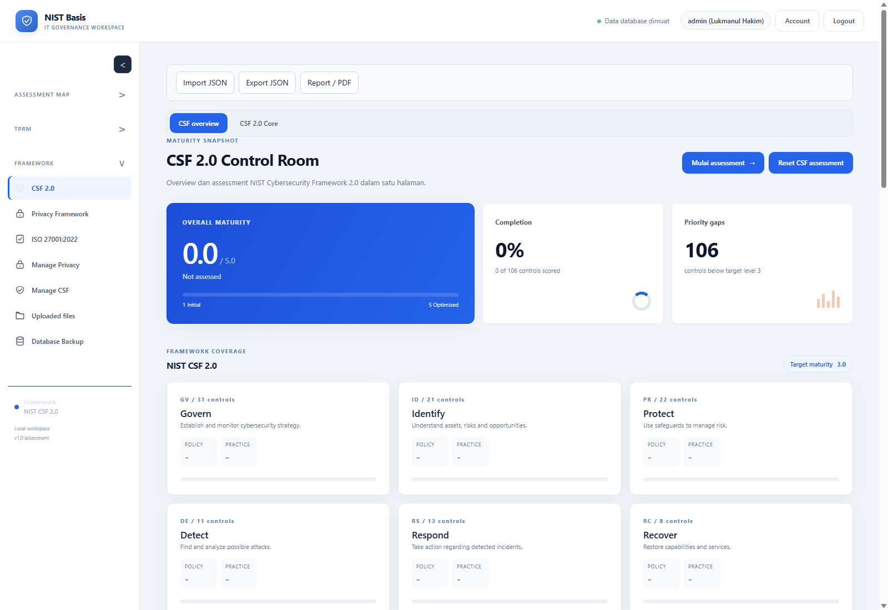

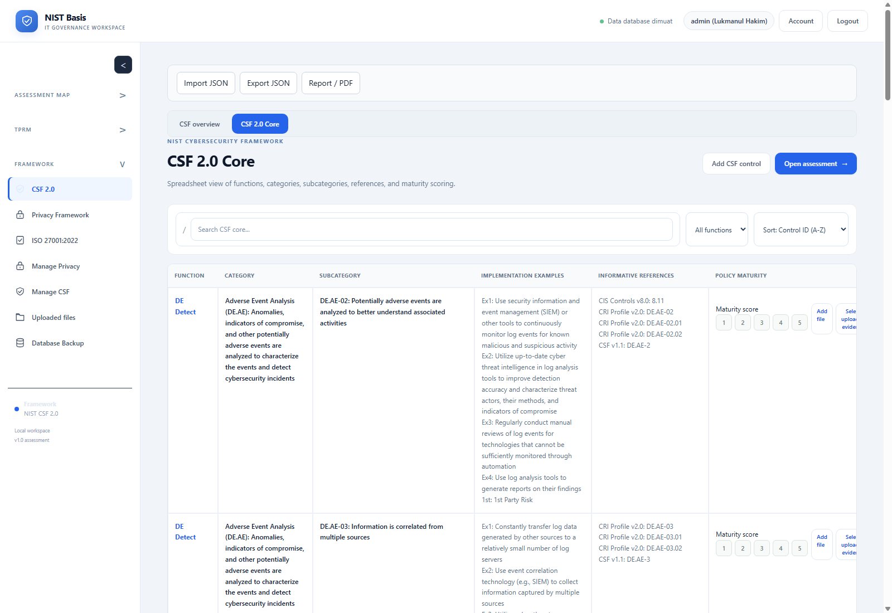

## 3. NIST Privacy Framework — dashboard dan assessment

- Menyediakan daftar function, category, subcategory, dan kontrol privasi dalam tampilan Core.
- Dashboard dan penilaian Policy/Practice untuk privasi menggunakan state assessment terpisah dari CSF.
- Tersedia target, catatan tindakan, pencarian/filter kontrol, dan evidence policy/practice.
- Manage Privacy menyediakan pengelolaan kontrol. Hak tambah, ubah, hapus, serta reset mengikuti izin pengguna.
- Tersedia Import JSON, Export JSON, dan Report/PDF khusus assessment privasi.

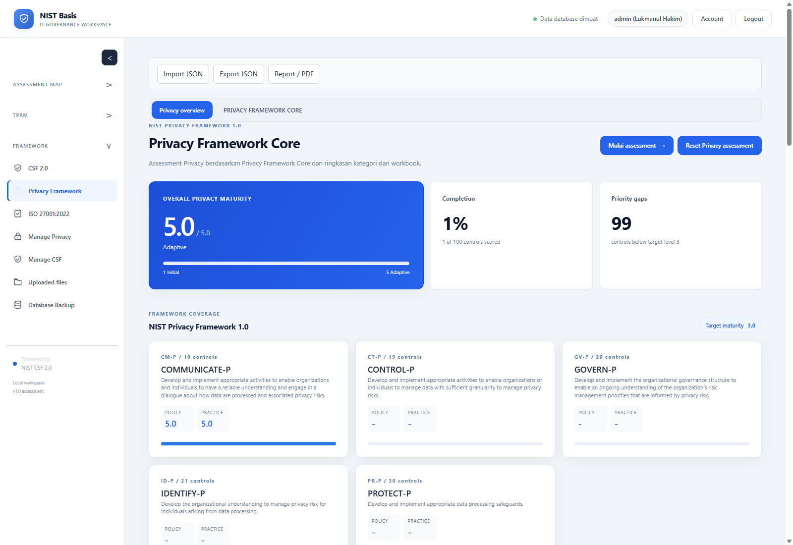

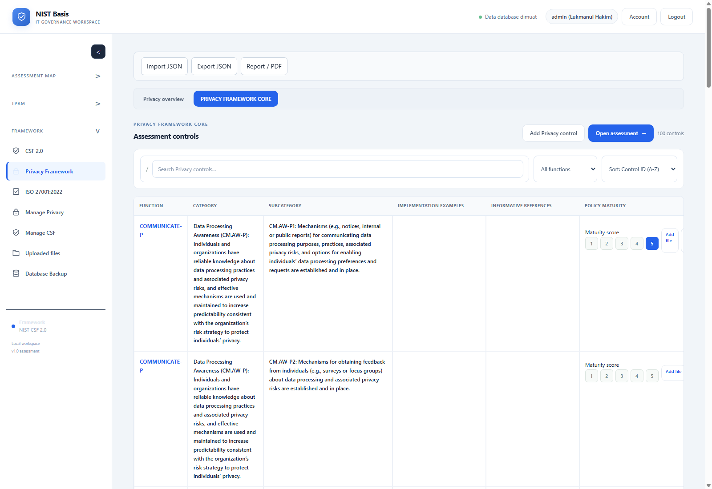

## 4. ISO/IEC 27001:2022 — dashboard, clauses, dan SOA

- Dashboard merangkum evidence Clauses 4–10, applicability Annex A/SOA, sasaran keamanan informasi, dan periode evaluasi yang perlu perhatian.
- Clauses 4–10 menyimpan clause/category, requirement, deliverable implementasi, referensi/pertanyaan auditor, minimum evidence, dan evidence yang terkait.
- Kontrol/requirement dapat ditambah, diubah, atau dihapus sesuai izin. Tabel menyediakan filter clause dan pencarian.
- SOA memuat kontrol Annex A dalam domain Organisational, People, Physical, dan Technological. Setiap kontrol mempunyai status Applicable atau Not applicable serta rincian implementasi dan evidence.
- Jumlah 93 kontrol adalah cakupan referensi Annex A 2022; isi database lokal dapat berubah bila pengguna mengubah katalog kontrol.
- Import/Export JSON ISO mencakup requirements, SOA, dan objectives. Report/PDF merangkum ketiga kelompok tersebut. Kelengkapan evidence yang ditampilkan tidak otomatis berarti organisasi telah lulus audit sertifikasi.

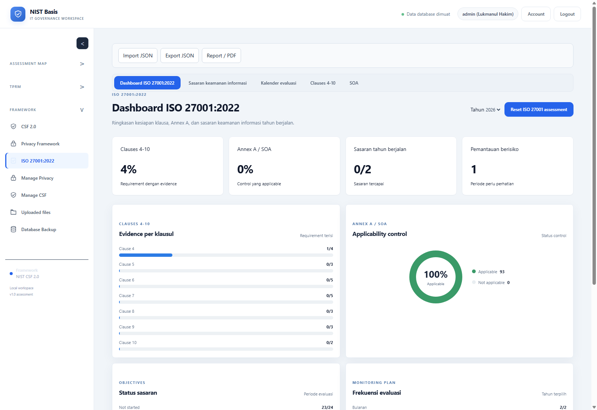

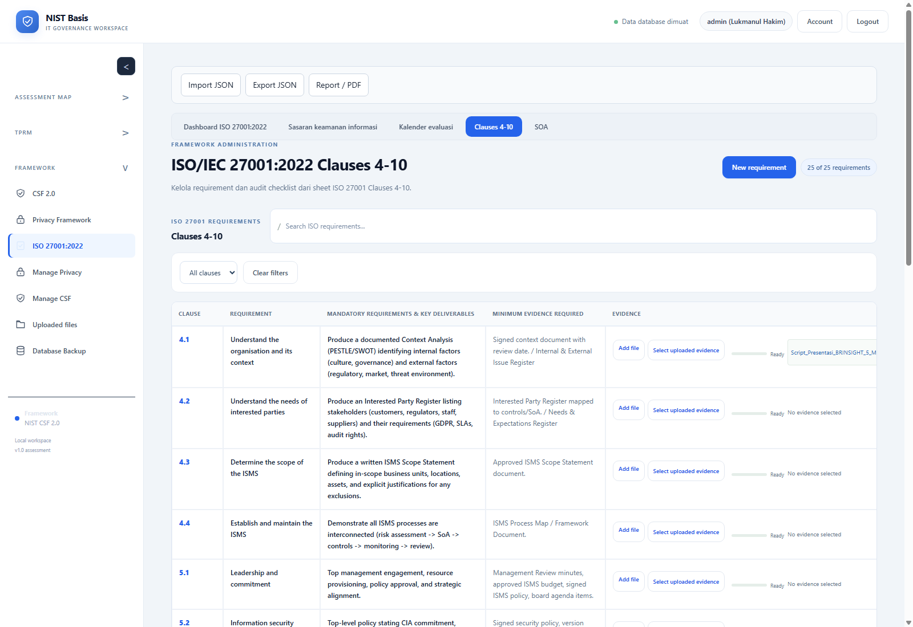

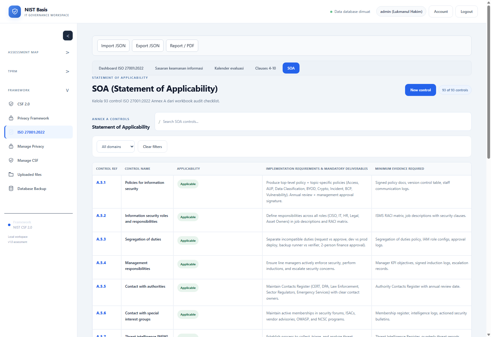

## 5. ISO — sasaran keamanan informasi dan kalender evaluasi

- Mencatat tahun, sasaran, indikator/KPI, baseline, target akhir tahun, PIC/pemilik, frekuensi evaluasi, dan catatan.
- Frekuensi tersedia dalam bulanan, triwulan, semester, atau tahunan.
- Kalender menyediakan periode evaluasi sepanjang tahun, data target/realisasi/status per periode sesuai form, dan penyimpanan perubahan kalender.
- Dashboard menggabungkan pencapaian sasaran dan pemantauan periode sesuai tahun yang dipilih.

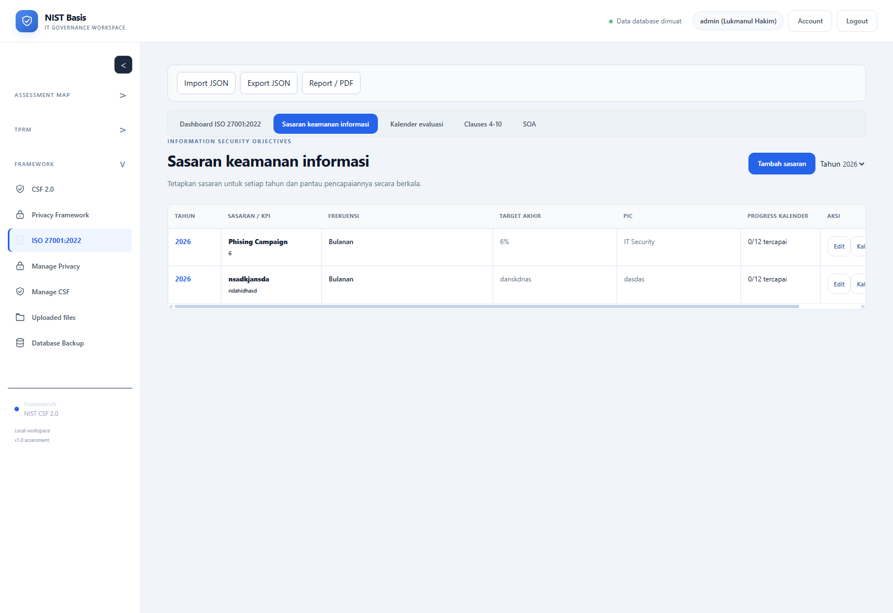

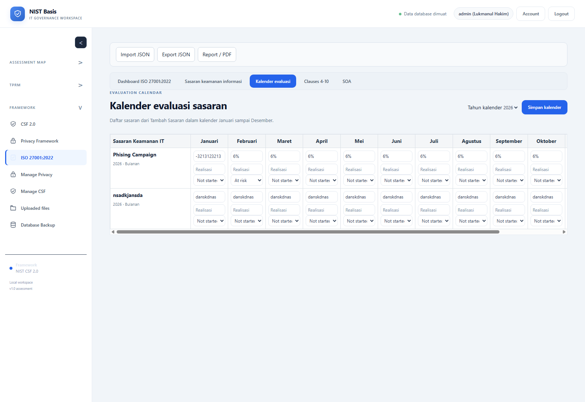

## 6. Risk Acceptance — penerimaan risiko

- Mencatat requestor, nama aset/aplikasi/layanan, departemen, riwayat penerimaan sebelumnya, deskripsi risiko atau penyimpangan kepatuhan, alasan/manfaat penerimaan, dan mitigasi.
- Bagian business owner mencatat keputusan sementara, sampai satu tahun, atau ditolak; tanggal remediasi; nama, kontak, isian tanda tangan, dan tanggal.
- Bagian CIO acknowledgement menyediakan komentar dan identitas peninjau. Bagian CIS review menyimpan keputusan Approved, Denied, atau Approved with conditions beserta alasan/kondisi.
- Form dapat disimpan, dibuka kembali, diperbarui, dan dihapus sesuai izin. Tersedia daftar permohonan tersimpan dan export PDF per formulir.
- Import JSON, Export JSON, dan Report/PDF register juga tersedia.
- Modul yang ditemukan adalah Risk Acceptance. Belum ditemukan modul Risk Appetite tersendiri untuk menetapkan appetite/tolerance organisasi. Isian persetujuan dan tanda tangan bukan bukti adanya e-signature atau workflow approval berjenjang otomatis.

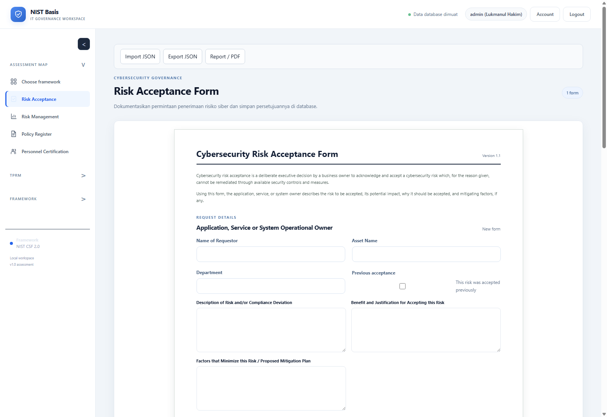

## 7. Risk Management — register, penilaian, dan treatment

- Dashboard menampilkan jumlah risiko, prioritas tinggi, residual risk tinggi, risiko melewati deadline, distribusi rating/treatment, serta rata-rata nilai aset.
- Register memuat ID risiko, kategori, aset terdampak, perangkat, owner, identifikasi risiko, kontrol, penyebab, analisis, referensi, dan catatan.
- Penilaian aset memakai confidentiality, integrity, availability. Nilai aset pada service dihitung dari penjumlahan ketiga nilai CIA.
- Likelihood dan impact menggunakan nilai 1–5. Rating dihitung dari hasil perkalian: 1–2 Very Low; 3–4 Low; 5–10 Medium; 11–19 High; 20–25 Very High.
- Treatment tersedia sebagai Acceptance, Mitigation, Transfer, Avoidance, atau Closed; dilengkapi penjelasan, owner of action, deadline, dan nomor form acceptance.
- Residual risk memiliki deskripsi, likelihood, impact, rating, serta komentar. Terdapat pencarian/filter kategori, rating, dan treatment.
- Pustaka indikator mencakup CIA, dampak, frekuensi, serta matriks risk level; tersedia pengelolaan indikator dan opsi dropdown.
- Tersedia tambah/ubah/hapus risiko, reset register sesuai izin, import/export JSON, contoh file import, serta Report/PDF. Tombol import/export lama Risk Management juga menggunakan JSON, bukan workbook Excel.

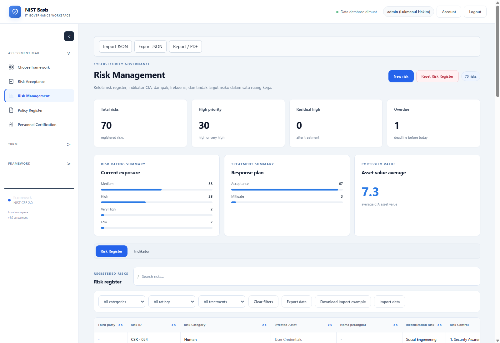

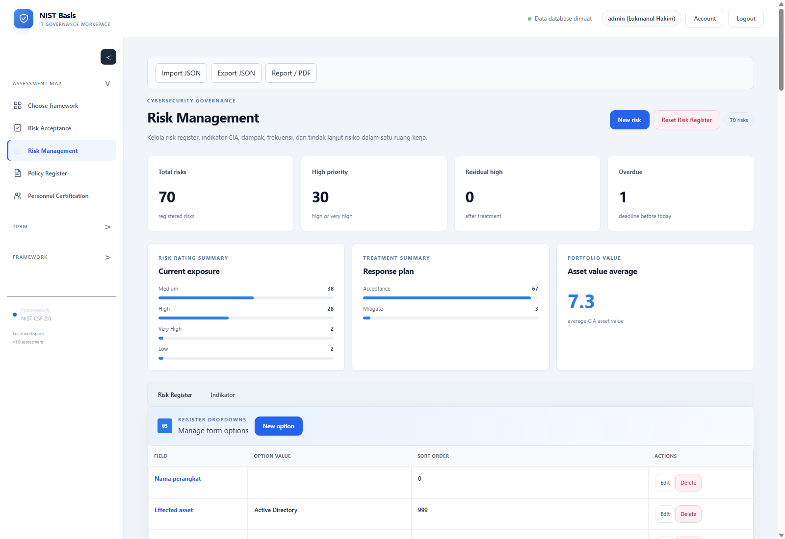

## 8. Policy Register — kebijakan dan review

- Menyimpan judul kebijakan, kategori, owner, review cycle, approval status, last review, catatan, dan lampiran.
- Isi kebijakan dapat dipecah menjadi beberapa subtitle/detail dan content. Lampiran dapat dibuka, diganti/dihapus melalui alur yang tersedia.
- Dashboard menampilkan jumlah kebijakan, approved, review due, owner, distribusi status persetujuan, dan jadwal review.
- Daftar kebijakan menyediakan pencarian/filter kategori, status, dan owner; opsi dropdown dapat dikelola sesuai izin.
- Review calendar menampilkan jadwal berdasarkan siklus review dan tanggal review terakhir, dengan navigasi bulan/tahun dan akses ke kebijakan.
- Tersedia tambah, ubah, hapus, Import JSON, Export JSON, serta Report/PDF. Export menyertakan metadata dan detail kebijakan.

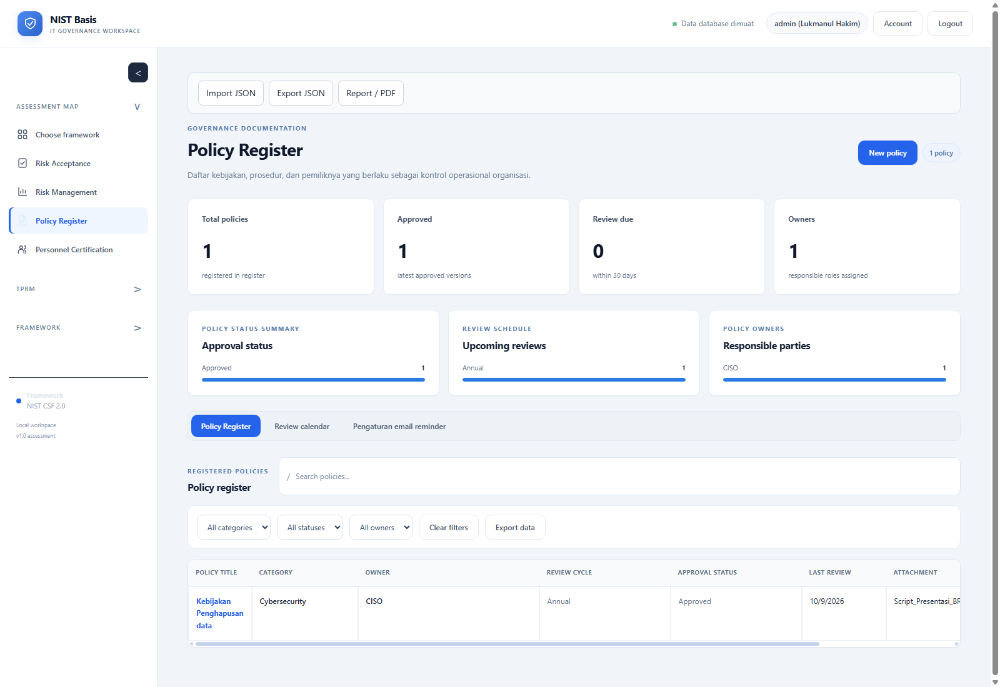

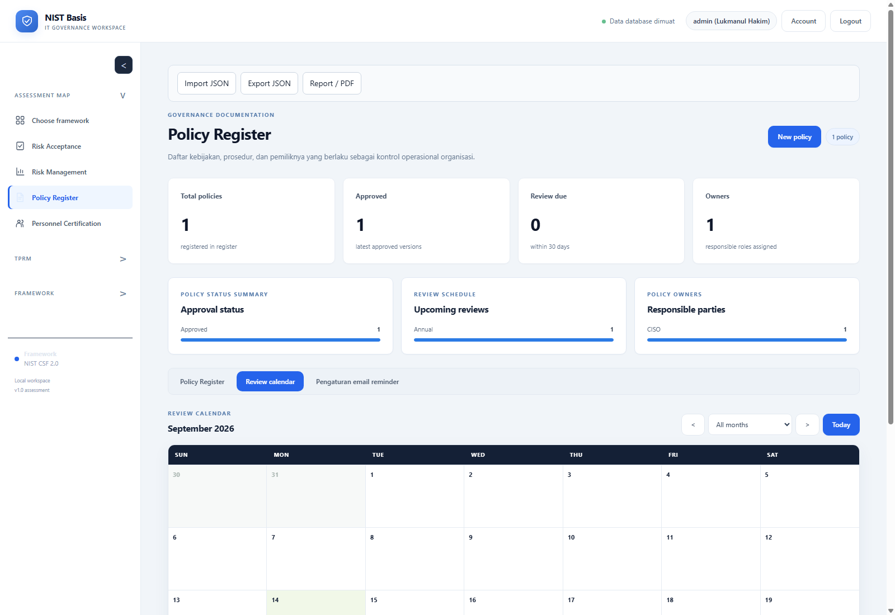

## 9. Policy Register — email reminder

- Administrator dapat mengatur SMTP host, port, STARTTLS/TLS, pengirim, username/password, serta status aktif reminder.
- Penerima dipetakan berdasarkan nama owner ke satu alamat email. Owner yang belum dipetakan dilewati.
- Pengingat dapat dikirim sejumlah hari sebelum due date, termasuk kebijakan yang sudah terlambat. Jadwal service memeriksa setiap jam ketika scheduler dijalankan.
- Due date dihitung dari last review: Annual = 12 bulan, Biannual = 6 bulan, Quarterly = 3 bulan. Ad hoc dan siklus lain yang tidak didukung dilewati.
- Subjek dan body email bisa disesuaikan menggunakan variabel title, owner, lastReview, reviewCycle, dan dueDate; tersedia pratinjau contoh.
- Tersedia tombol email percobaan dan pencatatan delivery untuk menghindari pengiriman ulang pada kombinasi kebijakan, due date, serta penerima yang sama.
- Dalam dokumentasi ini konfigurasi SMTP dan pengiriman email tidak diuji. Tidak ada email percobaan yang dikirim saat pengambilan screenshot.

## 10. Personnel Certification — pegawai, sertifikasi, roadmap

- Daftar pegawai mencatat nama, employee ID, role/jabatan, serta atasan langsung; atasan boleh kosong untuk posisi paling atas.
- Sertifikasi ditautkan ke pegawai terdaftar. Satu pegawai dapat memiliki beberapa sertifikasi; identitas pegawai berasal dari register pegawai.
- Record sertifikasi menyimpan nama sertifikasi, issuer, reference URL, level, status, issue date, expiry date, dan notes.
- Status meliputi Planned, In progress, Active, dan Expired. Level mencakup Entry Level, Intermediate, dan Advanced / Expert.
- Peta sertifikasi menampilkan kartu yang dapat diseret dan diubah ukurannya. Daftar sertifikasi dikelompokkan per pegawai.
- Reference Roadmap menampilkan katalog sertifikasi menurut domain dan level; kartu dapat dibuka untuk detail/referensi. Kontrol pengelolaan katalog muncul mengikuti peran dan implementasi akses.
- Ringkasan mencakup personel, sertifikasi aktif, kelompok peran, serta catatan yang perlu perhatian. Pegawai dengan sertifikasi terkait perlu ditangani relasinya sebelum dapat dihapus.
- Import/Export JSON mencakup daftar pegawai dan sertifikasinya; import memetakan ID pegawai hasil penyimpanan ke sertifikasi. Report/PDF mencakup kedua daftar. Katalog referensi tidak termasuk paket export personel ini.

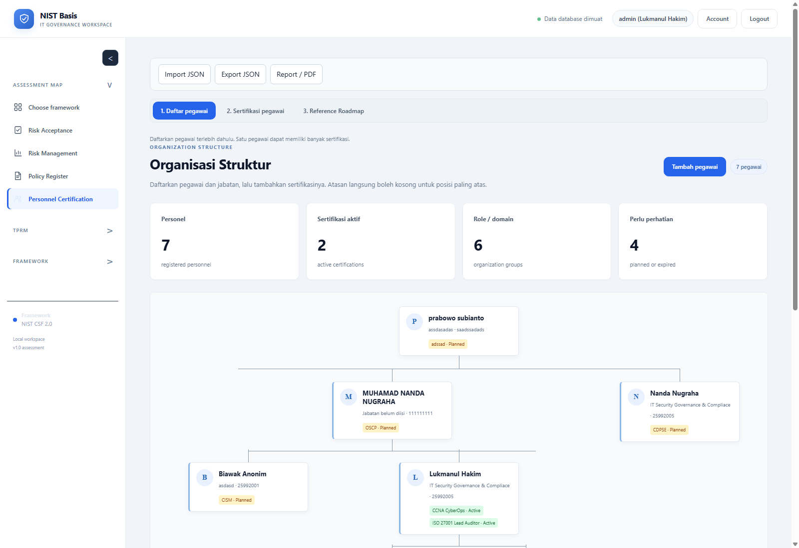

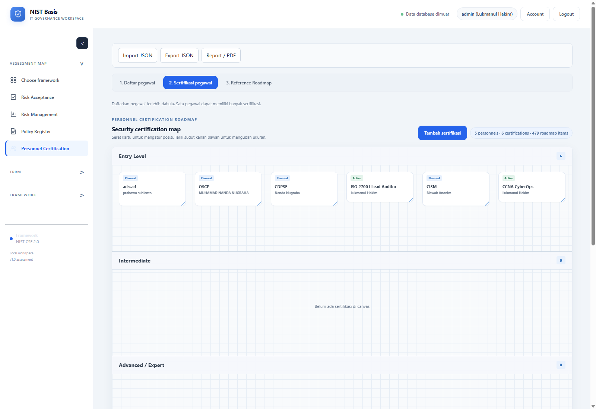

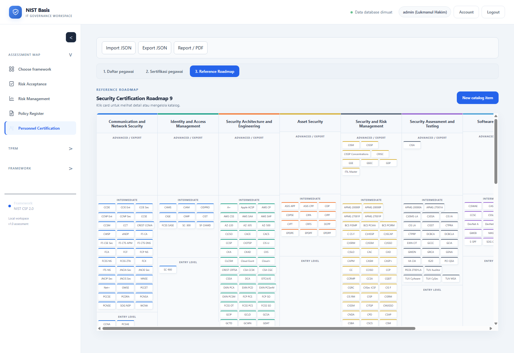

## 11. TPRM Framework dan Vendor Tiering Matrix

- Halaman TPRM Framework menjelaskan tujuan, scope, peran, dan lifecycle vendor: selection/due diligence, contracting, ongoing monitoring, serta offboarding.
- Memuat panduan klausul kontrak/DPA, secure development, KPI, eskalasi, agenda komite, dan checklist offboarding. Konten tersebut adalah referensi operasional dalam aplikasi.
- Vendor Tiering Matrix menjelaskan Tier 1 High, Tier 2 Medium, Tier 3 Low, dimensi penilaian, bobot, aturan override, cadence review, dan kebutuhan due diligence.
- Dimensi penilaian vendor: PII exposure 40%, security maturity 30%, financial stability 10%, reputation/references 20%.
- Penyebutan BitSight, SecurityScorecard, threat intelligence, DPA, dan perangkat lain pada panduan tidak berarti ada integrasi API atau monitoring otomatis ke layanan tersebut.

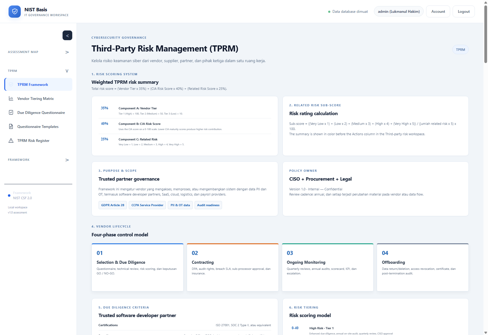

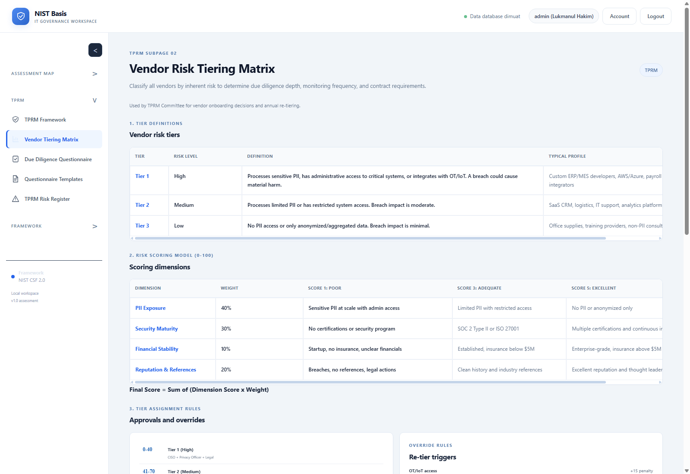

## 12. Due Diligence Questionnaire dan Questionnaire Templates

- Kuesioner vendor menyimpan company name, status assessment, review date, hasil assessment, reviewer, skor empat dimensi, dan response/assessment notes.
- Status assessment: Draft, In progress, Complete, Expired, dan Final. Hasil: Pending, Approved, Approved with Conditions, atau Rejected.
- Form menampilkan total skor berbobot maksimum 500: Tier 1 ≤ 200, Tier 2 201–350, Tier 3 351–500. Skor yang lebih tinggi menunjukkan kondisi/maturity yang lebih baik pada model ini.
- Pengguna dapat membuat assessment dari template, mengisi pertanyaan, menyimpan/mengubah, dan menghapus record sesuai izin.
- Questionnaire Templates menyediakan library template dengan nama, deskripsi, sections/questions, dan penanda default. Tersedia tambah section serta pengelolaan template.
- Modul ini tidak otomatis mendapat tombol import/export/report generik yang ditambahkan pada tujuh modul utama.

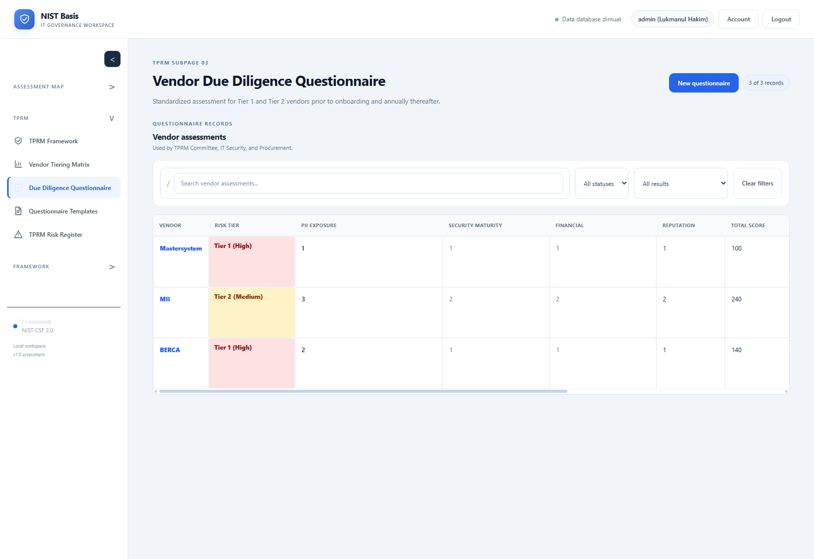

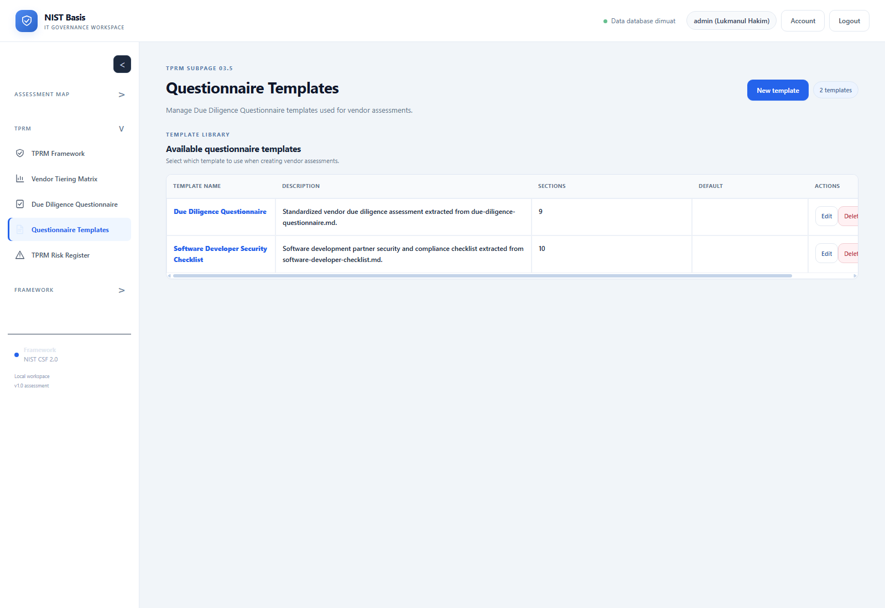

## 13. TPRM Risk Register dan CIA Device Assessment

- Mencatat pihak ketiga/vendor, service/dependency, due diligence risk, catatan, relationship status, assessment status, dan next review sesuai data register.
- Menghubungkan vendor dengan hasil due diligence, assessment CIA perangkat, dan related risks dari risk register.
- Assessment CIA perangkat mencakup drive encryption, access/authentication, sensitive data access, endpoint protection, patch/OS, user rights, backup, device management/MDM, serta operational role.
- Skor assessment CIA menggunakan arah terbalik: 1 berarti risiko sangat tinggi, 5 sangat rendah; hasil ditampilkan pada skala 0–100 dan tier.
- Ringkasan risiko gabungan menggunakan Vendor Tier 35%, CIA Risk Score 40%, dan Related Risk 25%. Formula related-risk menormalisasi rating Very Low sampai Very High.
- Tersedia pengelolaan record, pemilihan vendor, relasi risiko, serta pembukaan form penilaian CIA. Ini merupakan register dan penilaian internal, bukan pemindaian keamanan perangkat secara otomatis.

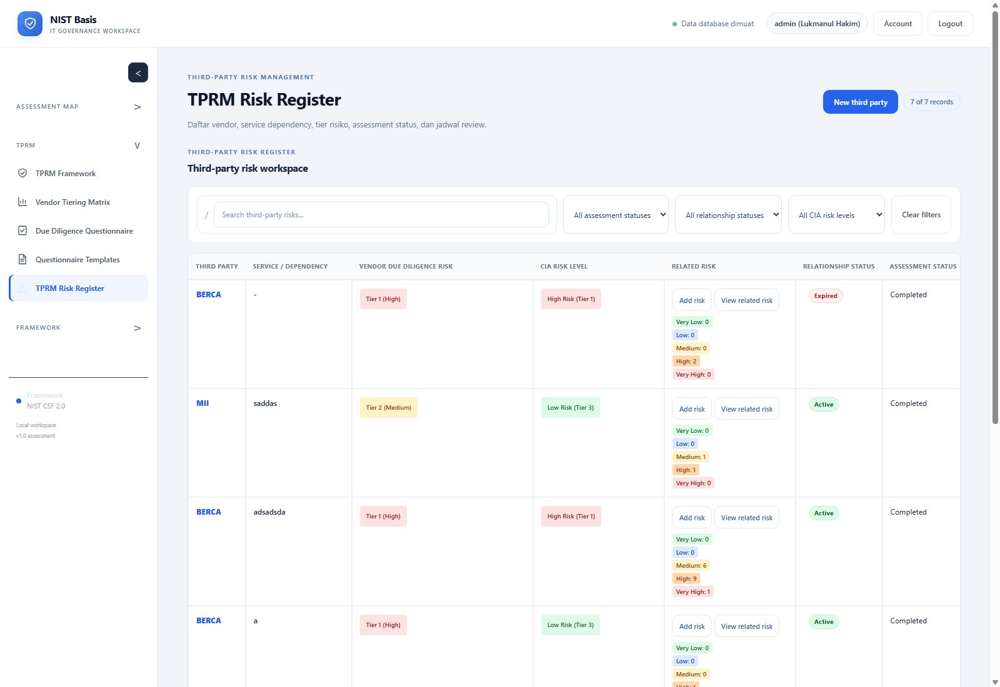

## 14. Uploaded Files dan pengaturan storage

- Library evidence menggabungkan file yang dipakai CSF, Privacy, ISO/SOA, dan Policy Register beserta lokasi penggunaannya.
- Menampilkan nama file, assessment, function, category, subcategory, jenis Policy/Practice, waktu upload, serta aksi yang tersedia.
- Mendukung membuka, mengunduh, menggunakan evidence yang sudah ada, mengunggah, mengganti, dan menghapus sesuai izin/alur modul.
- Penggantian file dirancang mempertahankan path agar referensi tetap terhubung. Format yang diterima mencakup PDF, Word (.doc/.docx), dan PowerPoint (.ppt/.pptx).
- Batas route upload evidence adalah 50 MB per file; route batch maksimal 20 file. Lampiran Policy Register memiliki batas 20 MB.
- Administrator dapat memilih folder upload lokal atau folder storage server/NAS, melakukan tes akses folder, dan menyimpan pengaturan.
- Perubahan storage berlaku untuk upload berikutnya. File lama dan penggantiannya tetap memakai lokasi asal; bukan migrasi otomatis seluruh file.

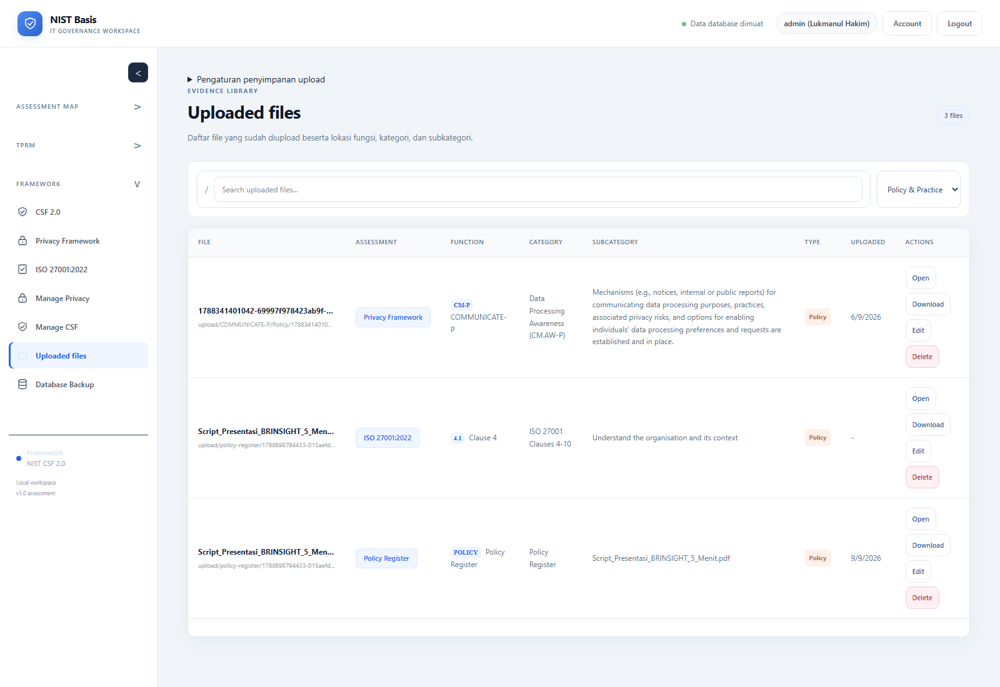

## 15. Account Management, Role Access, dan Audit Trail

- Profil akun menyediakan pengelolaan identitas dan perubahan password dengan current password serta konfirmasi password baru.
- Aturan password baru pada UI: 8–72 karakter, huruf besar, huruf kecil, dan angka.
- Administrasi akun menyediakan tambah, ubah, hapus pengguna, dan penetapan role.
- Role tersedia: admin, approver, editor, viewer, user. Role Access mengatur izin halaman dan menampilkan matriks akses.
- Izin efektif juga mengikuti matriks aksi backend; akses sebuah halaman tidak otomatis memberi izin create/update/delete di halaman itu.
- Audit Trail menyediakan waktu, actor, event, HTTP method/path, status, request ID, refresh, dan filter events/mutations/errors/requests.
- Session menggunakan cookie dan password disimpan sebagai hash. Detail akses administrasi mengikuti role serta middleware; screenshot diambil dengan akun admin lokal.

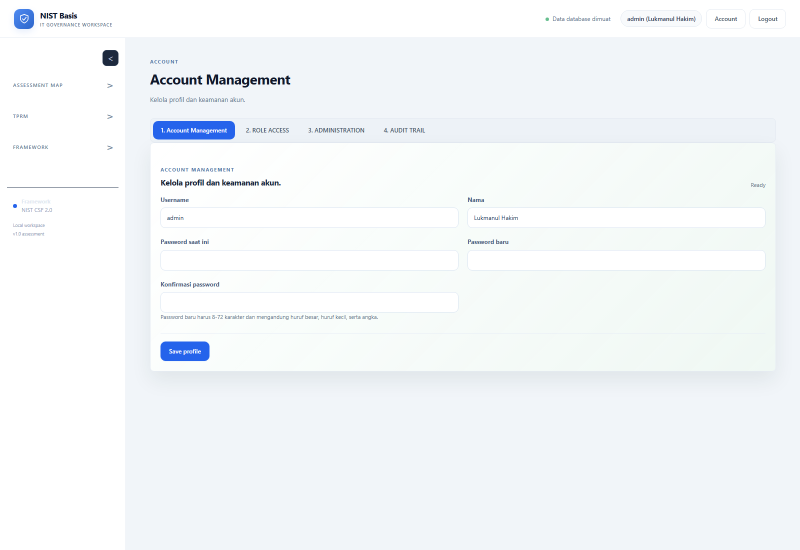

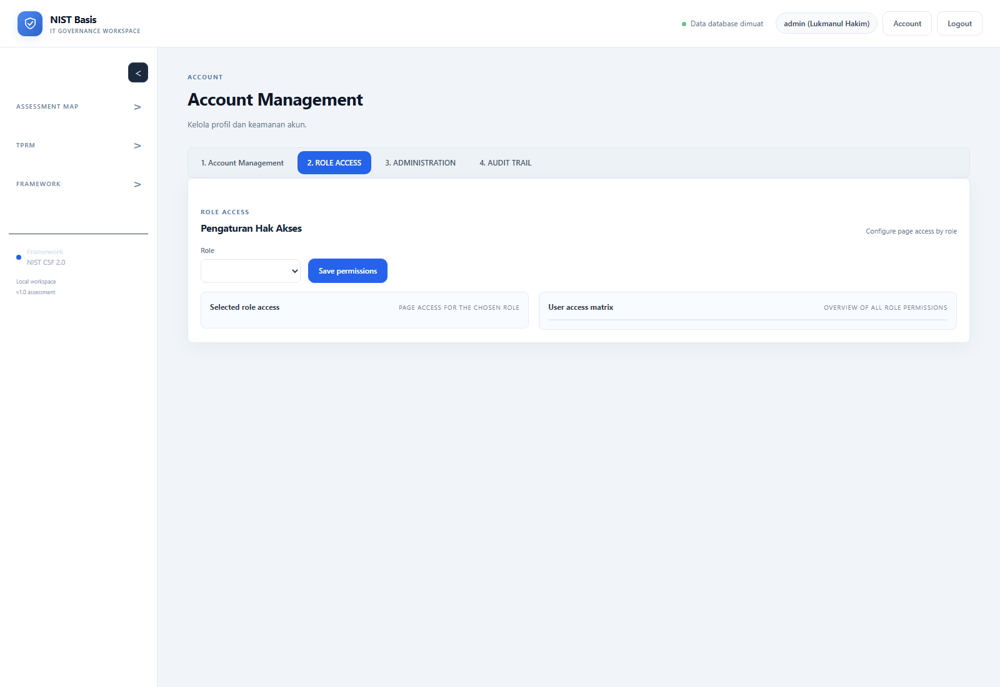

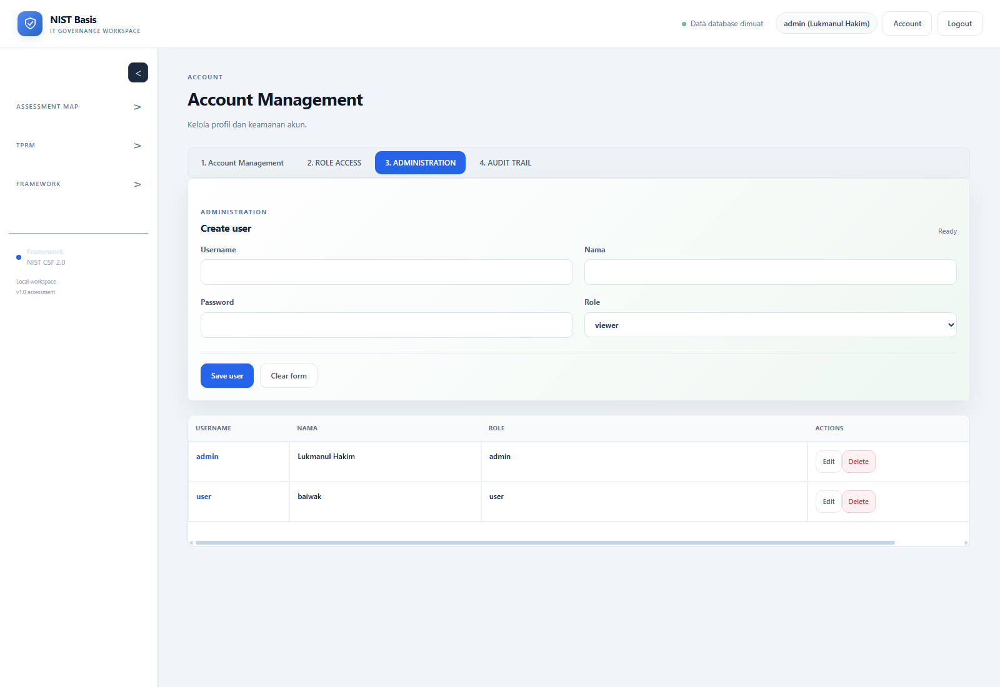

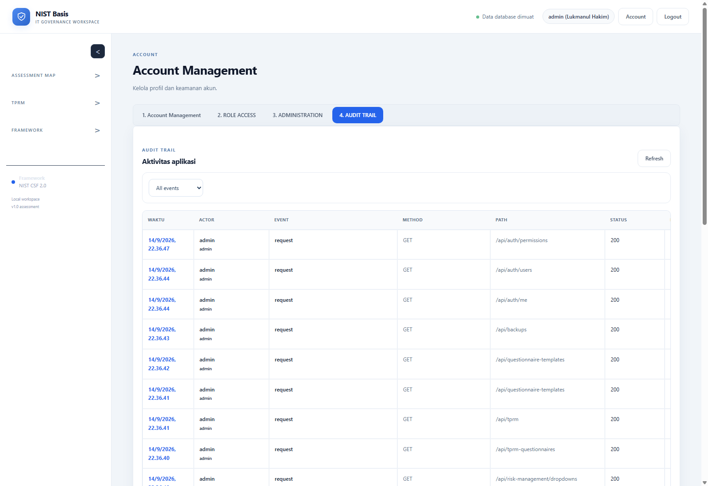

## 16. Database Backup dan Restore

- Administrator dapat membuat backup database, melihat arsip, mengunduh file backup, dan melakukan restore dari file yang didukung aplikasi.
- Backup menggunakan PostgreSQL custom dump bila pg_dump tersedia; terdapat fallback snapshot JSON ketika executable tidak tersedia.
- Restore mengganti data database. Fitur ini didokumentasikan dari UI/kode dan tidak dijalankan saat pengambilan screenshot.
- Backup database tidak otomatis mengarsipkan semua binary evidence di folder upload atau NAS. Salinan folder file dibutuhkan secara terpisah.

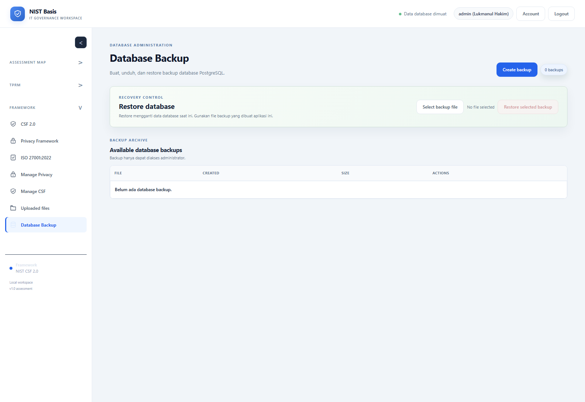

## 17. Import, Export, dan Report pada tujuh modul

- Toolbar tersedia pada NIST CSF Assessment, NIST Privacy Assessment, ISO 27001, Risk Acceptance, Risk Management, Policy Register, dan Personnel Certification.
- Export JSON mengambil seluruh data modul dari API, termasuk identitas modul, versi format, serta waktu export. Filter tabel tidak membatasi isi export.
- Import JSON menerima file hasil export modul yang sesuai, maksimal 10 MB, memvalidasi format/versi/modul dan sebagian struktur data, lalu menampilkan pratinjau.
- ID register yang sudah ada diperbarui; record baru ditambahkan melalui API. Assessment NIST diganti dengan state dalam file. Gunakan export dari instalasi yang sama agar ID cocok.
- Import berjalan berurutan. Jika gagal di tengah, record yang sudah tersimpan tetap tersimpan dan jumlahnya dilaporkan; tidak ada rollback atomik untuk seluruh file.
- Report/PDF mengunduh file HTML dengan kolom sesuai modul. Buka file tersebut, lalu gunakan Cetak / Simpan PDF. Risk Acceptance juga mempunyai PDF langsung untuk setiap formulir.
- JSON menyertakan referensi/path evidence, bukan berkas biner. File fisiknya harus tetap tersedia di server.
- Import/export JSON, backup database, dan penyalinan evidence adalah tiga kebutuhan berbeda. Dukungan Excel/CSV massal lintas semua modul belum ditemukan.

## Batas peninjauan

Peninjauan ini memverifikasi halaman dan membaca implementasi, bukan menguji ulang seluruh transaksi bisnis. Konten referensi TPRM tidak diperlakukan sebagai integrasi eksternal. Aplikasi saat ini memakai state assessment bersama per framework; belum ditemukan pemisahan multi-tenant atau assessment proyek/periode yang independen. Kalender menyimpan penilaian pengguna; tidak otomatis mengukur KPI dari sistem eksternal.

## Sumber implementasi

- frontend/client/src/workspace/components/
- frontend/client/src/workspace/features/
- frontend/public/landing.html
- src/routes/ dan src/services/
- manifest.json: waktu pengambilan dan daftar screenshot
